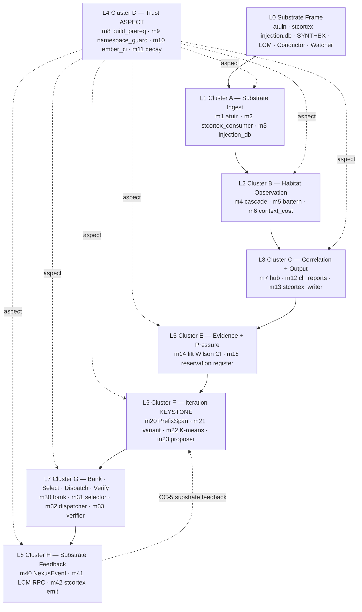

# workflow-trace — Architecture Deep Dive

> **Back to:** [`README.md`](../README.md) · [`CLAUDE.md`](../CLAUDE.md) · [`ARCHITECTURE.md`](../ARCHITECTURE.md) · [`ai_docs/INDEX.md`](INDEX.md) · [`ai_docs/optimisation-v7/ULTRAMAP.md`](optimisation-v7/ULTRAMAP.md) · [`ai_docs/GENESIS_PROMPT_V1_3.md`](GENESIS_PROMPT_V1_3.md) · [`the-workflow-engine-vault/HOME.md`](../the-workflow-engine-vault/HOME.md)
>
> **Scope:** This file goes one step deeper than [`ARCHITECTURE.md`](../ARCHITECTURE.md). `ARCHITECTURE.md` is the stable structural summary (cluster table, binary split, src/ layout, gap-authorship). This document explains **how the clusters interact at runtime** — the live data and control flow that turns raw substrate reads into bank-eligible workflows and Hebbian-grain substrate feedback. Status: planning-only · HOLD-v2 active · 0 LOC.

---

## 1. System overview

`workflow-trace` is a planned single-phase Rust codebase that **observes** the Zellij habitat as a substrate (atuin shell history, stcortex narrowed-scope memory, injection.db causal chains, Battern protocol traces, context-cost windows), **iterates** over those observations to propose composite workflow variants for human review, and **dispatches** human-ratified workflows via HABITAT-CONDUCTOR (never directly). It then **feeds back** the dispatch outcomes into the substrate so the next iteration cycle sees a different selection landscape.

It is built as **one Cargo crate, two binaries, one shared lib** (ORAC pattern, not LCM 10-crate workspace):

- `wf-crystallise` — read-heavy: ingest + observation + correlation + iteration + substrate feedback emission
- `wf-dispatch` — curated bank + selector + Conductor dispatcher + 4-agent verifier
- `workflow_core` (lib inside the same crate) — shared types, schemas, namespace constants (AP30), error taxonomy

The codebase is **26 modules** organised into **8 synergy clusters** spanning **9 layers L0-L8** (~3,810 LOC src + ~1,562 tests + ~600 LOC manifests/build.rs/integration ≈ ~5,200 LOC total). L0 is the substrate frame (atuin/stcortex/injection.db/SYNTHEX/LCM/Conductor/Watcher — observed, not authored); L9 (substrate-frame engine) is intentionally absent under the single-phase override (partial waive of R6 frame-separation; placeholder reserved for post-D120 evaluation).

Cluster D ships **Day 1, before any other cluster**, because m8 must install the build-time `cargo:rustc-cfg=povm_calibrated` gate before any module that touches POVM-derived signals can compile (CC-2 trust regime, see § 5).

Per [Genesis v1.3 § 1](GENESIS_PROMPT_V1_3.md), the architecture is **locked**. v1.3 references but does not duplicate [ULTRAMAP View 2](optimisation-v7/ULTRAMAP.md) for the per-module table.

---

## 2. Nine-layer topology (L0-L8)



**Reading rule:**
- Solid edge = build-time dependency (downstream cannot compile without upstream).
- Dashed `aspect` = Cluster D is woven at compile-time (m8) / write-time (m9) / output-time (m10) / lifecycle-time (m11). Aspects are *applied to* other modules, never imported by them.
- Dashed `CC-5 substrate feedback` = the only true substrate-grain loop in the engine. Slow (days/weeks), Hebbian-grain, not per-event.

Compile order under Wave-1 worktree allocation ([ULTRAMAP View 5](optimisation-v7/ULTRAMAP.md)): L0/L4 → L1 → L2 → L3 → L5 → L6 → L7 → L8.

---

## 3. Cluster interaction at runtime

### 3.1 Read path (substrate → bank-eligible proposals)

```
L0 substrate                  L1 ingest                      L2 observation                  L3 correlation
─────────────                 ────────────                   ──────────────                  ─────────────
atuin history.db        ─►   m1 typed RowIterator       ─►   m4 cascade_correlator      ─►   m7 workflow_runs hub
stcortex :3000          ─►   m2 narrowed consumer        ─►   m5 battern_step_record     ─►        │
injection.db            ─►   m3 injection_db_consumer    ─►   m6 context_cost EMA        ─►        │
                                                                                                    ▼
                                                                                          L5 evidence
                                                                                          ─────────
                                                                                          m14 Wilson-CI lift
                                                                                          (Option<Lift>::None when n<20)
                                                                                                    │
                                                                                                    ▼
                                                                                          L6 KEYSTONE iteration
                                                                                          ───────────────────
                                                                                          m20 PrefixSpan  ─►  m21 variant_builder
                                                                                                                       │
                                                                                          m22 K-means feature  ◄────────┤
                                                                                                                       ▼
                                                                                          m23 ProposalBuilder::build()
                                                                                          (gates on Lift evidence)
                                                                                                    │
                                                                                                    ▼
                                                                                          WorkflowProposal
                                                                                                    │
                                                                                                    ▼ wf-crystallise propose accept <id> (HUMAN — F5 boundary)
                                                                                                    │
                                                                                          L7 Cluster G
                                                                                          ────────────
                                                                                          m30 curated_bank.admit ─► BankEntry
                                                                                                    │
                                                                                                    ▼
                                                                                          m33 verifier (4-agent · 7d TTL)
                                                                                                    │
                                                                                                    ▼
                                                                                          m31 selector (α·fitness + β·recency + γ·frequency + δ·diversity)
                                                                                                    │
                                                                                                    ▼
                                                                                          m32 dispatcher (5-check pre-dispatch sequence)
```

### 3.2 Write path (dispatch outcome → substrate feedback → next selection cycle)

```
m32 dispatch ─► HABITAT-CONDUCTOR :8141 ─► workflow execution ─► DispatchOutcome
                                                                       │
                            ┌──────────────────────────────────────────┼──────────────────────────────────────────┐
                            ▼                                          ▼                                          ▼
                  L8 Cluster H                              L8 Cluster H                              L8 Cluster H
                  ─────────────                            ──────────────                            ──────────────
                  m40 NexusEvent emit                      m41 LCM RPC router                        m42 stcortex emit
                  outbox/m40/*.jsonl                       outbox/m41/*.jsonl                        outbox/m42/*.jsonl
                            │                                          │                                          │
                            ▼ best-effort                              ▼ if deploy-shaped                         ▼ stcortex-only (POVM DECOUPLED per 2026-05-17 ADR)
                  SYNTHEX v2 :8092                         LCM lcm.loop.create                       stcortex :3000 pathway.weight
                  /v3/nexus/push                           {max_iters: 1}                            update via m13 writer
                                                                                                                  │
                                                                                                                  ▼ intentionally slow (days/weeks)
                                                                                                       m31 reads weights next cycle
                                                                                                                  │
                                                                                                                  ▼ composite_score shifts
                                                                                                       new selection distribution
                                                                                                                  │
                                                                                                                  ▼ over weeks
                                                                                                       m20/m22 input distributions shift
                                                                                                                  │
                                                                                                                  ▼
                                                                                                       new patterns/variants in m23 proposals
                                                                                                                  │
                                                                                                                  └────► back to top of read path
```

**This is CC-5** — the only true substrate-grain loop in the engine (see § 5). All other CCs are anthropocentric-control flows (function call graphs, schema joins). When CC-5 fails, the failure is invisible from inside the engine; when any other CC fails, an integration test catches it.

**Per 2026-05-17 ADR `ai_docs/optimisation-v7/decisions/2026-05-17-m42-stcortex-only-pivot.md`:** m42 was renamed `src/m42_povm_dual/` → `src/m42_stcortex_emit/` and pivoted from POVM-dual-path to stcortex-only routing. CC-5 substrate semantics preserved 1:1 (fitness-delta constants, outbox-first JSONL, circuit-breaker, Watcher Class-I monitoring). Trigger: AP-V7-13 (Health-200 ≠ behaviour-verified) — POVM `:8125/health` returned 200 but live binary served pre-CR-2 inflated `learning_health=0.9146` vs expected ~0.067 post-CR-2.

### 3.3 Aspect path (Cluster D woven through everything)

Cluster D modules are **never imported** by other modules. They are *applied to* the codebase at four specific lifecycle points:

| Module | Lifecycle point | Mechanism | Effect |
|---|---|---|---|
| m8 `povm_build_prereq` | compile-time | `build.rs` emits `cargo:rustc-cfg=povm_calibrated`; `compile_error!` if env unsatisfied | Any code path reading POVM-derived `substrate_LTP_density` for display must be `#[cfg(povm_calibrated)]` gated; build fails if gate uncalibrated |
| m9 `watcher_namespace_guard` | write-time | Validation call from m13 / m42 write paths | Refuses any stcortex/POVM write whose namespace prefix ≠ `workflow_trace_*` (AP30 enforcement) |
| m10 `ember_ci_gate` | CI/output-time | CI step blocks merge on Held verdict over 7-trait Ember rubric | User-facing strings (CLI reports, prose) must pass Ember audit |
| m11 `fitness_weighted_decay` | lifecycle-time | Periodic decay cycle modulates m30 sunset triggers + m31 selector composite | Workflows that go stale (low frequency × fitness × recency product) decay toward `sunset_at`; pruned below `prune_threshold` |

Each module gets all four checkpoints. Together they form the **four-checkpoint aspect-weave**: compile / write / output / lifecycle.

---

## 4. State machines (summary)

Three interlocking state machines govern runtime execution. Full diagrams in [`STATE_MACHINES.md`](STATE_MACHINES.md).

| Machine | Owner | Persisted | Notes |
|---|---|---|---|
| **Sunset lifecycle** | m11 | bank state table | `Healthy → Decaying → SunsetWarn → SunsetExpired → Pruned`. Driven by Gap-2 compound decay (NEW PRIMITIVE) `decay_factor = base_rate + (1 − base_rate) × clamp(f × fit × r, 0, 1)`. |
| **Dispatch 5-check** | m32 | not persisted (synchronous) | (1) Conductor `:8141/health` UP, (2) m33 `ttl_expires_at > now`, (3) `definition_hash` matches m30, (4) `sunset_at > now`, (5) `dispatch_cooldown` elapsed. ANY failure → refuse-mode + typed `DispatchError`. |
| **Verifier verdict TTL** | m33 | SQLite cache | `PASS / FAIL / DEGRADED`, 7-day TTL on `ttl_expires_at`. m32 re-verifies on expiry. |

The composition: m32 dispatch requires m33 PASS within TTL **and** m30 not-yet-sunset **and** m11 decay-factor above prune threshold **and** Conductor reachable. Refuse-mode is **correct behaviour**, not failure — Watcher Class-C pre-positioned at every refusal.

---

## 5. Cross-cluster synergies (CC-1..CC-7)

Seven sanctioned cross-cluster interaction points. Any other coupling is structural rot per [`ANTIPATTERNS_REGISTER`](optimisation-v7/ANTIPATTERNS_REGISTER.md) AP-V7-02. Full contracts in [`CROSS_CLUSTER_SYNERGIES.md`](optimisation-v7/MODULE_PLANS/CROSS_CLUSTER_SYNERGIES.md).

| ID | Name | Path | Closure-test | Live deps |
|---|---|---|---|---|
| **CC-1** | Cascade-Cost Coupling | m4 ↔ m6 via m7 `consumer_inputs` JSONB | `cc1_cascade_cost_coupling.rs` | none |
| **CC-2** | Trust Layer Woven (aspect) | D → all clusters | `cc2_trust_aspect_routing.rs` | none |
| **CC-3** | Evidence-Driven Iteration | m14 `Option<Lift>` → m20/m22/m23 | `cc3_evidence_driven_iteration.rs` | none |
| **CC-4** | Proposal → Bank → Dispatch | m23 → human → m30 → m31 → m33 → m32 → Conductor | `cc4_proposal_bank_dispatch.rs` | Conductor :8141 (B3-blocked) |
| **CC-5** | **Substrate Learning Loop** | m32 → m40/m41/m42 → substrate → m31 read-back | `cc5_substrate_learning_loop.rs` | synthex-v2 :8092 + Conductor :8141 |
| **CC-6** | Verification-Gated Dispatch | m33 → m32 (cached VerifyResult) | `cc6_verification_gated_dispatch.rs` | Conductor :8141 |
| **CC-7** | Pressure-Driven Evolution | m15 → agent-cross-talk → Watcher/Zen → Luke → spec amendment → m1 config | `cc7_pressure_driven_evolution.rs` | none |

**CC-5 is special.** It is the only loop that, when broken, produces *invisible non-learning* — engine appears functional but substrate weight never moves. Watcher Class-I is pre-positioned as the primary detector; Phase 5C weekly synthesis includes `learning_health` delta over a rolling 7-day window.

**CC-7 is the meta-loop.** CC-3 through CC-6 evolve the *runtime behaviour*; CC-7 evolves the *spec itself* by surfacing accumulated pressure events from m15 to a human-deliberation surface (Watcher, Zen, Luke), which may amend v1.4/v1.5 of the spec → next session m1 reads updated config.

---

## 6. Structural-gap authorship

Three gaps cannot be lifted from boilerplate ancestors — they are net-new authorship:

1. **Gap 1 (KEYSTONE):** N-step compositional sub-graph detection — PrefixSpan + Levenshtein top-K + Wilson CI in m20-m23 (~600-1,000 LOC). No boilerplate composes all three primitives.
2. **Gap 2:** `frequency × fitness × recency` compound decay — m11 NEW PRIMITIVE formula `base_rate + (1 − base_rate) × clamp(f × fit × r, 0, 1)` (~200-300 LOC). Decay primitive lifted from `povm-v2_lifecycle.rs`; fitness signal infrastructure from `m39_fitness_tensor.rs`; recency exponential standard math. The *composition* is the contribution.
3. **Gap 3:** Unified destructiveness / `EscapeSurfaceProfile` schema — ordinal enum + display-before-step + namespace guard across m9, m30, m32 (~150-250 LOC).

Other ~65% of the codebase is boilerplate-lift from 48 source clones in `the-workflow-engine-vault/boilerplate modules/`. See [`BOILERPLATE_INDEX.md`](../the-workflow-engine-vault/boilerplate%20modules/BOILERPLATE_INDEX.md).

---

## 7. Bridge interactions (external services)

| External service | Port | m-module owner | Direction | Protocol | Notes |
|---|---|---|---|---|---|
| atuin SQLite | n/a | m1 | read | direct SQLite + subprocess fallback | cursor-pagination |
| stcortex | 3000 | m2 (read) + m13 (write) + m42 (emit) | both | SpacetimeDB WebSocket (Rust SDK) + offline JSON fallback at `data/snapshots/latest.json` | narrowed scope — `tool_call` + `consumption` reducers only |
| injection.db | n/a | m3 | read | direct SQLite | causal_chain table; resolved/unresolved partition |
| HABITAT-CONDUCTOR | 8141 | m32 | call | HTTP POST `/dispatch` | only dispatch surface — m32 NEVER bypasses; B3 blocker (`auto_start=false` for Waves 1B/1C/2/3) |
| SYNTHEX v2 | 8092 | m40 | emit | HTTP POST `/v3/nexus/push` | outbox-first JSONL durability; best-effort wire |
| LCM | UDS (RPC) | m41 | call | JSON-RPC `lcm.loop.create {max_iters: 1}` | reconnect-per-call; no persistent connection |
| POVM | 8125 | n/a | **DECOUPLED** | — | per 2026-05-17 ADR; m42 stcortex-only |
| Watcher | 8092 (synthex-v2 sphere) | n/a | observes | WCP notice file-drop | read-only carriage; never invoked by engine |

**Bridge discipline (per AP-Drift-06):** outbox JSONL schema must match wire-accepted format; `bridge-contract` skill runs pre-merge. Bridge URLs use raw `SocketAddr` (no `http://` prefix; BUG-033).

---

## 8. Performance envelope (preview)

Full table in [`PERFORMANCE.md`](PERFORMANCE.md). Hot-path budgets:

| Hot path | Target | Critical | Module |
|---|---|---|---|
| m4 cascade correlator throughput | ≥1k rows/s | ≥250 rows/s | m4 |
| m7 hub insert rate | ≥500 inserts/s | ≥100/s | m7 |
| m20 PrefixSpan over 10k rows | <2s | <10s | m20 (KEYSTONE) |
| m32 5-check pre-dispatch | <50ms | <200ms | m32 |
| m11 decay cycle (full bank ≤500 entries) | <500ms | <2s | m11 |
| m40/m41/m42 outbox write | <5ms | <50ms | Cluster H |

---

## 9. What this document deliberately does NOT cover

- **Module-internal logic.** See per-module specs at `../ai_specs/modules/cluster-X/m<N>_<name>.md`.
- **Test discipline.** See [`STANDARDS/TEST_DISCIPLINE.md`](optimisation-v7/STANDARDS/TEST_DISCIPLINE.md).
- **Generation/iteration history.** See [`GENERATIONS/`](optimisation-v7/GENERATIONS/) (G0-G7).
- **End-to-end deploy recipe.** See [`DEPLOYMENT_GUIDE.md`](DEPLOYMENT_GUIDE.md) (condensed) and [`ULTIMATE_DEPLOYMENT_FRAMEWORK_S1001982.md`](../the-workflow-engine-vault/ULTIMATE_DEPLOYMENT_FRAMEWORK_S1001982.md) (canonical 66,576 words).
- **Boilerplate provenance.** See [`BOILERPLATE_INDEX.md`](../the-workflow-engine-vault/boilerplate%20modules/BOILERPLATE_INDEX.md).
- **The 6 critical-path blockers + Luke decisions.** See [`CLAUDE.local.md`](../CLAUDE.local.md).

---

## 10. Gate-state synergy with this document

This document is **planning-only**. Per [`CLAUDE.md`](../CLAUDE.md) PRIME DIRECTIVE: no code, no cargo, no scaffold, no `src/`. The runtime topology described above will only exist after **G9** fires (Luke explicit signal `start coding workflow-trace`). Until then, treat every `mermaid` diagram and call-flow as architectural intent, not running code.

> **Back to:** [`README.md`](../README.md) · [`CLAUDE.md`](../CLAUDE.md) · [`ARCHITECTURE.md`](../ARCHITECTURE.md) · [`ai_docs/INDEX.md`](INDEX.md) · [`ai_docs/optimisation-v7/ULTRAMAP.md`](optimisation-v7/ULTRAMAP.md)

*ARCHITECTURE_DEEP_DIVE authored 2026-05-17 (S1001982) by Command. Adapted from dev-ops-engine-v3 template; workflow-trace-specific topology + cluster runtime semantics + CC-5 special depth + m42 ADR fact preserved.*
