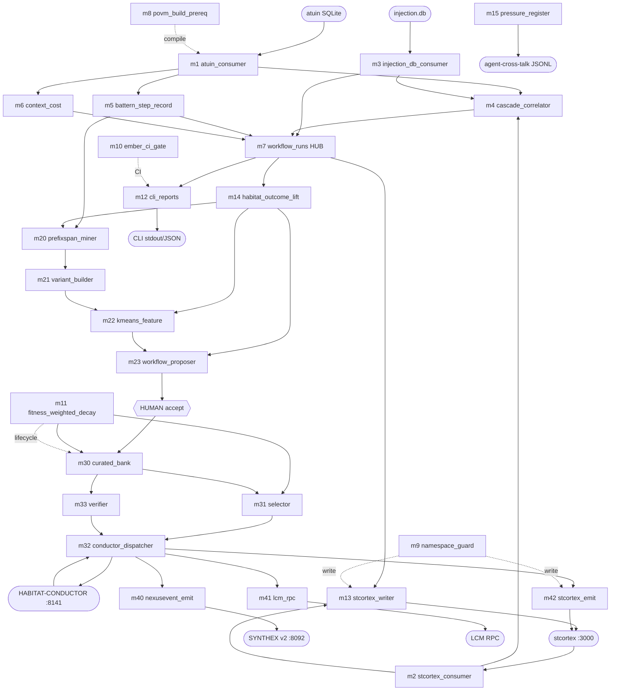

# workflow-trace — Code Module Map

> **Back to:** [`README.md`](../README.md) · [`CLAUDE.md`](../CLAUDE.md) · [`ARCHITECTURE.md`](../ARCHITECTURE.md) · [`ARCHITECTURE_DEEP_DIVE.md`](ARCHITECTURE_DEEP_DIVE.md) · [`META_TREE_MIND_MAP.md`](META_TREE_MIND_MAP.md) · [`ai_specs/MODULE_MATRIX.md`](../ai_specs/MODULE_MATRIX.md) · [`ai_docs/optimisation-v7/ULTRAMAP.md`](optimisation-v7/ULTRAMAP.md)
>
> **Function:** Per-module planned public surface, primary dependencies, hot paths, src/ path (post-G9). Synthesised from [`MODULE_MATRIX`](../ai_specs/MODULE_MATRIX.md) rows + per-module spec frontmatter at `../ai_specs/modules/cluster-{A-H}/m<N>_<name>.md`. Status: planning-only · 0 LOC · all 26 modules at SPEC.

---

## 1. Inter-module dependency DAG



**Reading rule.** Solid edges are compile + runtime call/data dependencies. Dashed edges are aspect-wraps (D woven through everything at compile/write/output/lifecycle).

---

## 2. Per-module catalogue (26 modules)

Each row gives: planned `src/` path · key planned public exports · primary upstream deps · hot path notes · cross-cluster contracts owned/consumed · per-module spec link.

### Cluster A — Substrate Ingest (L1)

| # | Module | src/path | Key planned exports | Upstream | Hot path | CC | Spec |
|---|---|---|---|---|---|---|---|
| 1 | `m1_atuin_consumer` | `src/m1_atuin_consumer/` | `AtuinReader`, `RowIterator`, `Cursor`, `AtuinError` | atuin SQLite | cursor pagination (4k rows / batch) | CC-1, CC-3 (upstream) | [`m1`](../ai_specs/modules/cluster-A/m1_atuin_consumer.md) |
| 2 | `m2_stcortex_consumer` | `src/m2_stcortex_consumer/` | `StcortexConsumer::register`, narrowed `ToolCallReducer`, `ConsumptionReducer`, `Stc2Error` | stcortex :3000 | dedup via reducer callback | CC-2 | [`m2`](../ai_specs/modules/cluster-A/m2_stcortex_consumer.md) |
| 3 | `m3_injection_db_consumer` | `src/m3_injection_db_consumer/` | `InjectionReader`, `CausalChain`, `ResolvedPartition` | injection.db | resolved/unresolved bucket | CC-1 | [`m3`](../ai_specs/modules/cluster-A/m3_injection_db_consumer.md) |

### Cluster B — Habitat Observation (L2)

| # | Module | src/path | Key planned exports | Upstream | Hot path | CC | Spec |
|---|---|---|---|---|---|---|---|
| 4 | `m4_cascade_correlator` | `src/m4_cascade_correlator/` | `CascadeCluster { cluster_id, session_id, step_count }`, `fnv1a_xor`, `CascadeError` | m1, m2, m3 | pairwise correlator over windows | CC-1 (owner), CC-3 | [`m4`](../ai_specs/modules/cluster-B/m4_cascade_correlator.md) |
| 5 | `m5_battern_step_record` | `src/m5_battern_step_record/` | `BatternStep { step_label: Option<_>, … }`, `StepRecorder`, `BatternError` | m1, m3 | append-only ring | CC-3 | [`m5`](../ai_specs/modules/cluster-B/m5_battern_step_record.md) |
| 6 | `m6_context_cost` | `src/m6_context_cost/` | `ContextCostBand { ema_mean, ema_variance, n }`, `EmaWindow::new(20)`, `CostError` | m1, m3 | 20-session EMA (excludes Converged — F10) | CC-1 | [`m6`](../ai_specs/modules/cluster-B/m6_context_cost.md) |

### Cluster C — Correlation + Output (L3)

| # | Module | src/path | Key planned exports | Upstream | Hot path | CC | Spec |
|---|---|---|---|---|---|---|---|
| 7 | `m7_workflow_runs` | `src/m7_workflow_runs/` | `WorkflowRunRow { consumer_inputs: JsonValue, fitness_dimension: f64 NOT NULL }`, `RunHub::insert/select`, `HubError` | m4, m5, m6, m3 | SQLite hub w/ JSONB column F9 zero-weight | CC-1 (hub owner) | [`m7`](../ai_specs/modules/cluster-C/m7_workflow_runs.md) |
| 12 | `m12_cli_reports` | `src/m12_cli_reports/` | `ReportCmd`, `JsonReport`, `HumanReport` (Ember-gated), `ReportError` | m7 | clap subcommands | — | [`m12`](../ai_specs/modules/cluster-C/m12_cli_reports.md) |
| 13 | `m13_stcortex_writer` | `src/m13_stcortex_writer/` | `StcortexWriter::write_with_band(band: LtpLtdBand)`, `JsonlBuffer`, `WriterError` | m7, m2 | 3-band LTP/LTD gate; JSONL deferred buffer | CC-2, CC-5 | [`m13`](../ai_specs/modules/cluster-C/m13_stcortex_writer.md) |

### Cluster D — Trust ASPECT (L4 cross-cutting; ships Day 1)

| # | Module | src/path | Key planned exports | Upstream | Hot path | CC | Spec |
|---|---|---|---|---|---|---|---|
| 8 | `m8_povm_build_prereq` | `build.rs` + `src/m8_povm_build_prereq/` | `cargo:rustc-cfg=povm_calibrated`, `compile_error!` guard, `BuildPrereqError` | env var | one-shot at `cargo check` | CC-2 | [`m8`](../ai_specs/modules/cluster-D/m8_povm_build_prereq.md) |
| 9 | `m9_watcher_namespace_guard` | `src/m9_watcher_namespace_guard/` | `assert_namespace`, `WORKFLOW_TRACE_PREFIX`, `NamespaceError` | namespace.rs constants | runtime assert on write paths | CC-2 (Gap 3) | [`m9`](../ai_specs/modules/cluster-D/m9_watcher_namespace_guard.md) |
| 10 | `m10_ember_ci_gate` | `src/m10_ember_ci_gate/` | `EmberRubric`, `verdict()`, `EmberError` | Ember 7-trait rubric | CI step | CC-2 | [`m10`](../ai_specs/modules/cluster-D/m10_ember_ci_gate.md) |
| 11 | `m11_fitness_weighted_decay` | `src/m11_fitness_weighted_decay/` | `DecayFactor`, `compute_decay_factor`, `SunsetPhase`, `SunsetStats`, `run_consolidation_cycle`, `DecayError` | m7, m14, stcortex weight | periodic cycle (cron-driven) | CC-2 (Gap 2 NEW PRIMITIVE) | [`m11`](../ai_specs/modules/cluster-D/m11_fitness_weighted_decay.md) |

### Cluster E — Evidence + Pressure (L5)

| # | Module | src/path | Key planned exports | Upstream | Hot path | CC | Spec |
|---|---|---|---|---|---|---|---|
| 14 | `m14_habitat_outcome_lift` | `src/m14_habitat_outcome_lift/` | `Lift { value, ci_lo, ci_hi }`, `compute_lift(samples) -> Option<Lift>` (None if n<20), `LiftError` | m7 | Wilson 95% CI not Wald | CC-3 (owner) | [`m14`](../ai_specs/modules/cluster-E/m14_habitat_outcome_lift.md) |
| 15 | `m15_pressure_register` | `src/m15_pressure_register/` | `PressureEvent`, `emit_jsonl_one_file`, `PressureKind`, `PressureError` | runtime triggers | atomic write+rename, one-event-per-file | CC-7 (owner) | [`m15`](../ai_specs/modules/cluster-E/m15_pressure_register.md) |

### Cluster F — Iteration KEYSTONE (L6)

| # | Module | src/path | Key planned exports | Upstream | Hot path | CC | Spec |
|---|---|---|---|---|---|---|---|
| 20 | `m20_prefixspan_miner` | `src/m20_prefixspan_miner/` | `PrefixSpan::mine(sequences, min_support)`, `Pattern`, `SupportCount`, `MinerError` | m5 (battern), m14 (lift) | sequential pattern mining over 10k rows (~2s target) | CC-4, CC-3 (Gap 1) | [`m20`](../ai_specs/modules/cluster-F/m20_prefixspan_miner.md) |
| 21 | `m21_variant_builder` | `src/m21_variant_builder/` | `Variant`, `levenshtein_normalised`, `top_k_by_distance`, `BuilderError` | m20 | top-K-by-distance N=3 | CC-4 (Gap 1) | [`m21`](../ai_specs/modules/cluster-F/m21_variant_builder.md) |
| 22 | `m22_kmeans_feature` | `src/m22_kmeans_feature/` | `FeatureVector`, `KMeans::cluster(k)`, `ClusterAssignment`, `KMeansError` | m21, m14 | NOT PrefixSpan — feature vectors | CC-3, CC-4 (Gap 1) | [`m22`](../ai_specs/modules/cluster-F/m22_kmeans_feature.md) |
| 23 | `m23_workflow_proposer` | `src/m23_workflow_proposer/` | `WorkflowProposal`, `ProposalBuilder::build()` (gated on `Lift::Some`), `Confidence`, `ProposalError::LiftEvidenceMissing` | m22, m14 | gradient-preservation; n≥5 deviation-relaxed | CC-4 (Gap 1) | [`m23`](../ai_specs/modules/cluster-F/m23_workflow_proposer.md) |

### Cluster G — Bank · Select · Dispatch · Verify (L7)

| # | Module | src/path | Key planned exports | Upstream | Hot path | CC | Spec |
|---|---|---|---|---|---|---|---|
| 30 | `m30_curated_bank` | `src/m30_curated_bank/` | `BankEntry { workflow_id, escape_surface: EscapeSurfaceProfile, definition_hash, sunset_at }`, `admit_workflow(accepted_by: HumanAcceptanceSignature)`, `BankError` | m23 (accepted), m11 (decay) | SQLite bank; NEVER auto-promote (F5) | CC-4, CC-5 (Gap 3) | [`m30`](../ai_specs/modules/cluster-G/m30_curated_bank.md) |
| 31 | `m31_selector` | `src/m31_selector/` | `SelectedWorkflow { composite_score }`, `score = 0.40·fitness + 0.25·recency + 0.20·frequency + 0.15·diversity`, `SelectorError` | m30, m11, m14 | composite per cycle | CC-4, CC-5 | [`m31`](../ai_specs/modules/cluster-G/m31_selector.md) |
| 32 | `m32_conductor_dispatcher` | `src/m32_conductor_dispatcher/` | `Dispatcher::dispatch(SelectedWorkflow)`, `DispatchOutcome`, 5-check sequence, `DispatchError` | m31, m9, m33 | <50ms 5-check; refuse-mode on any fail | CC-4, CC-6 (Gap 3) | [`m32`](../ai_specs/modules/cluster-G/m32_conductor_dispatcher.md) |
| 33 | `m33_verifier` | `src/m33_verifier/` | `VerifyResult { verdict, ttl_expires_at, definition_hash }`, `verify(workflow_id) -> {PASS, FAIL, DEGRADED}`, `VerifyError` | m30 | 4-agent gate; 7-day TTL | CC-6 (owner) | [`m33`](../ai_specs/modules/cluster-G/m33_verifier.md) |

### Cluster H — Substrate Feedback (L8)

| # | Module | src/path | Key planned exports | Upstream | Hot path | CC | Spec |
|---|---|---|---|---|---|---|---|
| 40 | `m40_nexusevent_emit` | `src/m40_nexusevent_emit/` | `NexusEvent::WorkflowEvent::Run`, `OutboxJsonl`, `emit_best_effort`, `NexusError` | m32 outcome | outbox-first JSONL → SYNTHEX :8092 | CC-5 | [`m40`](../ai_specs/modules/cluster-H/m40_nexusevent_emit.md) |
| 41 | `m41_lcm_rpc` | `src/m41_lcm_rpc/` | `LcmRouter::route(deploy_shaped)`, `lcm.loop.create {max_iters: 1}`, `LcmError` | m32 outcome | reconnect-per-call (no persistent UDS) | CC-5 | [`m41`](../ai_specs/modules/cluster-H/m41_lcm_rpc.md) |
| 42 | `m42_stcortex_emit` | `src/m42_stcortex_emit/` | `StcortexEmitter::reinforce(workflow, fitness_delta)`, fitness_delta ∈ `{+0.25, +0.15, −0.05, −0.10}`, `EmitError` | m32 outcome, m13 | stcortex-ONLY (POVM DECOUPLED per 2026-05-17 ADR) | CC-5 | [`m42`](../ai_specs/modules/cluster-H/m42_stcortex_emit.md) |

---

## 3. `workflow_core` library (in-crate)

Per [Genesis v1.3 § 1](GENESIS_PROMPT_V1_3.md) and [G2-consolidation](optimisation-v7/GENERATIONS/G2-consolidation.md) § Canonical src/ layout, `workflow_core` lives in `src/lib.rs` (NOT a separate workspace member):

| File | Contents |
|---|---|
| `src/lib.rs` | Public re-exports; declares all 26 `m<N>_<name>` modules + cluster grouping comments |
| `src/types.rs` | Newtypes: `SessionId(Uuid)`, `ConsumerId(String)`, `WorkflowId(String)`, `PaneId(String)`, `Confidence(f64)`, `DecayFactor(f64)` |
| `src/schemas.rs` | JSON schemas: `NexusEvent`, `WorkflowRunRow`, `EscapeSurfaceProfile`, `BankEntry`, `VerifyResult` |
| `src/namespace.rs` | AP30 constants: `WORKFLOW_TRACE_PREFIX = "workflow_trace_"`; helper `is_workflow_trace_namespace(s: &str) -> bool` |
| `src/errors.rs` | thiserror taxonomy — see [`ERROR_TAXONOMY.md`](ERROR_TAXONOMY.md) for full per-cluster breakdown |

---

## 4. Binary entry points

| Binary | Path | Owned modules | Purpose |
|---|---|---|---|
| `wf-crystallise` | `src/bin/wf-crystallise/main.rs` | m1-m23 + m40-m42 (18 modules) | Read-heavy: ingest + observation + correlation + iteration + substrate feedback emit |
| `wf-dispatch` | `src/bin/wf-dispatch/main.rs` | m30-m33 (4 modules) | Curated bank + selector + Conductor dispatcher + 4-agent verifier |

CLI subcommand surface (planned):

```
wf-crystallise observe          # one-shot read + correlate + write to m7 hub
wf-crystallise propose          # mine + variant + cluster + propose (m20-m23)
wf-crystallise propose accept <id>   # human accept boundary (F5 mitigation)
wf-crystallise report [--json]  # m12 CLI reports
wf-dispatch verify <name>       # m33 4-agent verifier
wf-dispatch select              # m31 selector preview
wf-dispatch dispatch <name>     # m32 5-check + Conductor dispatch
```

---

## 5. Feature gate matrix

Per [`CLAUDE.md`](../CLAUDE.md) and [`plan.toml`](../plan.toml):

```toml
[features]
default      = ["full"]
full         = ["api", "intelligence", "monitoring", "evolution"]
api          = []   # m12 reports, m32 dispatch CLI surface
intelligence = []   # m14, m15 evidence + m20-m23 iteration
monitoring   = []   # m40, m41, m42 substrate feedback
evolution    = []   # m11 lifecycle/sunset decay
```

**Cluster D is NOT feature-gated** — aspect-layer invariants every other module routes through. m8's `cargo:rustc-cfg=povm_calibrated` is env-only (not a Cargo feature) so it cannot be bypassed by `--features full`.

---

## 6. Test budget per module (synthesised)

| Cluster | Modules | Min tests each | Cluster total |
|---|---|---|---|
| A | m1, m2, m3 | 50 each | 150 |
| B | m4, m5, m6 | 60 each | 180 |
| C | m7 (70), m12, m13 (60 each) | varies | 190 |
| D | m8, m9, m10 (50-60), m11 (70 — Gap 2 property + mutation) | varies | 240 |
| E | m14 (70 — Wilson property), m15 (60) | varies | 130 |
| F | m20 (75-90 — KEYSTONE), m21-m23 (60-65 each) | varies | 255-300 |
| G | m30-m33 (70-80 each — integration heavy) | varies | 290 |
| H | m40-m42 (60-70 each — async) | varies | 190 |
| **Total** | **26** | min 50 | **~1,562-1,599** |

Top-1% norm per [`STANDARDS/TEST_DISCIPLINE.md`](optimisation-v7/STANDARDS/TEST_DISCIPLINE.md).

---

## 7. Cross-references

- **Per-module specs:** `../ai_specs/modules/cluster-{A-H}/m<N>_<name>.md` (8 cluster directories)
- **Cluster plans:** [`ai_docs/optimisation-v7/MODULE_PLANS/cluster-{A-H}.md`](optimisation-v7/MODULE_PLANS/)
- **Cross-cluster contracts:** [`CROSS_CLUSTER_SYNERGIES.md`](optimisation-v7/MODULE_PLANS/CROSS_CLUSTER_SYNERGIES.md)
- **Boilerplate provenance:** [`BOILERPLATE_INDEX.md`](../the-workflow-engine-vault/boilerplate%20modules/BOILERPLATE_INDEX.md)
- **Runtime topology:** [`ARCHITECTURE_DEEP_DIVE.md`](ARCHITECTURE_DEEP_DIVE.md)
- **Mind map view:** [`META_TREE_MIND_MAP.md`](META_TREE_MIND_MAP.md)
- **Error taxonomy:** [`ERROR_TAXONOMY.md`](ERROR_TAXONOMY.md)

> **Back to:** [`ARCHITECTURE.md`](../ARCHITECTURE.md) · [`ai_specs/MODULE_MATRIX.md`](../ai_specs/MODULE_MATRIX.md) · [`ULTRAMAP.md`](optimisation-v7/ULTRAMAP.md)

*CODE_MODULE_MAP authored 2026-05-17 (S1001982) by Command. Synthesised from MODULE_MATRIX + per-module spec frontmatter; preserves m42 POVM-decoupled fact + Cluster D Day-1 ordering + unpadded `m1-m42` naming (OI-4).*
