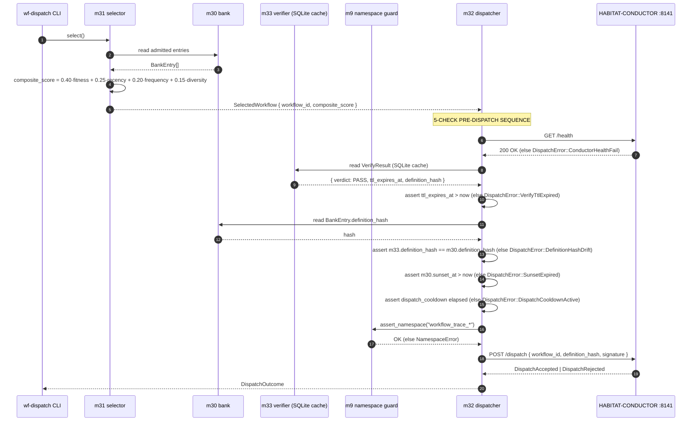

# workflow-trace — Message Flows

> **Back to:** [`README.md`](../README.md) · [`CLAUDE.md`](../CLAUDE.md) · [`ARCHITECTURE_DEEP_DIVE.md`](ARCHITECTURE_DEEP_DIVE.md) · [`CODE_MODULE_MAP.md`](CODE_MODULE_MAP.md) · [`ERROR_TAXONOMY.md`](ERROR_TAXONOMY.md) · [`CROSS_CLUSTER_SYNERGIES.md`](optimisation-v7/MODULE_PLANS/CROSS_CLUSTER_SYNERGIES.md)
>
> **Function:** Full cross-cluster + cross-service message envelopes. Module-to-module calls are in-process Rust function calls; bridge calls are HTTP (JSON), SQLite (direct), JSON-RPC (UDS), or WebSocket (stcortex SDK). Status: planning-only · 0 LOC.

---

## 1. Pipeline summary

The end-to-end engine cycle is **one read pass + one iterate pass + one optional dispatch pass + one feedback pass**:

```
[L0 substrates] ─► [m1/m2/m3 ingest] ─► [m4/m5/m6 observation] ─► [m7 hub]
                                                                       │
                                                                       ▼
                                                                  [m14 lift]
                                                                       │
                                                                       ▼
                                                            [m20→m21→m22→m23 iteration]
                                                                       │
                                                                       ▼
                                                            [wf-crystallise propose accept]  ← HUMAN
                                                                       │
                                                                       ▼
                                                            [m30 admit → m33 verify → m31 select → m32 dispatch]
                                                                       │
                                                                       ▼
                                                            [HABITAT-CONDUCTOR :8141]
                                                                       │
                                                                       ▼
                                                            [m40/m41/m42 substrate feedback emit]
                                                                       │
                                                                       ▼
                                                            [SYNTHEX/LCM/stcortex]
                                                                       │
                                                                       ▼
                                                            [next cycle m31 reads updated weights]   (CC-5 loop)
```

---

## 2. Read path — substrate ingest to m7 hub

```
m1                m4                  m7
 |                 |                   |
 |  AtuinRow[]     |                   |
 |---------------->|                   |
 |                 |  CascadeCluster   |
 |                 |   { cluster_id,   |
 |                 |     session_id,   |
 |                 |     step_count }  |
 |                 |------------------>|
 |                 |                   |  INSERT INTO workflow_runs
 |                 |                   |    ( session_id, cluster_id,
 |                 |                   |      step_count, consumer_inputs JSONB,
 |                 |                   |      fitness_dimension REAL NOT NULL,
 |                 |                   |      last_run_at )
 |                 |                   |  RETURNING run_id

m5                m7
 |                 |
 |  BatternStep    |
 |   { step_label  |
 |     : Option }  |
 |---------------->|
 |                 |  UPSERT JSONB.consumer_inputs.battern

m6                m7
 |                 |
 | ContextCostBand |
 |  { ema_mean,    |
 |    ema_var, n } |  (n<20 → write band with caveat)
 |---------------->|
 |                 |  UPSERT JSONB.consumer_inputs.cost_band
```

**Wire formats (in-process Rust):**

```rust
// m4 → m7
struct CascadeCluster {
    cluster_id: u64,             // FNV-1a XOR opaque (F11 opaque IDs)
    session_id: SessionId,
    step_count: u32,
}

// m5 → m7
struct BatternStep {
    session_id: SessionId,
    step_index: u32,
    step_label: Option<String>,  // unlabelled preserved (F-discipline)
    ts_ms: u64,
}

// m6 → m7
struct ContextCostBand {
    session_type: SessionType,
    ema_mean: f64,
    ema_variance: f64,
    n: u32,                       // excludes Converged outcomes (F10)
}

// m7 → SQLite
struct WorkflowRunRow {
    run_id: WorkflowId,
    session_id: SessionId,
    cluster_id: u64,
    step_count: u32,
    consumer_inputs: serde_json::Value,   // JSONB join surface (CC-1)
    fitness_dimension: f64,                // NOT NULL DEFAULT 0.0 (F9)
    last_run_at: i64,                      // unix ms
}
```

---

## 3. Iteration path — m7 → m20 → m21 → m22 → m23

```
m7                m14                 m20                  m21               m22                m23
 |                 |                   |                    |                  |                  |
 | SELECT          |                   |                    |                  |                  |
 |  rows WHERE     |                   |                    |                  |                  |
 |  session group  |                   |                    |                  |                  |
 |---------------->|                   |                    |                  |                  |
 |                 | compute_lift()    |                    |                  |                  |
 |                 |  ─► Option<Lift>  |                    |                  |                  |
 |                 |  (None if n<20)   |                    |                  |                  |
 |                 |------------------>|                    |                  |                  |
 |                 |                   | mine(sequences,    |                  |                  |
 |                 |                   |   min_support)     |                  |                  |
 |                 |                   |  ─► Pattern[]      |                  |                  |
 |                 |                   |  (gated on Lift)   |                  |                  |
 |                 |                   |------------------->|                  |                  |
 |                 |                   |                    | top_k_by_dist    |                  |
 |                 |                   |                    |  (Levenshtein    |                  |
 |                 |                   |                    |   N=3)           |                  |
 |                 |                   |                    |  ─► Variant[]    |                  |
 |                 |                   |                    |----------------->|                  |
 |                 |                   |                    |                  | KMeans::cluster  |
 |                 |                   |                    |                  |  ─► Cluster[]    |
 |                 |                   |                    |                  |----------------->|
 |                 |                   |                    |                  |                  | ProposalBuilder::build()
 |                 |                   |                    |                  |                  |  let lift = self.lift
 |                 |                   |                    |                  |                  |    .ok_or(ProposalError
 |                 |                   |                    |                  |                  |        ::LiftEvidenceMissing)?;
 |                 |                   |                    |                  |                  |  ─► WorkflowProposal
```

---

## 4. Human accept boundary (F5 mitigation)

```
m23                       wf-crystallise CLI                   m30
 |                                |                              |
 |  WorkflowProposal[]            |                              |
 |  (write to review queue)       |                              |
 |------------------------------->|                              |
 |                                |  $ wf-crystallise propose ls |
 |                                |  ───► list proposals         |
 |                                |                              |
 |                                |  $ wf-crystallise propose accept <id>
 |                                |                              |
 |                                |  admit_workflow(             |
 |                                |    proposal_id,              |
 |                                |    accepted_by:              |
 |                                |      HumanAcceptanceSignature)
 |                                |----------------------------->|
 |                                |                              |  INSERT INTO bank
 |                                |                              |   (workflow_id,
 |                                |                              |    escape_surface,
 |                                |                              |    definition_hash,
 |                                |                              |    sunset_at,
 |                                |                              |    accepted_by NOT NULL)
 |                                |                              |  RETURNING BankEntry
```

**Discipline.** `accepted_by` is a NOT NULL column. Any insert path that passes `accepted_by = "auto"` or NULL fails the column constraint AND is caught by `m30::BankError::AutoPromotionAttempted`. This is **structural** — there is no code path that auto-promotes a proposal.

---

## 5. The m32 5-check pre-dispatch sequence (sequenceDiagram)



**Refuse-mode discipline.** ANY of the 5 checks failing returns a typed `DispatchError`. m32 NEVER panics, NEVER exits the process. The CLI surface returns non-zero exit and a structured error to stderr. Watcher Class-C is pre-positioned at every refusal — refusing is correct behaviour, not failure.

---

## 6. m23 → m30 operator-review handoff (sequenceDiagram)

```mermaid
sequenceDiagram
    autonumber
    participant M23 as m23 proposer
    participant Q as review queue (JSONL)
    participant Op as Operator (Luke / Watcher / Zen)
    participant CLI as wf-crystallise CLI
    participant M30 as m30 bank
    participant M15 as m15 pressure register

    M23->>M23: ProposalBuilder::build()
    Note right of M23: lift = self.lift<br/>.ok_or(LiftEvidenceMissing)?;<br/>deviation_n ≥ 5 check
    M23->>Q: write WorkflowProposal JSONL
    Q->>Op: surface for review
    Op->>CLI: wf-crystallise propose ls
    CLI-->>Op: proposals[]
    alt Operator accepts
        Op->>CLI: wf-crystallise propose accept <id>
        CLI->>M30: admit_workflow(accepted_by: HumanAcceptanceSignature)
        M30-->>CLI: BankEntry { workflow_id, escape_surface, sunset_at }
    else Operator rejects
        Op->>CLI: wf-crystallise propose reject <id> --reason "..."
        CLI->>M15: emit PressureEvent { kind: ProposalRejected }
        Note right of M15: One JSONL file per event<br/>~/projects/shared-context/<br/>agent-cross-talk/<br/>PHASE-B-RESERVATION-NOTICE-*.jsonl
    end
```

---

## 7. CC-5 substrate-feedback path

```
m32              m40             outbox          SYNTHEX :8092      stcortex :3000      m31 (next cycle)
 |                |                |                  |                    |                    |
 | DispatchOutcome|                |                  |                    |                    |
 |--------------->|                |                  |                    |                    |
 |                | write JSONL    |                  |                    |                    |
 |                |--------------->|                  |                    |                    |
 |                |                | POST             |                    |                    |
 |                |                | /v3/nexus/push   |                    |                    |
 |                |                |  { event: "Run",|                    |                    |
 |                |                |    workflow_id, |                    |                    |
 |                |                |    outcome }    |                    |                    |
 |                |                |----------------->|                    |                    |
 |                |                |   200 OK         |                    |                    |
 |                |                |<-----------------|                    |                    |
 |
 | (fan-out to m41)                                                        |                    |
 |---► LCM { lcm.loop.create, max_iters: 1 } (deploy-shaped only)         |                    |
 |
 | (fan-out to m42)                                                        |                    |
 |---► m42 stcortex emit                                                   |                    |
 |       ─► outbox/m42/*.jsonl                                              |                    |
 |       ─► call stcortex reducer "reinforce_pathway"                       |                    |
 |              { pathway_id: "workflow_trace_<id>",                        |                    |
 |                fitness_delta: +0.25 | +0.15 | -0.05 | -0.10 }            |                    |
 |       ──────────────────────────────────────────────────────────────────►|                    |
 |                                                                          | UPDATE pathway     |
 |                                                                          | SET weight=weight  |
 |                                                                          |   + fitness_delta  |
 |                                                                                                |
 |   (intentionally slow — days/weeks for next selection cycle to read updated weights)          |
 |                                                                                                |
 |                                                                          read pathway.weight  |
 |                                                                          <-------------------- |
```

**fitness_delta encoding** (per Phase 5 doc):

| Outcome | fitness_delta | Notes |
|---|---|---|
| `PassVerified` | +0.25 | strong LTP |
| `Pass` | +0.15 | weak LTP |
| `Degraded` | −0.05 | weak LTD |
| `Fail` | −0.10 | strong LTD |

**Per 2026-05-17 ADR** — m42 routes to stcortex ONLY. POVM dual-path retired. No silent fallback if stcortex unreachable; spill to outbox + alert. CC-5 semantic preserved 1:1.

---

## 8. m33 verifier 4-agent fan-out

```
m33 verifier
   |
   ├──► silent-failure-hunter agent      ─► verdict
   ├──► security-auditor agent           ─► verdict
   ├──► performance-engineer agent       ─► verdict
   └──► zen agent                        ─► verdict
                                                |
                                                ▼
                          quorum compute (3-of-4 PASS = PASS; split = DEGRADED)
                                                |
                                                ▼
                          VerifyResult {
                              verdict: PASS | FAIL | DEGRADED,
                              ttl_expires_at: now + 7d,
                              definition_hash: FNV-1a(steps_json),
                          }
                                                |
                                                ▼
                          INSERT INTO verify_cache (workflow_id, …) ON CONFLICT UPDATE
```

---

## 9. m15 pressure register → agent-cross-talk (CC-7)

```
runtime trigger (forbidden-verb dispatch attempt | sample-size relaxation pressure |
                  scope-relaxation pressure | handshake silence | escape-surface escalation)
   |
   ▼
m15::emit_jsonl_one_file({ kind, context, ts, event_id })
   |
   ▼  atomic tmp + rename
   ~/projects/shared-context/agent-cross-talk/
   PHASE-B-RESERVATION-NOTICE-{ts}_{event_id}.jsonl
   |
   ├──► Watcher tick observes (file watcher + cadence)
   |     └──► classify; if accumulation threshold reached:
   |          ─► ~/.local/bin/watcher notify (WCP notice)
   |
   └──► Zen audit tick observes (G7-style cadence)
         └──► if forbidden-verb pattern:
              ─► file AUDIT-REQUEST drop in agent-cross-talk/
                       |
                       ▼
              Luke deliberation (out of engine)
                       |
                       ▼
              v1.4 / v1.5 spec amendment authored
                       |
                       ▼
              G7 re-audit
                       |
                       ▼
              merge → m1.config (cursor, scope filters) updated
                       |
                       ▼  next session
              loop continues with new constraints
```

---

## 10. Bridge message formats (external services)

### 10.1 HTTP JSON — HABITAT-CONDUCTOR (m32)

```http
POST http://localhost:8141/dispatch HTTP/1.1
Content-Type: application/json

{
  "workflow_id": "workflow_trace_proposal_42",
  "definition_hash": "fnv1a64:0xa3f9c2d1e7b8045f",
  "escape_surface": "BoundedFilesystem",
  "signature": "human:luke@2026-05-17T16:00Z"
}
```

### 10.2 HTTP JSON — SYNTHEX v2 NexusEvent (m40)

```http
POST http://localhost:8092/v3/nexus/push HTTP/1.1
Content-Type: application/json

{
  "type": "WorkflowEvent.Run",
  "workflow_id": "workflow_trace_proposal_42",
  "outcome": "PassVerified",
  "ts_ms": 1739803200000,
  "namespace": "workflow_trace_"
}
```

**TRAP — serde `rename = "type"`.** Rust `type` is a keyword; serde rename most likely silent failure mode. m40 spec covers this. Pre-deploy verify must POST a known payload and assert 2xx + correct echo.

### 10.3 JSON-RPC over UDS — LCM (m41)

```jsonrpc
→ { "jsonrpc": "2.0",
    "method": "lcm.loop.create",
    "params": { "max_iters": 1, "workflow_id": "workflow_trace_proposal_42" },
    "id": 1 }

← { "jsonrpc": "2.0",
    "result": { "loop_id": "lcm_loop_8af3", "status": "queued" },
    "id": 1 }
```

**Discipline.** `max_iters: 1` is the ONLY accepted value (we are NOT `lcm.deploy`). Anything else → `LcmError::MaxItersInvalid`.

### 10.4 stcortex WebSocket reducer call (m13 + m42)

```text
client → stcortex   call_reducer("reinforce_pathway",
                                  { pathway_id: "workflow_trace_proposal_42",
                                    fitness_delta: 0.25 })
stcortex → client   ReducerCallResult { success: true, energy_delta: ... }
```

**Discipline.** All `pathway_id` and namespace strings MUST match `^workflow_trace_` (AP30 enforced by m9 namespace guard).

---

## 11. CLI surface flows

### 11.1 `wf-crystallise observe`

```
wf-crystallise observe [--since=24h] [--dry-run]
   |
   ├─ m1 atuin read
   ├─ m2 stcortex narrowed read
   ├─ m3 injection.db read
   ├─ m4 cascade correlate
   ├─ m5 battern record
   ├─ m6 cost compute
   └─ m7 insert (unless --dry-run)
```

### 11.2 `wf-crystallise propose`

```
wf-crystallise propose [--accept=<id>] [--reject=<id> --reason=...]
   |
   ├─ m14 lift compute (read m7)
   ├─ m20 PrefixSpan mine
   ├─ m21 variant build
   ├─ m22 K-means cluster
   ├─ m23 proposer (gated on lift evidence)
   └─ write to review queue OR admit to m30 (--accept path)
```

### 11.3 `wf-dispatch verify <workflow>`

```
wf-dispatch verify <workflow>
   |
   ├─ m33 fan-out to 4 verifier agents
   ├─ quorum compute
   ├─ INSERT verify_cache (TTL 7d)
   └─ stdout PASS | FAIL | DEGRADED
```

### 11.4 `wf-dispatch dispatch <workflow>`

```
wf-dispatch dispatch <workflow>
   |
   ├─ m31 select
   ├─ m32 5-check pre-dispatch sequence
   ├─ Conductor POST /dispatch
   └─ fan-out to m40/m41/m42 (CC-5)
```

---

## 12. Cross-references

- **Per-cluster contracts (CC-1..CC-7):** [`CROSS_CLUSTER_SYNERGIES.md`](optimisation-v7/MODULE_PLANS/CROSS_CLUSTER_SYNERGIES.md)
- **Runtime topology:** [`ARCHITECTURE_DEEP_DIVE.md`](ARCHITECTURE_DEEP_DIVE.md)
- **Error taxonomy:** [`ERROR_TAXONOMY.md`](ERROR_TAXONOMY.md)
- **State machines:** [`STATE_MACHINES.md`](STATE_MACHINES.md)
- **Per-module specs:** `../ai_specs/modules/cluster-{A-H}/m<N>_<name>.md`

> **Back to:** [`README.md`](../README.md) · [`CLAUDE.md`](../CLAUDE.md) · [`ARCHITECTURE_DEEP_DIVE.md`](ARCHITECTURE_DEEP_DIVE.md) · [`CROSS_CLUSTER_SYNERGIES.md`](optimisation-v7/MODULE_PLANS/CROSS_CLUSTER_SYNERGIES.md)

*MESSAGE_FLOWS authored 2026-05-17 (S1001982) by Command. m32 5-check sequenceDiagram + m23→m30 operator-review handoff sequenceDiagram + CC-5 substrate feedback path; preserves m42 POVM-decoupled (no silent fallback) and serde rename = "type" trap.*
