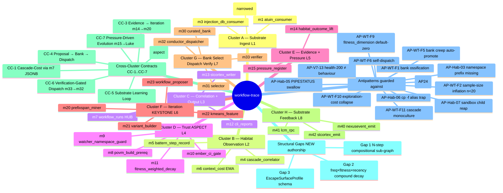

# workflow-trace — Meta Tree Mind Map

> **Back to:** [`README.md`](../README.md) · [`CLAUDE.md`](../CLAUDE.md) · [`ARCHITECTURE.md`](../ARCHITECTURE.md) · [`CODE_MODULE_MAP.md`](CODE_MODULE_MAP.md) · [`ULTRAMAP.md`](optimisation-v7/ULTRAMAP.md) · [`plan.toml`](../plan.toml)
>
> **Function:** Conceptual cartography of the project. workflow-trace at root; 8 clusters as branches; 26 modules as leaves; 7 CC contracts as cross-edges; 3 structural gaps as marker nodes; 13 antipatterns as warning leaves. Source-of-truth for the architecture-as-concept-tree view. Status: planning-only · 0 LOC.

---

## 1. Identity manifest

```
name              = workflow-trace
version           = 0.0.0-spec.0
edition           = 2021
rust_version      = 1.83
binary_count      = 2 (wf-crystallise, wf-dispatch)
lib_in_crate      = workflow_core (in src/lib.rs)
port              = 8190 (reserved; CLI-not-service for Phase 5A)
service_id        = TBD (G2 rename gate)
devenv_batch      = TBD (CLI not service)
health_path       = n/a (CLI; semantic probes only — AP-V7-13)
binding_spec      = ai_docs/GENESIS_PROMPT_V1_3.md
canonical_ultramap = ai_docs/optimisation-v7/ULTRAMAP.md
status            = PLANNING-ONLY · HOLD-v2 active · G9 NOT FIRED · 0 LOC
gate_chain        = check → clippy → pedantic → test (zero tolerance, PIPESTATUS per stage)
quality_lints     = unwrap=deny, unsafe=forbid, pedantic=deny
test_budget       = 1599 (top-1% norm)
authority         = Luke @ node 0.A
gap_authorship    = 3 net-new (Gap 1 PrefixSpan KEYSTONE, Gap 2 freq×fitness×recency, Gap 3 EscapeSurfaceProfile)
boilerplate_reuse = ~65% from 48 source clones in the-workflow-engine-vault/boilerplate modules/
m42_substrate     = stcortex-ONLY (POVM DECOUPLED per 2026-05-17 ADR)
```

---

## 2. Mindmap (Mermaid)



---

## 3. Layer tree (textual)

```
workflow-trace/
│
├── L0 Substrate Frame (external · observed not authored)
│    atuin · stcortex · injection.db · SYNTHEX :8092 · LCM · Conductor :8141 · Watcher
│
├── L1 Cluster A — Substrate Ingest
│    ├── m1 atuin_consumer            src/m1_atuin_consumer/
│    ├── m2 stcortex_consumer         src/m2_stcortex_consumer/
│    └── m3 injection_db_consumer     src/m3_injection_db_consumer/
│
├── L2 Cluster B — Habitat Observation
│    ├── m4 cascade_correlator        src/m4_cascade_correlator/
│    ├── m5 battern_step_record       src/m5_battern_step_record/
│    └── m6 context_cost              src/m6_context_cost/
│
├── L3 Cluster C — Correlation + Output  [feature: api]
│    ├── m7 workflow_runs HUB         src/m7_workflow_runs/
│    ├── m12 cli_reports              src/m12_cli_reports/
│    └── m13 stcortex_writer          src/m13_stcortex_writer/
│
├── L4 Cluster D — Trust ASPECT  [ships Day 1; NOT feature-gated]
│    ├── m8 povm_build_prereq         build.rs + src/m8_povm_build_prereq/
│    ├── m9 watcher_namespace_guard   src/m9_watcher_namespace_guard/
│    ├── m10 ember_ci_gate            src/m10_ember_ci_gate/
│    └── m11 fitness_weighted_decay   src/m11_fitness_weighted_decay/
│
├── L5 Cluster E — Evidence + Pressure  [feature: intelligence]
│    ├── m14 habitat_outcome_lift     src/m14_habitat_outcome_lift/
│    └── m15 pressure_register        src/m15_pressure_register/
│
├── L6 Cluster F — Iteration KEYSTONE  [feature: intelligence]
│    ├── m20 prefixspan_miner         src/m20_prefixspan_miner/
│    ├── m21 variant_builder          src/m21_variant_builder/
│    ├── m22 kmeans_feature           src/m22_kmeans_feature/
│    └── m23 workflow_proposer        src/m23_workflow_proposer/
│
├── L7 Cluster G — Bank / Select / Dispatch / Verify  [feature: api]
│    ├── m30 curated_bank             src/m30_curated_bank/
│    ├── m31 selector                 src/m31_selector/
│    ├── m32 conductor_dispatcher     src/m32_conductor_dispatcher/
│    └── m33 verifier                 src/m33_verifier/
│
├── L8 Cluster H — Substrate Feedback  [feature: monitoring]
│    ├── m40 nexusevent_emit          src/m40_nexusevent_emit/
│    ├── m41 lcm_rpc                  src/m41_lcm_rpc/
│    └── m42 stcortex_emit            src/m42_stcortex_emit/   (POVM DECOUPLED)
│
└── L9 (reserved · intentionally absent — single-phase override partial waive of R6)
```

---

## 4. Verb classes (per ULTRAMAP View 2)

| Verb | Modules | Phase-A status |
|---|---|---|
| **passive (record/ingest)** | m1, m2, m3 (ingest); m4 (correlate); m5, m6 (record); m11 (record); m15 (emit) | clean Phase-A verbs |
| **passive (correlate/emit)** | m7 (record-into-hub); m12 (emit); m13 (emit); m40, m41, m42 (emit) | clean Phase-A verbs |
| **passive (refuse)** | m8, m9, m10 (refuse via gate); m33 (refuse via verdict) | clean Phase-A verbs |
| **active (recommend\*)** | m20, m21, m22, m23 — single-phase override per Genesis v1.3 § 1 | active verb permitted under single-phase override only |
| **active (select/dispatch)** | m30 (record + select); m31 (select); m32 (dispatch) | active verb permitted under single-phase override only |

`*` per [Genesis v1.3 § 1](GENESIS_PROMPT_V1_3.md) — recommend is the Phase-B verb permitted under Luke's 2026-05-17 single-phase override. Risk surface documented in § 4 of the spec.

---

## 5. Cross-edge concept map (CC contracts)

```
                          ┌─────────────────┐
                          │  m11 decay      │◄────┐
                          │  (lifecycle)    │     │ CC-5 read-back
                          └────────┬────────┘     │ (substrate-grain)
                                   │              │
                                   ▼              │
                          ┌─────────────────┐     │
                          │  m31 selector   │─────┤
                          └────────┬────────┘     │
                                   │              │
                                   ▼              │
   CC-4  m23 → human → m30 → m31 → m32 ──► CONDR ─┤
                                   │              │
                                   ▼              │
                          ┌─────────────────┐     │
                          │  m33 verifier   │     │
                          │  (CC-6 cache)   │     │
                          └─────────────────┘     │
                                                  │
                                   m40/m41/m42 ───┤
   CC-3  m14 → m20/m22/m23 ────────────────────────┘ CC-5 substrate-grain loop
                                                    (slow; Hebbian-grain)

   CC-1  m4 ←─ m7 JSONB ─→ m6                       (cluster-internal join)

   CC-2  m8/m9/m10/m11 ····► ALL OTHER MODULES      (aspect-layer woven)

   CC-7  m15 → agent-cross-talk → Watcher/Zen → Luke → spec amendment → m1 config
                                                    (meta-loop; spec-grain evolution)
```

**Distinction.** CC-5 is the **only substrate-grain loop**; failure produces *invisible non-learning*. All other CCs are control-flow grain; failure produces obvious test failures.

---

## 6. Worktree allocation (post-G9 build waves)

| Wave | Worktree | Days | Modules | Lead |
|---|---|---|---|---|
| 1 — Foundation | `wt-l0-core` | 0-3 | workflow_core types/schemas/namespace | Command-2 |
| 1 — Trust ASPECT | `wt-l4-trust` | 0-3 | m8, m9, m10, m11 | Command-2 |
| 1 — Substrate Ingest | `wt-l1-ingest` | 0-3 | m1, m2, m3 | Command-2 |
| 2 — Habitat Observation | `wt-l2-observe` | 3-12 | m4, m5, m6 | Command-2 + rust-pro |
| 2 — Correlation + Output | `wt-l3-central` | 3-12 | m7, m12, m13 | Command-2 + rust-pro |
| 2 — Evidence + Pressure | `wt-l5-evidence` | 3-12 | m14, m15 | Command-2 + rust-pro |
| 3 — KEYSTONE | `wt-l6-keystone` | 12-21 | m20, m21, m22, m23 | Command-2 (m20) + Command-3 (m21) |
| 3 — Dispatch | `wt-l7-dispatch` | 12-21 | m30, m31, m32, m33 | Command-3 (librarian) |
| 3 — Feedback | `wt-l8-feedback` | 12-21 | m40, m41, m42 | Command-2 + rust-pro |

---

## 7. Cross-references

- **Module-by-module surface:** [`CODE_MODULE_MAP.md`](CODE_MODULE_MAP.md)
- **Five-view topology:** [`optimisation-v7/ULTRAMAP.md`](optimisation-v7/ULTRAMAP.md) (Layer Map, Cluster × Module table, Phase × Runbook × Owner, Tooling Integration, Agent × Worktree × Layer)
- **Antipatterns full catalogue:** [`optimisation-v7/ANTIPATTERNS_REGISTER.md`](optimisation-v7/ANTIPATTERNS_REGISTER.md)
- **CC contracts full text:** [`optimisation-v7/MODULE_PLANS/CROSS_CLUSTER_SYNERGIES.md`](optimisation-v7/MODULE_PLANS/CROSS_CLUSTER_SYNERGIES.md)
- **Plan.toml source-of-truth:** [`../plan.toml`](../plan.toml)
- **Stable architecture summary:** [`../ARCHITECTURE.md`](../ARCHITECTURE.md)

> **Back to:** [`README.md`](../README.md) · [`CLAUDE.md`](../CLAUDE.md) · [`ARCHITECTURE.md`](../ARCHITECTURE.md) · [`CODE_MODULE_MAP.md`](CODE_MODULE_MAP.md)

*META_TREE_MIND_MAP authored 2026-05-17 (S1001982) by Command. Concept-tree view; preserves m42 POVM-decoupled fact, Cluster D Day-1 ordering, Gap 1/2/3 NEW-authorship markers, 13 antipatterns as warning leaves.*
