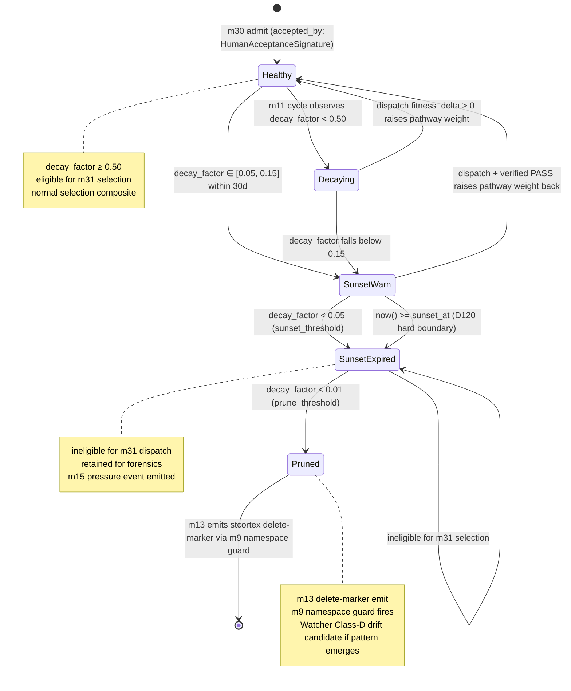
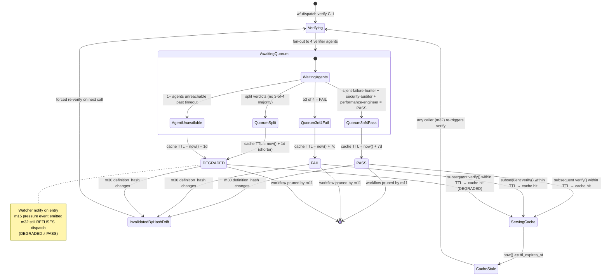

# workflow-trace — State Machines

> **Back to:** [`README.md`](../README.md) · [`CLAUDE.md`](../CLAUDE.md) · [`ARCHITECTURE_DEEP_DIVE.md`](ARCHITECTURE_DEEP_DIVE.md) · [`MESSAGE_FLOWS.md`](MESSAGE_FLOWS.md) · [`ERROR_TAXONOMY.md`](ERROR_TAXONOMY.md) · per-module specs at `../ai_specs/modules/cluster-{A-H}/m<N>_<name>.md`
>
> **Function:** Three interlocking state machines govern runtime behaviour. All states + transitions explicit; persistence + recovery noted. Status: planning-only · 0 LOC.

---

## 1. Sunset lifecycle (m11 fitness-weighted decay)

Governs each `AcceptedWorkflow`'s lifecycle from admission (m30) through prune (m11). This is the **Gap 2 NEW PRIMITIVE** state machine driven by compound decay `decay_factor = base_rate + (1 − base_rate) × clamp(f × fit × r, 0, 1)`.



### 1.1 Transition rules

| From → To | Trigger | Module | Persistence |
|---|---|---|---|
| `[*] → Healthy` | `m30::admit_workflow(accepted_by: HumanAcceptanceSignature)` | m30 | `bank.status = 'admitted'` |
| `Healthy → Decaying` | m11 cycle: `decay_factor < 0.50` | m11 | `bank.decay_factor`, `bank.sunset_phase = 'Decaying'` |
| `Decaying → Healthy` | dispatch PassVerified raises pathway weight; next m11 cycle sees recovery | m32 → m42 → stcortex → m11 | persisted async via CC-5 |
| `Decaying → SunsetWarn` | `decay_factor < 0.15` | m11 | `bank.sunset_phase = 'SunsetWarn'` |
| `SunsetWarn → SunsetExpired` | `decay_factor < 0.05` OR `now() >= sunset_at` | m11 | `bank.sunset_phase = 'SunsetExpired'` |
| `SunsetExpired → Pruned` | `decay_factor < 0.01` (prune_threshold) | m11 | `bank.status = 'pruned'`; m13 emit delete-marker |
| `Pruned → [*]` | m13 stcortex delete-marker emit succeeds | m13 + m9 | row archived to `bank_archive` table |

### 1.2 Sunset_at immutability invariant

Per [`phase-6-sunset-and-cross-cutting`](../the-workflow-engine-vault/deployment%20framework/phase-6-sunset-and-cross-cutting.md):

**`sunset_at` is encoded at deploy time, NOT recalculated at runtime.** Runtime recalculation is how ancestors drifted (BUG-035 class). m11 may modulate `decay_factor` continuously; `sunset_at` is immutable barring formal Luke amendment.

**Bounded extension** — 60-day max × 2 cycles before formal spec amendment required. Luke can extend `sunset_at` once via `wf-dispatch extend <id> --days=60`; second extension requires Watcher + Zen approval; third requires spec amendment via CC-7.

### 1.3 D120 sunset evaluation (Phase 6)

At D120 from initial deploy (Phase 5C end), m11 produces evaluation per workflow:

| Outcome | Action |
|---|---|
| **PASS continue** (`decay_factor ≥ 0.50`) | Workflow remains; new `sunset_at` set per next-cycle policy |
| **FAIL retire** (`decay_factor < 0.05`) | m11 forces Pruned transition; m13 delete-marker emit |
| **DEGRADED Luke-decide** (`decay_factor ∈ [0.05, 0.50]`) | m15 emits PressureEvent; Luke deliberation; spec amendment possibility |

---

## 2. Dispatch 5-check pre-dispatch sequence (m32)

Governs each m32 `Dispatcher::dispatch(SelectedWorkflow)` call. Synchronous; NOT persisted (state transitions are within a single function call, not durable).

```mermaid
stateDiagram-v2
    [*] --> CheckHealth: m31 returns SelectedWorkflow
    CheckHealth --> CheckVerifyTtl: GET :8141/health == 200
    CheckHealth --> RefuseConductorHealthFail: 5xx | timeout | connection refused
    CheckVerifyTtl --> CheckHashMatch: m33.ttl_expires_at > now()
    CheckVerifyTtl --> RefuseVerifyTtlExpired: ttl expired
    CheckHashMatch --> CheckSunset: m33.definition_hash == m30.definition_hash
    CheckHashMatch --> RefuseDefinitionHashDrift: hash mismatch
    CheckSunset --> CheckCooldown: m30.sunset_at > now()
    CheckSunset --> RefuseSunsetExpired: sunset past
    CheckCooldown --> CheckNamespace: dispatch_cooldown elapsed
    CheckCooldown --> RefuseDispatchCooldownActive: cooldown active
    CheckNamespace --> Dispatching: m9.assert_namespace OK
    CheckNamespace --> RefuseNamespaceViolation: AP30 violation
    Dispatching --> DispatchAccepted: Conductor POST /dispatch 2xx
    Dispatching --> RefuseConductorWire: 5xx | wire failure
    DispatchAccepted --> [*]: fan-out to m40/m41/m42 (CC-5)
    RefuseConductorHealthFail --> [*]: typed DispatchError + non-zero CLI exit
    RefuseVerifyTtlExpired --> [*]: typed DispatchError; caller re-runs m33
    RefuseDefinitionHashDrift --> [*]: typed DispatchError; re-verify
    RefuseSunsetExpired --> [*]: typed DispatchError; m30 sunsets entry
    RefuseDispatchCooldownActive --> [*]: typed DispatchError; backoff
    RefuseNamespaceViolation --> [*]: hard refusal; Watcher Class-C
    RefuseConductorWire --> [*]: circuit-break on second failure

    note right of Dispatching
        Refuse-mode is NOT panic
        NOT exit; NEVER silent-success
    end note
```

### 2.1 5-check sequence invariants

1. **Order matters.** Cheap checks first (Conductor health, then cache reads, then namespace guard, then wire call).
2. **Any failure → refuse-mode.** Typed `DispatchError`; CLI returns non-zero; structured error to stderr.
3. **Never panic, never exit, never silent-success.** Refusing is the correct behaviour, not failure. Watcher Class-C is pre-positioned at every refusal.
4. **Cooldown is per-workflow.** A workflow that fires PassVerified does NOT immediately re-dispatch — `dispatch_cooldown` (default 60s) prevents thundering herd.

### 2.2 Refuse-mode error mapping

| Check | Failure error | Recovery |
|---|---|---|
| 1 — Conductor health | `DispatchError::ConductorHealthFail { status }` | Refuse; caller retries after Conductor recovers |
| 2 — VerifyTtl | `DispatchError::VerifyTtlExpired { ttl_expires_at }` | Refuse; caller runs `wf-dispatch verify <name>` first |
| 3 — Hash match | `DispatchError::DefinitionHashDrift { expected, found }` | Refuse; m33 re-verify required |
| 4 — Sunset | `DispatchError::SunsetExpired { sunset_at }` | Refuse; m30 may sunset entry |
| 5 — Cooldown | `DispatchError::DispatchCooldownActive { remaining_ms }` | Refuse; caller waits |
| Namespace | `DispatchError::NamespaceViolation` | Hard refusal; AP-Hab-03 |
| Wire | `DispatchError::ConductorWire { source }` | Retry once; circuit-break on second |

See [`ERROR_TAXONOMY.md`](ERROR_TAXONOMY.md) § 8.3.

### 2.3 B3 blocker — `ConductorDispatchDisabled`

While Conductor Waves 1B/1C/2/3 are `auto_start=false` (B3), the entire 5-check sequence short-circuits at check 1 with `DispatchError::ConductorDispatchDisabled` (per Genesis v1.3 § 2 hard refusals). m32 refuse-mode logs ERROR via `tracing::error!` and exits non-zero on the CLI. NOT panic.

---

## 3. Verifier state (m33 PASS/FAIL/DEGRADED + 7-day TTL)

Governs each `m33::verify(workflow_id)` call and the verifier cache TTL.



### 3.1 Verdict semantics

| Verdict | m32 dispatch behaviour | TTL | Notes |
|---|---|---|---|
| **PASS** | proceed to 5-check (m33 contribution = PASS) | 7d | normal happy path |
| **FAIL** | refuse-mode at 5-check #2 (`VerifyTtlExpired` NOT raised because TTL valid; structural refuse at hash/state level instead) | 7d | NEVER dispatch |
| **DEGRADED** | refuse-mode; Watcher notify; m15 PressureEvent emit; caller may force re-verify | 1d (shorter) | m32 does NOT dispatch DEGRADED |

### 3.2 Hash-drift invalidation

If `m30.definition_hash` changes (because m30 entry was modified post-verify), the verify cache for that workflow is immediately invalidated regardless of TTL. m32's check 3 catches this AND m33's cache-read path catches this — defence in depth.

### 3.3 Persistence

Verifier cache lives in SQLite `verify_cache` table:

```sql
CREATE TABLE verify_cache (
    workflow_id        TEXT PRIMARY KEY,
    verdict            TEXT NOT NULL CHECK (verdict IN ('PASS', 'FAIL', 'DEGRADED')),
    definition_hash    TEXT NOT NULL,
    ttl_expires_at     INTEGER NOT NULL,  -- unix ms
    verified_at        INTEGER NOT NULL,
    quorum_detail      TEXT NOT NULL      -- JSON: per-agent verdict
);
CREATE INDEX idx_verify_ttl ON verify_cache(ttl_expires_at);
```

---

## 4. Inter-machine composition

The three machines are **interlocked**:

```
m11 (Sunset lifecycle)              m32 (5-check dispatch)             m33 (Verifier TTL)
─────────────────────              ───────────────────────             ────────────────────
Healthy                             check 1: Conductor health          (cache populated)
Decaying       ◄────────────►       check 2: VerifyTtl  ◄──────────►   PASS / FAIL / DEGRADED
SunsetWarn                          check 3: HashMatch  ◄──────────►   definition_hash
SunsetExpired  ◄────────────►       check 4: Sunset  (m30.sunset_at)
Pruned                              check 5: Cooldown
```

**Cross-machine invariants:**

1. **m32 dispatch requires:** m11 NOT `SunsetExpired` AND m33 verdict `PASS` within TTL AND hashes match AND Conductor up AND cooldown elapsed AND namespace OK. ALL must hold; ANY failure = refuse-mode.
2. **m33 cache invalidation:** Any m30 `definition_hash` mutation invalidates m33's cache for that workflow regardless of TTL.
3. **m11 sunset triggers stcortex delete-marker:** `Pruned` transition triggers m13 emit via m9 namespace guard; m9 namespace guard fires + records pressure event.
4. **CC-5 feedback closes the loop:** m32 successful dispatch → m42 stcortex emit → pathway.weight update → next m11 cycle observes higher fitness signal → workflow returns to `Healthy`.

---

## 5. Watcher class pre-positioning per state

Per [`CROSS_CLUSTER_SYNERGIES.md`](optimisation-v7/MODULE_PLANS/CROSS_CLUSTER_SYNERGIES.md) § Watcher class pre-position:

| State | Watcher class | Trigger |
|---|---|---|
| m11 `SunsetExpired` | Class-A activation if first SunsetExpired post-deploy | first lifecycle close |
| m11 `Pruned` | Class-D drift if many entries pruning rapidly | pruning rate >1/day |
| m11 `Healthy → Decaying` flap | Class-D drift | flap rate >3/week |
| m32 refuse-mode (any) | Class-C refusal (correct behaviour) | per refusal |
| m32 wire failure | Class-B hand-off boundary | per Conductor call |
| m33 DEGRADED | Class-I Hebbian-silence candidate (substrate not moving) | per DEGRADED entry |
| m33 QuorumSplit | Class-D drift | per split |
| CC-5 substrate-silence | Class-I primary | rolling 7-day delta flat AND >5 dispatches |

---

## 6. Persistence summary

| Machine | Persistence | Recovery |
|---|---|---|
| m11 sunset lifecycle | `bank` table (`status`, `decay_factor`, `sunset_phase`, `sunset_at` columns) | rebuild from `m7 workflow_runs` + stcortex pathway.weight read |
| m32 5-check | NOT persisted (per-call synchronous) | n/a |
| m33 verifier TTL | `verify_cache` SQLite table | re-verify on cache miss; expire on TTL |

m32 is intentionally stateless across calls — every invocation runs the full 5-check sequence. There is NO "dispatch in progress" state because the synchronous round-trip is the unit of work.

---

## 7. Cross-references

- **Architecture deep dive (where these machines sit):** [`ARCHITECTURE_DEEP_DIVE.md`](ARCHITECTURE_DEEP_DIVE.md) § 4
- **Message flows (m32 5-check sequenceDiagram):** [`MESSAGE_FLOWS.md`](MESSAGE_FLOWS.md) § 5
- **Error taxonomy:** [`ERROR_TAXONOMY.md`](ERROR_TAXONOMY.md) (refuse-mode error variants)
- **m11 per-module spec (Gap 2 NEW PRIMITIVE):** [`../ai_specs/modules/cluster-D/m11_fitness_weighted_decay.md`](../ai_specs/modules/cluster-D/m11_fitness_weighted_decay.md)
- **m32 per-module spec:** [`../ai_specs/modules/cluster-G/m32_conductor_dispatcher.md`](../ai_specs/modules/cluster-G/m32_conductor_dispatcher.md)
- **m33 per-module spec:** [`../ai_specs/modules/cluster-G/m33_verifier.md`](../ai_specs/modules/cluster-G/m33_verifier.md)
- **Phase 6 sunset evaluation:** [`phase-6-sunset-and-cross-cutting`](../the-workflow-engine-vault/deployment%20framework/phase-6-sunset-and-cross-cutting.md)

> **Back to:** [`README.md`](../README.md) · [`CLAUDE.md`](../CLAUDE.md) · [`ARCHITECTURE_DEEP_DIVE.md`](ARCHITECTURE_DEEP_DIVE.md) · [`MESSAGE_FLOWS.md`](MESSAGE_FLOWS.md)

*STATE_MACHINES authored 2026-05-17 (S1001982) by Command. Three interlocking machines (m11 sunset lifecycle + m32 5-check + m33 verifier TTL) with Mermaid stateDiagram-v2 each; preserves D120 sunset_at immutability + refuse-mode-NOT-panic discipline + Watcher class pre-positioning.*
