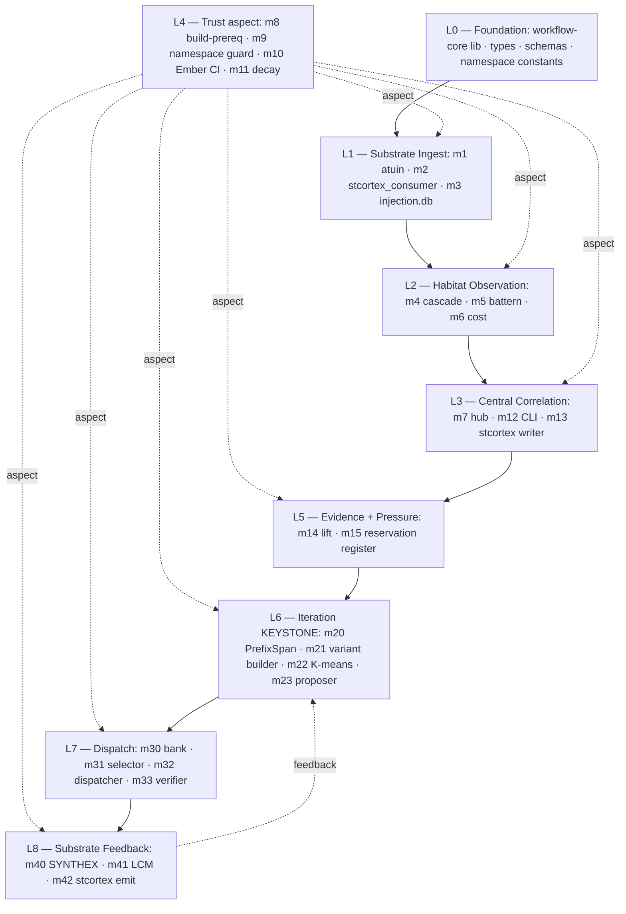

# ULTRAMAP — workflow-trace Full-Stack Topology

> Back to: [[TASK_LIST_V7_OPTIMISATION.md]] · [[KEYWORDS_20.md]] · [[../../the-workflow-engine-vault/HOME.md]]
>
> **Purpose:** the workflow-trace end-to-end stack rendered as five overlaid views: (1) Layer Map L0-L8, (2) Cluster × Module × src/path × Bidi-flow, (3) Phase × Runbook × Owner timeline, (4) Tooling Integration Graph, (5) Agent × Worktree × Layer allocation. Any single mental query about the engine should land at this file first.

---

## View 1 — Layer Map (L0-L8)



**Reading rule:**
- Solid arrow = build-time dependency (downstream cannot compile without upstream).
- Dashed `aspect` = L4 is woven through every other layer at compile/write/output/lifecycle — not a feature.
- Dashed `feedback` = runtime CC-5 loop (slow, days/weeks).
- L9 (substrate-frame engine) intentionally absent — single-phase override waived R6 frame-separation (partial); L9 placeholder reserved for post-D120.

---

## View 2 — Cluster × Module × src/path × Bidi-flow

| Cluster | Module | Purpose | Upstream → | ← Downstream | src/ path (proposed) | LOC | Tests (≥50) |
|---|---|---|---|---|---|---|---|
| **A L1** | m1 | atuin consumer (cursor-based pagination) | (none) | m4, m5, m6, m7 | `src/m1_atuin_consumer/` | ~80 | 50 |
| | m2 | stcortex consumer (narrowed-scope: tool_call + consumption only) | stcortex `:3000` | m4, m5, m13 | `src/m2_stcortex_consumer/` | ~70 | 50 |
| | m3 | injection.db consumer | `~/.local/share/habitat/injection.db` | m4, m5, m7 | `src/m3_injection_consumer/` | ~80 | 50 |
| **B L2** | m4 | cascade correlator (F11 opaque IDs via FNV-1a XOR) | m1, m2, m3 | m7 | `src/m4_cascade/` | ~180 | 60 |
| | m5 | battern step recorder (step_label Option) | m1, m3 | m7 | `src/m5_battern/` | ~140 | 55 |
| | m6 | context-cost EMA (F10 exclude-Converged baseline) | m1, m3 | m7 | `src/m6_cost/` | ~140 | 55 |
| **C L3** | m7 | central correlation hub (F9 zero-weight column) | m1-m6 | m12, m13, m14 | `src/m7_central/` | ~200 | 70 |
| | m12 | human CLI reports | m7 | (stdout) | `src/m12_cli_reports/` | ~80 | 50 |
| | m13 | stcortex writer (3-band LTP/LTD gate) | m7, m11 | stcortex | `src/m13_stcortex_writer/` | ~90 | 60 |
| **D L4 aspect** | m8 | build-prereq (`cargo:rustc-cfg=povm_calibrated`) | (build.rs) | ALL | `build.rs` + `src/m8_build_prereq/` | ~60 | 50 |
| | m9 | namespace guard at write boundaries (AP30) | (config) | m13, m42 | `src/m9_namespace_guard/` | ~50 | 50 |
| | m10 | Ember 7-trait CI gate (Held = CI-FAIL post-§5.1 amendment) | Ember rubric | CI | `src/m10_ember_gate/` | ~90 | 60 |
| | m11 | freq×fitness×recency decay (NEW PRIMITIVE) | m7, m14, stcortex | m31 | `src/m11_decay/` | ~250 | 70 |
| **E L5** | m14 | habitat_outcome_lift (Wilson CI; Option<f64> below n=20) | m7 | m31 | `src/m14_lift/` | ~120 | 60 |
| | m15 | reservation register (JSONL one-event-per-file) | (forbidden-verb pressure) | agent-cross-talk/ | `src/m15_pressure/` | ~80 | 50 |
| **F L6 KEYSTONE** | m20 | PrefixSpan sequential pattern miner | m4, m5, m14 | m23 | `src/m20_prefixspan/` | ~350 | 90 |
| | m21 | variant builder (Levenshtein top-K) | m20 | m23 | `src/m21_variant_builder/` | ~200 | 70 |
| | m22 | K-means feature clusterer (NOT PrefixSpan) | m6, m7 | m23 | `src/m22_kmeans/` | ~150 | 60 |
| | m23 | gradient-preservation proposer (n≥5 deviation-relaxed) | m20, m21, m22, m14 | m30 (post-accept) | `src/m23_proposer/` | ~150 | 60 |
| **G L7** | m30 | curated bank (EscapeSurfaceProfile authoritative) | m23 (post-accept) | m31, m32 | `src/m30_bank/` | ~250 | 70 |
| | m31 | selector (α·fitness + β·recency + γ·frequency + δ·diversity = 0.40/0.25/0.20/0.15) | m30, m11, m14 | m32 | `src/m31_selector/` | ~250 | 70 |
| | m32 | dispatcher (5-check pre-dispatch; Conductor-only) | m30, m31, m33 | Conductor → workflow exec | `src/m32_dispatcher/` | ~250 | 80 |
| | m33 | 4-agent verifier (7-day TTL) | m30 | m32 | `src/m33_verifier/` | ~200 | 70 |
| **H L8** | m40 | SYNTHEX v2 NexusEvent emitter (outbox-first JSONL) | m32 | `:8092/v3/nexus/push` | `src/m40_synthex_emit/` | ~150 | 60 |
| | m41 | LCM `lcm.loop.create {max_iters:1}` router | m32 | LCM RPC | `src/m41_lcm_router/` | ~150 | 60 |
| | m42 | stcortex emit (substrate-feedback; POVM dual-path retired per 2026-05-17 ADR) | m32 | stcortex `:3000` | `src/m42_stcortex_emit/` | ~150 | 60 |
| **Totals** | **26 modules** | | | | | **~3,810** | **1,562** |

**Note:** ~5,200 LOC target includes ~1,300 LOC tests + Cargo manifests + build.rs + integration tests outside `src/m*` tree. Per-module test minimum is 50; total minimum 1,300 tests — actual budget 1,562 (matches top-1% norm).

### Bidi-flow edges (every module has explicit upstream + downstream contract)

```
m1 ─┐
m2 ─┼──► m4 ─┐                                                  ┌──► stcortex
m3 ─┘        ├──► m7 ─┬──► m12                                  │
m1 ─┐        │        ├──► m13 ────────────────────────────────►┤
m3 ─┼──► m5 ─┤        │                                          │
m1 ─┘        │        ├──► m14 ──────► m23 ──► m30 ──► m32 ──► m40 ──► SYNTHEX
m1 ─┐        │        │                       ▲                │
m3 ─┼──► m6 ─┘        │      m20 ──► m21 ────►│                ├──► m41 ──► LCM
                       │      m22 ────────────►│                │
                       │       ▲   ▲           │                └──► m42 ──► stcortex
                       │       │   │           ▼
                       │       │   └── m11 ──► m31
                       │       │              ▲
                       │       └── m14 ───────┘
                       │
                       └──► m6
m8 ┐
m9 ┼─ aspect-layer (woven through ALL above at compile/write/output/lifecycle)
m10┤
m11┘
m15 ── pressure register (sideband to agent-cross-talk/)
```

---

## View 3 — Phase × Runbook × Owner Timeline

| Days | Phase | Runbook ID | Primary owner | Output artefact |
|---|---|---|---|---|
| pre-G9 | Phase 0 G1-G9 | R-00 | Watcher / Command / Luke / Zen | all 9 gates GREEN; Luke G9 signal |
| 0-3 | Phase 1 Genesis | R-01 | Command + Command-2 (build-executor) | cargo workspace + Cluster D + Cluster A + Cat 10 foundation |
| 3-12 | Phase 2A B/C/E (measure-only) | R-02 | Command-2 | m4-m7 + m12-m15 (~870 LOC) |
| 12-21 | Phase 2B F/G/H (active) | R-03 | Command-2 + Command-3 (G librarian) | m20-m23 + m30-m33 + m40-m42 (~2,200 LOC) |
| 21-26 | Phase 3 Integration | R-04 | Command + Command-3 + Zen | 5 integration tracks; CC-5 first closure |
| 26-28 | Phase 4 Hardening | R-05 | Zen + 4-agent gate | PASS/FAIL/DEGRADED verdict |
| 28-30 | Phase 5A Deploy | R-06a | Command + Luke @ terminal | binaries in ~/.local/bin/wf-* |
| 30 | Phase 5B Cutover | R-06b | Command + Watcher | WCP carriage handoff |
| 30→D120 | Phase 5C Soak | R-06c | Watcher + system | continuous lift + decay + weekly synthesis |
| D120 | Phase 6 Sunset | R-07 | m11 + Luke | PASS continue / FAIL retire / DEGRADED Luke-decide |
| continuous | Phase 7 Security | R-08 | security-auditor (per phase) | 7 domains × 7 phases matrix |
| continuous | Phase 8 Observability | R-09 | observability-engineer (per phase) | 5 tracks |
| continuous | Cross-cutting CC-1..CC-7 | R-10 | various | per concern |
| any | Emergency rollback | R-11 | Command + Luke | 3-command rollback per phase |

---

## View 4 — Tooling Integration Graph

```mermaid
graph LR
    subgraph "Authoring Layer"
        SCAFF[/scaffold/ -- V8 bound]
        V8[CodeSynthor V8 :8111 -- Elixir OTP Holy Trinity]
        SC[stcortex :3000 -- SpacetimeDB memory]
        ATU[atuin -- 165+ scripts + KV store]
    end
    subgraph "Build Layer"
        V3[DevOps Engine V3 :8082 -- T1-T6 + resume_from]
        CARGO[cargo workspace + features]
        BACON[bacon -- continuous quality]
    end
    subgraph "Coordination Layer"
        ZELL[Zellij Tab 1 Orchestrator]
        CMD[Command]
        C2[Command-2]
        C3[Command-3]
        WATCH[Watcher :8092]
        ZEN[Zen Tab 10]
    end
    subgraph "Runtime Layer"
        CRYS[wf-crystallise binary]
        DISP[wf-dispatch binary]
        COND[HABITAT-CONDUCTOR :8141]
        SX2[SYNTHEX v2 :8092]
        LCM[LCM RPC]
        POVM[POVM :8125 -- deprecated 2026-07-10]
    end

    SCAFF --> V8
    V8 --> V3
    V3 --> CARGO
    CARGO --> CRYS
    CARGO --> DISP
    ATU --> CMD
    ATU --> C2
    ATU --> C3
    ZELL --> CMD
    ZELL --> C2
    ZELL --> C3
    CMD --> CARGO
    CMD --> ZEN
    BACON --> CARGO
    CRYS --> SC
    DISP --> COND
    COND --> CRYS
    DISP --> SX2
    DISP --> LCM
    DISP --> POVM
    WATCH -.observes.-> CRYS
    WATCH -.observes.-> DISP
    WATCH -.observes.-> SC
```

**Reading rule:**
- Solid arrow = build-time or runtime dispatch.
- Dashed observes = read-only Watcher carriage.
- `/scaffold` is V8's bound (corrective when V8 drifts), not its competitor.
- atuin is the ONLY cross-tool provenance — V3/V8/`/scaffold` each have own SQLite; trajectory across all four lives in `~/.local/share/atuin/history.db`.

---

## View 5 — Agent × Worktree × Layer Allocation

The 9 layers are buildable in **3 worktree waves** after G9 fires:

### Wave 1 — Foundation (Days 0-3)
| Layer | Worktree | Agent | Modules |
|---|---|---|---|
| L0 | `wt-l0-core` | Command-2 (foreground) | workflow-core types + schemas + namespace constants |
| L4 aspect | `wt-l4-trust` | Command-2 | m8 build-prereq + m9 namespace + m10 Ember CI + m11 decay |
| L1 substrate | `wt-l1-ingest` | Command-2 | m1 + m2 + m3 |

### Wave 2 — Measure-only (Days 3-12)
| Layer | Worktree | Agent | Modules |
|---|---|---|---|
| L2 | `wt-l2-observe` | Command-2 + rust-pro subagent | m4 + m5 + m6 |
| L3 | `wt-l3-central` | Command-2 + rust-pro subagent | m7 + m12 + m13 |
| L5 | `wt-l5-evidence` | Command-2 + rust-pro subagent | m14 + m15 |

### Wave 3 — Active + Feedback (Days 12-21)
| Layer | Worktree | Agent | Modules |
|---|---|---|---|
| L6 KEYSTONE | `wt-l6-keystone` | Command-2 (PrefixSpan) + Command-3 (variant builder) | m20 + m21 + m22 + m23 |
| L7 dispatch | `wt-l7-dispatch` | Command-3 (librarian-lane) | m30 + m31 + m32 + m33 |
| L8 feedback | `wt-l8-feedback` | Command-2 + rust-pro subagent | m40 + m41 + m42 |

**Isolation invariants (worktree discipline):**
1. **No shared mutable state** between worktrees during Wave — merge only at wave end.
2. **Shared resource list** (per `worktree-mastery` skill): `Cargo.lock` merged; `target/` per-worktree (no symlink); `node_modules/` N/A.
3. **Lock discipline:** every worktree holds an `.atuin-worktree-lock` for the duration; supervisor re-checks every 30s.
4. **Merge protocol:** Wave-end → Command rebases all wave worktrees to `main`; quality-gate run on integrated branch; merge.
5. **Cleanup:** worktrees auto-pruned after wave-end merge SHA verified on `main`.

**Agent View allocation:**
- **Command (foreground):** orchestration, integration, Wave-merge.
- **Command-2 (foreground):** all build-executor work — primary author.
- **Command-3 (foreground):** Cluster G librarian-lane (m30-m33 only).
- **rust-pro subagents (background):** per-module test authorship (≥50 per module); Battern-dispatched in 9-pane fleet.
- **silent-failure-hunter (background):** Phase 4 hardening sweep.
- **security-auditor (background):** Phase 4 hardening + Phase 7 continuous.
- **performance-engineer (background):** Phase 4 hardening + Phase 8 continuous.
- **zen (background):** every Wave-end gate audit + Phase 4 4-agent member.
- **stcortex-reviewer (background):** every Wave-end stcortex anchor verification.
- **obsidian-vault-librarian (background):** every Wave-end vault sweep.

---

## Cross-view query examples

**Query 1:** "Where does m20 PrefixSpan live and what calls it?"
- Layer Map: L6
- Cluster: F (KEYSTONE)
- src/path: `src/m20_prefixspan/`
- Upstream: m4 (cascades) + m5 (batterns) + m14 (lift evidence)
- Downstream: m23 (proposer)
- Runbook: R-03 Phase 2B Active
- Owner agent: Command-2 (PrefixSpan author)
- Worktree: `wt-l6-keystone` Wave 3
- Tests: ≥90 (KEYSTONE complexity)
- Watcher class to pre-position: A (activation at first PrefixSpan invocation) + G (substrate-frame confusion if treated as anthropocentric search)

**Query 2:** "What's the Conductor dependency for m32 functional dispatch?"
- Layer Map: L7 → Conductor :8141 (external)
- Blocker: B3 (`auto_start=false` for Waves 1B/1C/2/3)
- Resolution: Luke @ terminal `~/.local/bin/devenv -c ~/.config/devenv/devenv.toml start weaver/zen/enforcer`
- m32 behaviour pre-fix: refuse-mode (ERROR log + typed `DispatchError::ConductorDispatchDisabled`)
- Runbook: R-04 Phase 3 Integration § Track 2
- Watcher class to pre-position: C (confidence-gate refusal — m32 refusing to dispatch is the safe path, not failure)

**Query 3:** "How does the V8 ↔ V3 bidirectional wire affect workflow-trace?"
- View 4 Tooling Integration: existing — `POST :8082/api/v8/confidence` + `/api/v8/learning` already wired
- Inherit, don't reinvent (S1002029 learning #1)
- Workflow-trace uses V3 `resume_from: "T2"` to let V8+Zen own T1 spec while V3 owns trajectory
- Runbook: R-04 Phase 3 Integration § Track 5 (DevOps V3 m41 routing)

---

## Drift register (this Ultramap itself)

| Date | Change | Reason | Generation |
|---|---|---|---|
| 2026-05-17 | initial author | V7 T0.3 deliverable | G0 (pre-iteration) |
| (per gen) | (per-gen diff) | (per-gen rationale) | G1..G7 |

The Ultramap is the **anchor doc** for the V7 stack. Every generation may revise it; revisions append to this register. Goal: at G7 close, this map is the canonical "single load → full mental model" entry.

---

*ULTRAMAP authored 2026-05-17 by Command. Five views composite. Updated per generation per drift register.*
