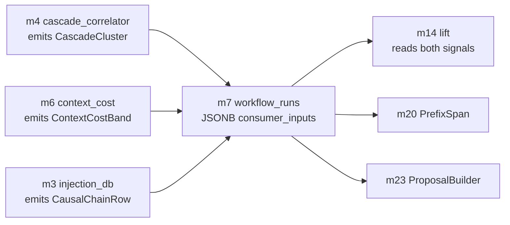
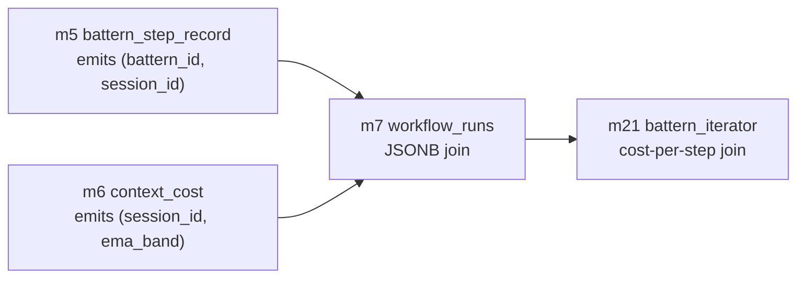

# CC-1 — Cascade-Cost Coupling (B internal)

> **Back to:** [`README.md`](README.md) · [`../INDEX.md`](../INDEX.md) · canonical [`../../ai_docs/optimisation-v7/MODULE_PLANS/CROSS_CLUSTER_SYNERGIES.md`](../../ai_docs/optimisation-v7/MODULE_PLANS/CROSS_CLUSTER_SYNERGIES.md) § CC-1 · [`../layers/cluster-B.md`](../layers/cluster-B.md) · [`../layers/cluster-C.md`](../layers/cluster-C.md)

## Contract surface

CC-1 IS **the cascade-cost coupling contract** owned by Cluster C's m7 (the central correlation hub). Cluster B's m4 (cascade correlator) and m6 (context-cost EMA) NEVER directly call each other; they emit observations that land in m7's `workflow_runs.consumer_inputs` JSONB column on the same row, and downstream consumers (m14 lift, m20-m23 iteration) read both signals off the same row through a single m7 query. The JSONB schema is owned by m7, validated against `workflow_core::schemas::ConsumerInputs`, and is the canonical "stable schema as coupling surface" pattern.

## Modules involved

- **m7** (Cluster C, hub, OWNER) — central correlation table; ALTER permission on the JSONB schema lives here exclusively. See [`../modules/cluster-C/m7_workflow_runs.md`](../modules/cluster-C/m7_workflow_runs.md).
- **m4** (Cluster B, emitter) — emits `CascadeCluster { cluster_id: OpaqueId, session_id, step_count, fnv_xor_signature }`. See [`../modules/cluster-B/m4_cascade_correlator.md`](../modules/cluster-B/m4_cascade_correlator.md).
- **m6** (Cluster B, emitter) — emits `ContextCostBand { session_type, ema_mean, ema_variance, n }`. See [`../modules/cluster-B/m6_context_cost.md`](../modules/cluster-B/m6_context_cost.md).
- **m3** (Cluster A, supplementary) — emits `CausalChainRow` partitioned by `resolved_session IS NULL`; lands in same JSONB column as supplementary lifecycle context. See [`../modules/cluster-A/m3_injection_db_consumer.md`](../modules/cluster-A/m3_injection_db_consumer.md).
- **m14, m20, m22, m23** (downstream consumers) — read both cascade + cost signals off the same `workflow_runs` row.

## Data-flow

The shape: m4 + m6 are observation emitters; m7 is the hub; m14 / m20 / m23 are joined consumers. m4 and m6 are decoupled by the JSONB schema — neither imports the other, neither needs the other's deploy timing.

## Coupling discipline

- **No direct calls between m4 and m6.** Verified at code review (intra-cluster invocation forbidden per [`../layers/cluster-B.md`](../layers/cluster-B.md)) and by verify-sync invariant #2 (cluster-internal use-graph audit).
- **JSONB schema owned by m7 exclusively.** ALTER requires a migration filed under `migrations/` and a contract test asserting the consumer schemas still resolve.
- **Consumers deserialise through `workflow_core::schemas::ConsumerInputs`**, never `serde_json::Value` ad hoc — typed pattern-match catches drift at compile time.
- **F9 zero-weight default.** New rows insert with `fitness_dimension = 0.0`; absence of a non-zero value does NOT imply "this row was never used".

## Invariants

| # | Invariant | Enforcement |
|---|---|---|
| 1 | m4 + m6 emit independently | code review + `rg 'm6::\|m4::' src/m4*/ src/m6*/` audit |
| 2 | JSONB schema is single-source | `workflow_core::schemas::ConsumerInputs` is the only definition |
| 3 | Consumers use typed deserialiser | `rg 'serde_json::Value' src/m{14,20,23}*/` returns 0 |
| 4 | F9 zero-weight column NOT NULL | SQLite `NOT NULL DEFAULT 0.0` |
| 5 | `cluster_id` is opaque (F11) | tests assert no human-readable string format |

## Closure test

`tests/integration/cc1_cascade_cost_coupling.rs` — pure in-process; no live services required. Asserts:

1. m4 emits `CascadeCluster` into m7
2. m6 emits `ContextCostBand` into the same m7 row
3. Both signals are queryable from a single `m7::get_row(workflow_id)` call
4. Schema drift in `ConsumerInputs` fails the test at deserialise

## Failure modes if violated

- **m4 → m6 direct call slipped in:** observation pipeline becomes opaque (no audit trail through m7); CC-1 becomes a spaghetti coupling. Test caught: `cargo deny` use-graph audit + invariant #1.
- **Two m7 schema writers (e.g., a "fast-path insert"):** drift between writer schemas; consumers see inconsistent rows. Caught: contract test asserts single ConsumerInputs definition.
- **Untyped serde_json::Value read:** drift in JSONB shape silently passes; downstream consumers crash on missing fields. Caught: invariant #3.

## Watcher class pre-position

- **Class D (four-surface drift)** — if m4's CascadeCluster schema drifts from m7's JSONB acceptance OR m6's ContextCostBand schema drifts.
- **Class G (substrate-frame)** — at any spec language suggesting m4 or m6 produce anthropocentric signals.

## Owning runbook

`RUNBOOKS/runbook-02-phase-2A-measure-only.md` (B/C build wave per V7 TASK_LIST T4.2).

---

## CC-1.subA — Battern-Cost Coupling (m5 ↔ m6)

**Sub-contract decision: this is CC-1.subA, NOT a net-new CC-8.** See [`README.md`](README.md) § CC-1b resolution decision for rationale.

### Sub-contract surface

m5's `BatternStepObservation { battern_id, session_id, step_index, step_token }` and m6's `ContextCostBand { session_type, ema_mean, ema_variance, n, session_id }` join on `session_id` within a `battern_id` range. Cluster F's `m21_battern_iterator` performs the join through m7's JSONB `consumer_inputs` to derive cost-per-step approximations for variant generation.

### Sub-contract data-flow

### Sub-contract coupling discipline

- m5 and m6 are NEVER directly coupled (same rule as CC-1 parent).
- The join lives in m7's JSONB `consumer_inputs` column with `(battern_id, session_id)` tuples as the key.
- m21 is the canonical reader; m21 deserialises via `workflow_core::schemas::ConsumerInputs::battern_cost_view()`.

### Sub-contract invariants

| # | Invariant | Enforcement |
|---|---|---|
| 1 | m5 → m6 direct call forbidden | use-graph audit |
| 2 | Battern boundaries are protocol-defined, not heuristic | m5 spec §5 |
| 3 | EMA gradient preserved (F10) | m6 returns mean + variance + n; not single scalar |
| 4 | `(battern_id, session_id)` tuple is the join key | m7 JSONB schema pinned |

### Sub-contract closure test

Covered by the parent `tests/integration/cc1_cascade_cost_coupling.rs` test file with additional assertions in a `mod cc1_subA_battern_cost { ... }` submodule. No separate file needed (avoids test-infra duplication for a sub-pattern).

### Sub-contract Watcher pre-position

Same as CC-1 parent: Class D (schema drift) + Class G (substrate-frame confusion). No additional Class.

---

> **Back to:** [`README.md`](README.md) · [`../INDEX.md`](../INDEX.md) · canonical [`../../ai_docs/optimisation-v7/MODULE_PLANS/CROSS_CLUSTER_SYNERGIES.md`](../../ai_docs/optimisation-v7/MODULE_PLANS/CROSS_CLUSTER_SYNERGIES.md) § CC-1
