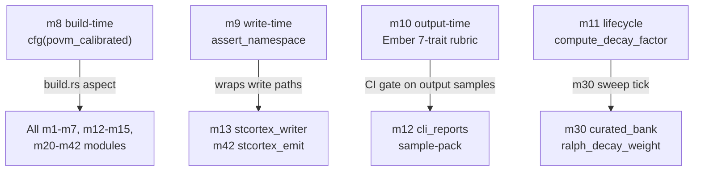

# CC-2 — Trust Layer Woven (D → all)

> **Back to:** [`README.md`](README.md) · [`../INDEX.md`](../INDEX.md) · canonical [`../../ai_docs/optimisation-v7/MODULE_PLANS/CROSS_CLUSTER_SYNERGIES.md`](../../ai_docs/optimisation-v7/MODULE_PLANS/CROSS_CLUSTER_SYNERGIES.md) § CC-2 · [`../layers/cluster-D.md`](../layers/cluster-D.md)

## Contract surface

CC-2 IS **the trust-aspect contract** — the entirety of Cluster D wraps the rest of the engine at four distinct lifecycle points (build-time, write-time, output-time, lifecycle-time). The contract is **woven, not called**: no module imports a Cluster D module as a conventional dependency. m8 is a `build.rs` aspect; m9 is a write-time assertion on m13/m42 paths; m10 is a CI gate over m12 output; m11 is a lifecycle hook m30 calls on its decay tick.

## Modules involved

- **m8** (OWNER, build-time) — `build.rs` sets `cargo:rustc-cfg=povm_calibrated`; downstream modules `#[cfg(povm_calibrated)]`-gate. See [`../modules/cluster-D/m8_povm_build_prereq.md`](../modules/cluster-D/m8_povm_build_prereq.md).
- **m9** (OWNER, write-time) — `m9::assert_namespace(id)` called by m13 + m42 + any future writer; validates `workflow_trace_*` prefix. See [`../modules/cluster-D/m9_watcher_namespace_guard.md`](../modules/cluster-D/m9_watcher_namespace_guard.md).
- **m10** (OWNER, output-time) — Ember 7-trait rubric over m12 sample-pack output; Held verdict fails CI. See [`../modules/cluster-D/m10_ember_ci_gate.md`](../modules/cluster-D/m10_ember_ci_gate.md).
- **m11** (OWNER, lifecycle) — `compute_decay_factor` + `apply_decay_tick`; called by m30 on engine sweep. See [`../modules/cluster-D/m11_fitness_weighted_decay.md`](../modules/cluster-D/m11_fitness_weighted_decay.md).
- **Consumers:** ALL clusters (the aspect surface is universal).

## Data-flow (aspect routing)

## Coupling discipline

Aspects are **woven, not invoked as ordinary deps**. The pattern:

| Aspect | Wraps | How |
|---|---|---|
| m8 | crate root | `build.rs` emits cfg; downstream `#[cfg(povm_calibrated)]` |
| m9 | write paths | direct call from `m13::write` + `m42::reinforce`; not import-from-consumer-side |
| m10 | output paths | CI test over `target/output-samples/`; not runtime code |
| m11 | lifecycle | `m30::apply_decay_tick(now_ms)` internally calls `m11::compute_decay_factor(...)` |

The cluster D modules live in `workflow_core` library (m9, m11), `build.rs` (m8), and `tests/ember/` (m10). They are physical-package dependencies for downstream code, but they constrain via the aspect surface, not via module-to-module method calls.

## Invariants

| # | Invariant | Enforcement |
|---|---|---|
| 1 | m8 hard-fails on missing prereq (F7 / AP-V7-13 mitigation) | `compile_error!` in build.rs |
| 2 | m9 is the SINGLE namespace-guard implementation | `workflow_core::namespace::WORKFLOW_TRACE_PREFIX` const-source |
| 3 | m10 Held verdict fails CI (no sycophancy escape) | `tests/ember/ci_gate.rs` exit-code asserts |
| 4 | m11 decay-factor `[0.0, 1.0]` clamped | property test (10k iters) on bounds |
| 5 | No module bypasses an aspect (no `#[cfg(not(povm_calibrated))]` fallback) | code review + `rg '!povm_calibrated\|not(povm_calibrated)' src/` returns 0 |

## Closure test

`tests/integration/cc2_trust_aspect_routing.rs` — pure in-process; no live services required. Asserts:

1. Build with `WORKFLOW_TRACE_POVM_CALIBRATION` unset → compile error (test runs in `tests/build_failures/` with build-script).
2. m13 + m42 invocations call `m9::assert_namespace` (verified by mocking m9 and asserting call site invocation count).
3. m12 sample-pack output passes Ember 7-trait rubric (m10 test loads the rubric and asserts PASS on a known-good sample).
4. m30 decay tick calls `m11::compute_decay_factor` (mocked m11 asserts call site).

## Failure modes if violated

- **m8 emits warning instead of compile_error:** F7 antipattern — degraded binary ships. Caught: build-failure test in CI.
- **m9 bypassed via inline string write:** AP30 violation; namespace drift undetected at write time. Caught: invariant #2 + `rg '"workflow_trace_' src/ | grep -v 'namespace.rs\|m9_watcher'` returns 0.
- **m10 Held silently absorbed:** sycophancy violation per `feedback_sycophancy_mitigation.md`. Caught: CI exit code.
- **m11 decay-factor returns > 1.0:** runaway pathway weight. Caught: property test invariant.

## Watcher class pre-position

- **Class A (activation)** at first successful `cfg(povm_calibrated)` build (first time the trust layer is observably active).
- **Class D (four-surface drift)** if aspect application drifts between m8 (build), m9 (write), m10 (CI), m11 (lifecycle) — internal aspect consistency required.

## Owning runbook

`RUNBOOKS/runbook-01-phase-1-genesis.md` (D BEFORE A — Cluster D ships first per V7 TASK_LIST T4.1 + Wave 1 worktree allocation).

---

> **Back to:** [`README.md`](README.md) · canonical [`../../ai_docs/optimisation-v7/MODULE_PLANS/CROSS_CLUSTER_SYNERGIES.md`](../../ai_docs/optimisation-v7/MODULE_PLANS/CROSS_CLUSTER_SYNERGIES.md) § CC-2
