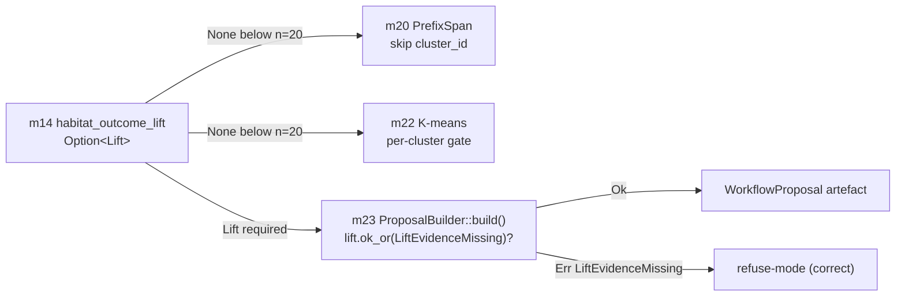

# CC-3 — Evidence-Driven Iteration (E → F)

> **Back to:** [`README.md`](README.md) · [`../INDEX.md`](../INDEX.md) · canonical [`../../ai_docs/optimisation-v7/MODULE_PLANS/CROSS_CLUSTER_SYNERGIES.md`](../../ai_docs/optimisation-v7/MODULE_PLANS/CROSS_CLUSTER_SYNERGIES.md) § CC-3 · [`../layers/cluster-E.md`](../layers/cluster-E.md) · [`../layers/cluster-F.md`](../layers/cluster-F.md)

## Contract surface

CC-3 IS **the evidence-gate contract** — m14's `Option<Lift>` is the construction-time gate for Cluster F's iteration KEYSTONE. Below n=20 sample size, m14 returns `Ok(None)`; downstream m20-m23 cannot construct a `WorkflowProposal` without a non-`None` `Lift`. The gate is at *construction*, not at runtime — `m23::ProposalBuilder::build()` calls `let lift = self.lift.ok_or(ProposalError::LiftEvidenceMissing)?;` as the literal gate line. There is no runtime bypass; no `force_build` method.

## Modules involved

- **m14** (Cluster E, OWNER) — habitat_outcome_lift; emits `Option<Lift>` where `None` = "below n=20, no evidence". See [`../modules/cluster-E/m14_habitat_outcome_lift.md`](../modules/cluster-E/m14_habitat_outcome_lift.md).
- **m20** (Cluster F, consumer) — PrefixSpan miner; iteration gated by m14 evidence per cluster_id.
- **m21** (Cluster F, consumer) — variant builder; gated by m20 output (which is gated by m14).
- **m22** (Cluster F, consumer) — K-means feature clusterer; per-cluster n≥20 gate.
- **m23** (Cluster F, consumer + structural gate site) — ProposalBuilder; gate enforced at `.build()` via `lift.ok_or(LiftEvidenceMissing)?`.

## Data-flow

## Coupling discipline

- m14's `Option<Lift>` is the gate signal; `None` propagates as construction-time failure in m23.
- Wilson-CI **lower bound** is the gate value reported in `Lift`, never the point estimate. Optimism is structurally banned.
- m23 has no `Lift::default()` constructor; `Lift` is built only through `m14::compute_lift(success, total)` which enforces n≥20.
- Downstream m31 selection composite-score also reads the lower bound (consistent pessimism across modules).

## Invariants

| # | Invariant | Enforcement |
|---|---|---|
| 1 | `m14::compute_lift(success, total)` returns `Ok(None)` when `total < 20` | unit test + property test |
| 2 | `Lift` carries `(lower_bound, point, upper_bound)`; consumers use lower | type definition |
| 3 | `m23::ProposalBuilder::build()` returns `Err(LiftEvidenceMissing)` if lift is None | unit test |
| 4 | No `force_build` / `unchecked_build` method on m23 ProposalBuilder | API surface audit |
| 5 | m20/m22 skip cluster_ids without evidence | integration test |

## Closure test

`tests/integration/cc3_evidence_driven_iteration.rs` — pure in-process; no live services required. Asserts:

1. `m14::compute_lift(19, 20)` returns `Ok(None)`
2. `m14::compute_lift(20, 20)` returns `Ok(Some(Lift { ... }))`
3. `m23::ProposalBuilder::default().build()` returns `Err(ProposalError::LiftEvidenceMissing)` (no lift set)
4. `m23::ProposalBuilder::default().with_lift(lift).build()` returns `Ok(WorkflowProposal { ... })` with the lower-bound carried
5. m20 iteration over a synthetic dataset with 19 occurrences of cluster_id X yields no patterns containing X

## Failure modes if violated

- **m14 returns wide-CI `Some(Lift)` to flatter:** downstream iterates on noise; F2 sample-size inflation. Caught: invariant #1.
- **m23 has a `force_build` method:** evidence gate bypassed; proposals slip through without lift. Caught: invariant #4 API audit.
- **Consumers use point estimate not lower bound:** optimism creeps into selection composite-score; F2 + selection-bias. Caught: m31 contract test reads lower bound.

## Watcher class pre-position

- **Class C (refusal)** at every `Option::None` propagation — refusal IS correct behaviour.
- **Class A (activation)** at first `ProposalBuilder::build()` success post-G9 (CC-3 closure observable).

## Owning runbook

`RUNBOOKS/runbook-03-phase-2B-active.md` (F/G/H active wave per V7 TASK_LIST T4.3).

---

> **Back to:** [`README.md`](README.md) · canonical [`../../ai_docs/optimisation-v7/MODULE_PLANS/CROSS_CLUSTER_SYNERGIES.md`](../../ai_docs/optimisation-v7/MODULE_PLANS/CROSS_CLUSTER_SYNERGIES.md) § CC-3
