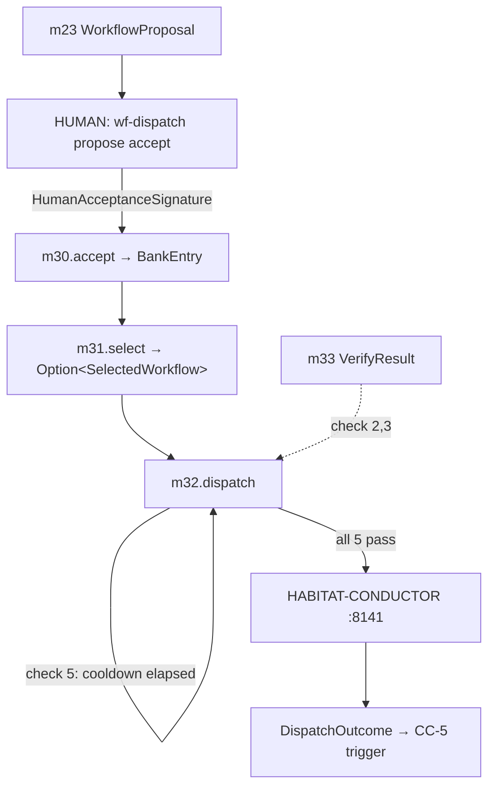

# CC-4 — Proposal → Bank → Dispatch (F → G → Conductor)

> **Back to:** [`README.md`](README.md) · [`../INDEX.md`](../INDEX.md) · canonical [`../../ai_docs/optimisation-v7/MODULE_PLANS/CROSS_CLUSTER_SYNERGIES.md`](../../ai_docs/optimisation-v7/MODULE_PLANS/CROSS_CLUSTER_SYNERGIES.md) § CC-4 · [`../layers/cluster-F.md`](../layers/cluster-F.md) · [`../layers/cluster-G.md`](../layers/cluster-G.md)

## Contract surface

CC-4 IS **the proposal-to-dispatch pipeline contract** — the path from m23's emitted `WorkflowProposal` artefact through human review → m30 admission → m31 selection → m33 verification → m32 5-check pre-dispatch → HABITAT-CONDUCTOR execution. The contract has two structural boundaries: (1) the **human-review boundary** between m23 and m30 is non-bypassable — there is no `auto_promote` code path (F5 / AP-V7-07 mitigation); (2) the **5-check pre-dispatch sequence** at m32 is strict — all five must pass, any failure returns typed `DispatchError`, no soft-fail path.

## Modules involved

- **m23** (Cluster F, emitter) — produces `WorkflowProposal` artefacts to a CLI review queue.
- **Human boundary** — `wf-dispatch propose accept <id>` interactive subcommand; requires `isatty()` + operator signature.
- **m30** (Cluster G, OWNER admission) — `BankDb::accept(wf, sig)` with `HumanAcceptanceSignature { interactive_terminal: true, accepted_by: <operator> }`.
- **m31** (Cluster G, consumer) — `select` returns `Option<SelectedWorkflow { composite_score }>`.
- **m33** (Cluster G, prerequisite) — produces `VerifyResult` consumed by m32 check 2 + 3.
- **m32** (Cluster G, OWNER dispatch) — 5-check pre-dispatch then `conductor_client.dispatch()`.
- **Conductor** (external `:8141`) — actual workflow execution.

## Data-flow

## The 5-check pre-dispatch sequence (m32)

| # | Check | Failure error |
|---|---|---|
| 1 | Conductor `:8141/health` returns 200 | `DispatchError::ConductorDispatchDisabled` |
| 2 | `m33.VerifyResult.ttl_expires_at > now_ms` | `DispatchError::VerificationStale` |
| 3 | `definition_hash` matches m30 row | `DispatchError::DefinitionDrifted` |
| 4 | `sunset_at > now_ms` | `DispatchError::WorkflowSunset` |
| 5 | `dispatch_cooldown` elapsed (per workflow) | `DispatchError::CooldownActive` |

## Coupling discipline

- **No auto-promote.** `m30::accept` requires `HumanAcceptanceSignature` with `interactive_terminal: true` AND `accepted_by != "agent"|"auto"`. m23 cannot construct a `HumanAcceptanceSignature` (constructor is private to the `wf-dispatch` CLI's interactive subcommand).
- **5-check strict sequence.** Any check fails → typed error returned; no soft-fail, no retry-with-relaxed-check.
- **Conductor-only routing.** m32 has no `exec_local` or `dispatch_direct` symbol; verified by `rg 'exec_local\|dispatch_direct' src/m32_conductor_dispatcher/` returning 0.
- **No self-dispatch (AP-V7-08).** A workflow whose steps include `m32::dispatch` is rejected at m30 schema layer (StepClassifier `EscapeSurfaceProfile::SandboxEscape` minimum) AND at m32 runtime (defense in depth).

## Invariants

| # | Invariant | Enforcement |
|---|---|---|
| 1 | `HumanAcceptanceSignature` constructor private to `wf-dispatch` CLI | API surface audit |
| 2 | `accepted_by` blocklist: "agent", "auto", "" | unit test |
| 3 | All 5 m32 checks must pass; any failure → typed error | unit test per check |
| 4 | Conductor-bypass impossible by construction | invariant #20 verify-sync |
| 5 | Self-dispatch refused at m30 AND m32 | defense-in-depth unit tests |

## Closure test

`tests/integration/cc4_proposal_bank_dispatch.rs` — `#[ignore = "requires Conductor :8141 (B3)"]` until Wave 1B/1C/2/3 auto_start resolved. Asserts:

1. m23 emit → m30 accept (with mocked `HumanAcceptanceSignature`) → m30 row exists
2. m31 select picks the row when eligible
3. m32 5-check sequence — each check tested by mocking failure of one check at a time
4. End-to-end: m23 → m30 → m31 → m32 → Conductor (real or test-double `:8141`) → DispatchOutcome
5. Self-dispatch attempt rejected (m30 schema layer)

## Failure modes if violated

- **`auto_promote` code path slipped in:** m23 directly inserts into m30; F5 bank creep. Caught: invariant #1 + `rg 'BankDb::accept' src/m23*/` returns 0.
- **Check skipped under load:** caller observes "dispatched" but verification was stale → AP-WT-F4 premature dispatch. Caught: invariant #3.
- **`exec_local` slipped in for "fast path":** Conductor bypass; loses audit trail + Watcher visibility. Caught: invariant #4.
- **Self-dispatch admitted:** recursion trap → engine deadlock or runaway. Caught: invariant #5.

## Watcher class pre-position

- **Class A (activation)** at first successful CC-4 closure (first proposal → dispatch round-trip) post-G9.
- **Class B (hand-off boundary)** at every Conductor dispatch call.
- **Class C (refusal)** at every 5-check failure — refuse-mode IS correct behaviour.

## Owning runbook

`RUNBOOKS/runbook-04-phase-3-integration.md` (Phase 3 integration tracks per V7 TASK_LIST T4.4).

---

> **Back to:** [`README.md`](README.md) · canonical [`../../ai_docs/optimisation-v7/MODULE_PLANS/CROSS_CLUSTER_SYNERGIES.md`](../../ai_docs/optimisation-v7/MODULE_PLANS/CROSS_CLUSTER_SYNERGIES.md) § CC-4
