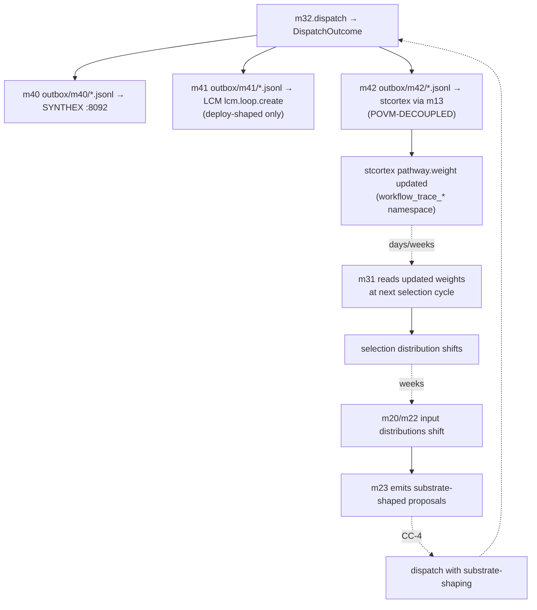

# CC-5 — Substrate Learning Loop — **SPECIAL DEPTH**

> **Back to:** [`README.md`](README.md) · [`../INDEX.md`](../INDEX.md) · canonical [`../../ai_docs/optimisation-v7/MODULE_PLANS/CROSS_CLUSTER_SYNERGIES.md`](../../ai_docs/optimisation-v7/MODULE_PLANS/CROSS_CLUSTER_SYNERGIES.md) § CC-5 (SPECIAL DEPTH) · [`../layers/cluster-G.md`](../layers/cluster-G.md) · [`../layers/cluster-H.md`](../layers/cluster-H.md)

## Contract surface — and the load-bearing fact

CC-5 IS **the engine's only substrate-grain loop.** Per G3 substrate-frame pass: "From substrate-frame, bidirectional edges are *information channels* between persistent substrate-state stores. The CC-5 loop is the only true substrate-grain loop (Hebbian-pulse update). Other CCs are anthropocentric-control flows (function call graphs); useful for code organisation but not substrate-shaping."

**The substrate-frame distinction:** CC-5 is the only contract whose absence would cause substrate to silently degrade. Other CCs failing produces obvious test failures. CC-5 failing produces **invisible non-learning** — engine appears functional but substrate-weight never moves. This is why Watcher Class-I (Hebbian silence) is pre-positioned as the primary class for CC-5.

## Modules involved

- **m32** (Cluster G, trigger) — emits `DispatchOutcome` post-execution; fans into m40/m41/m42 fire-and-forget.
- **m40** (Cluster H) — emits typed `WorkflowEvent` to SYNTHEX v2 `:8092/v3/nexus/push`.
- **m41** (Cluster H) — routes deploy-shaped DispatchOutcome through LCM `lcm.loop.create` (NOT `lcm.deploy`).
- **m42** (Cluster H) — Hebbian reinforce via m13 stcortex write under `workflow_trace_*` AP30 prefix. **POVM-DECOUPLED per 2026-05-17 ADR** — no POVM branch.
- **stcortex (external)** — pathway weights update on substrate side.
- **m31** (Cluster G, next-cycle reader) — reads updated pathway weights at next selection cycle (timescale: days/weeks).
- **m20, m22** (Cluster F, downstream consumers over weeks) — iterator inputs shift as substrate-grain selection distribution shifts.

## Data-flow

The loop is **intentionally slow — Hebbian-grain, not per-event**. Per-deploy effect on substrate is small; cumulative effect over weeks shifts the engine's selection bias toward higher-fitness pathways.

## Substrate-grain semantics (load-bearing)

Per V7 § CC-5 in depth:

> m32 dispatches workflow `W` via Conductor → fan-out fire-and-forget to Cluster H:
> - m40 emits `WorkflowEvent::Run { id: W, outcome }` to SYNTHEX v2 `:8092/v3/nexus/push`
> - m41 routes deploy-shaped steps through LCM `lcm.loop.create`
> - m42 calls stcortex via m13 with `fitness_delta` per outcome (PassVerified +0.25 ... Fail −0.10) under `workflow_trace_*` pathway prefix
>
> Pathway weights update in stcortex. Next selection cycle, m31 reads updated pathway weights, composite score shifts, selection distribution changes. Over weeks, m20-m22 iterator inputs shift accordingly.

## Coupling discipline

- **Outbox-first JSONL durability.** Every Cluster H emit writes to `outbox/m{40,41,42}/*.jsonl` BEFORE the network RPC. Network never blocks m32 dispatch; substrate-down is a recoverable condition (offline-snapshot replay on substrate return).
- **Circuit breaker on 2 consecutive failures.** Each Cluster H module tracks its own breaker; OPEN after 2 failures, HALF_OPEN after 30s, CLOSED after 1 success. Watcher Class-I logs every OPEN transition.
- **Fitness-delta constants are module-level.** `m42::FITNESS_PASS_VERIFIED = +0.25`, `FITNESS_PASS = +0.15`, `FITNESS_BLOCKED = -0.05`, `FITNESS_FAIL = -0.10`. Clamp to `[-1.0, 1.0]` is post-compute defense.
- **AP-V7-13 mitigation (m42).** HTTP 200 on `/v1/pathway` is NEVER taken as proof that pathway-weights moved. Verification belongs to the Class-I Watcher rolling-window monitor (7-day delta on `workflow_trace_*` IDs).
- **No POVM fallback (m42).** Per Genesis v1.3 § 2 + ADR 2026-05-17: m42 surfaces `ReinforceOutcome::SubstrateUnavailable` typed error; never silent POVM fall-through.

## Invariants

| # | Invariant | Enforcement |
|---|---|---|
| 1 | Outbox written before network RPC | unit test asserts write-order |
| 2 | Breaker OPEN after 2 consecutive failures | unit test simulates failure sequence |
| 3 | `fitness_delta` clamped to [-1.0, 1.0] | property test |
| 4 | m42 zero POVM symbol | `rg -i 'povm' src/m42_stcortex_emit/` returns 0 (allowed: `// POVM-DECOUPLED` comments) |
| 5 | AP30 prefix on every stcortex write | m9::assert_namespace called at m42 site |
| 6 | Hyphen-slug encoding at slug boundary | property test on slug conversion |

## Closure test

`tests/integration/cc5_substrate_learning_loop.rs` — requires live services. `#[ignore = "requires synthex-v2 + povm-v2 + Conductor"]` for PR-CI; runs in nightly + Wave-end. The test:

1. Capture baseline `povm_learning_health()` value (legacy probe — m42 itself doesn't depend on POVM).
2. Dispatch a known test workflow via m32.
3. Assert `DispatchOutcome::PassVerified | Pass`.
4. Sleep 2s for substrate propagation.
5. Re-read `povm_learning_health()` and assert `post > pre` (the legacy delta probe).
6. **Primary CC-5 verification:** call `stcortex_query_pathway_weight_delta(workflow_trace_*, window=7d)` and assert non-zero. This is the post-ADR-2026-05-17 verification surface — replaces "POVM learning_health moved" with substrate-grain pathway delta.

If the primary assertion (step 6) fails, **Class-I would fire** — CC-5 not closing, substrate not moving. This is the engine's most important silent-failure detection.

## Failure mode (Watcher Class-I flag — primary CC-5 risk)

Per V7 § CC-5:

> If `learning_health` does not move during pipeline runs, Cluster H is decorative — engine appears functional but substrate isn't being fed. Pre-positioned to flag at synthesis time as workflow-level improvement candidate.

This is the engine's **most important** silent-failure mode. Detection is structural (Phase 5C weekly Watcher synthesis includes pathway-weight delta over rolling 7-day window on `workflow_trace_*` IDs).

## Watcher class pre-position

- **Class I (Hebbian silence)** is the **PRIMARY** class for CC-5 — pre-positioned to fire if substrate doesn't move after first 5+ dispatches.
- **Class A (activation)** at first CC-5 closure (first successful round-trip — Day 26 ideal).
- **Class B (hand-off boundary)** at every Cluster H wire attempt.
- **Class D (four-surface drift)** if outbox JSONL durability drifts from wire emit schema (m40_42_common consistency).

## Owning runbook

- Primary: `RUNBOOKS/runbook-04-phase-3-integration.md` § CC-5 first closure (Day 26 milestone — first measurable substrate delta).
- Secondary: `RUNBOOKS/runbook-06-phase-5-deploy-soak.md` § continuous loop verification (Phase 5C weekly synthesis).

## Substrate-substrate coupling decomposition (NA-GAP-03 closure, Wave 4)

Per [`../../ai_docs/NA_GAP_ANALYSIS_S1002127_SCAFFOLD.md`](../../ai_docs/NA_GAP_ANALYSIS_S1002127_SCAFFOLD.md) NA-GAP-03, CC-5 collapses **4-5 substrate-substrate edges** into a single "substrate-learning loop" line. The Frame A decomposition makes each edge explicit:

| # | Substrate → Substrate edge | Trigger | Engine-observable? | Verification |
|---|---|---|---|---|
| **E1** | `m32 → S-C stcortex (pathway weight delta)` | every Cluster H emit | partially (m42 receipt confirms ingest; not propagation) | Watcher Class-I rolling 7-day delta on `workflow_trace_*` |
| **E2** | `m32 → S-E synthex NexusEvent → S-C stcortex (via Hebbian coordinator since S226)` | m40 push triggers SYNTHEX v2's Hebbian coordinator to compute deltas | NO — engine sees emit but not coordinator action | Watcher Class-I subscribes to BOTH endpoints |
| **E3** | `S-C stcortex → habitat-memory daemon → S-B injection.db reinforcement_count` | substrate-side translation by habitat-memory | NO — engine does not control or directly observe | Next-session `habitat-inject` hook surfaces the row; engine observes via m3 read delta |
| **E4** | `m32 → S-F LCM (deploy-shaped) → S-V3 deploy partner` | deploy-shaped DispatchOutcomes only (m41) | partially (LCM loop_id receipt; V3 partner is not engine-visible) | LCM supervisor + V3 health probe |
| **E5** | `S-C stcortex → S-G operator via weekly digest reports` | substrate-side digest cadence | NO — engine does not trigger digest | watcher-notices file drops observe digest fire |

**The hidden CC-5 chain that NA-GAP-03 surfaces:** `m32 → S-C → habitat-memory daemon → S-B → next-session m3 read → m20 iterator priors shift`. Today the engine "verifies" CC-5 via Watcher Class-I monitoring on S-C only — Class-I fires on absence of pathway-weight delta but does NOT detect S-C → S-B coupling failure (e.g. injection.db TTL sweep deleting reinforced rows before next-session reads, per the canonical `feedback_ttl_sweep_test_timestamps.md` incident shape).

**Per-edge observability contract:** each edge in the table MUST have its own observability surface. The engine should NOT collapse CC-5 verification into "Class-I fired = loop healthy". E1+E2 verification is at S-C delta; E3 verification requires cross-substrate timing (S-C write at T → S-B row pre-warmed at T + session_delta) — see substrate dossiers [`../substrates/stcortex.md`](../substrates/stcortex.md) § 8 and [`../substrates/injection_db.md`](../substrates/injection_db.md) § 8.

**Substrate-confirmable receipt (NA-GAP-09 closure):** the engine SHOULD request a substrate-side `cc5_closed_at` field — stcortex itself writes this when it detects N+1-dispatch reinforce on the same pathway. This replaces engine-side inference with substrate-confirmation. Pending substrate-side change request; tracked in [`../../ai_docs/decisions/`](../../ai_docs/decisions/).

## Refusal-token observability (NA-GAP-11 closure, Wave 4)

When CC-5 fan-out encounters a refusal at any edge, the refusing module emits a `WireEvent::Refusal { token: ... }` per [`../cross-cutting/refusal-taxonomy.md`](../cross-cutting/refusal-taxonomy.md):
- `S-C stcortex RefuseWriteNoConsumer` → m42 emits `SubstrateAuthored` token
- `S-E synthex SchemaRejected` → m40 emits `SubstrateAuthored` token
- `S-F lcm SupervisorNotLive` → m41 emits `SubstrateAuthored` token
- `m32 5-check failure` → m32 emits `EngineAuthored` token via m40

The Watcher Class-C count is sourced from these wire emissions, not Watcher-inferred from absence.

---

> **Back to:** [`README.md`](README.md) · canonical [`../../ai_docs/optimisation-v7/MODULE_PLANS/CROSS_CLUSTER_SYNERGIES.md`](../../ai_docs/optimisation-v7/MODULE_PLANS/CROSS_CLUSTER_SYNERGIES.md) § CC-5 (SPECIAL DEPTH) · NA remediation [`../../ai_docs/NA_GAP_ANALYSIS_S1002127_SCAFFOLD.md`](../../ai_docs/NA_GAP_ANALYSIS_S1002127_SCAFFOLD.md) · [`../substrates/`](../substrates/) · [`../cross-cutting/refusal-taxonomy.md`](../cross-cutting/refusal-taxonomy.md) · [`../cross-cutting/substrate-drift.md`](../cross-cutting/substrate-drift.md)
