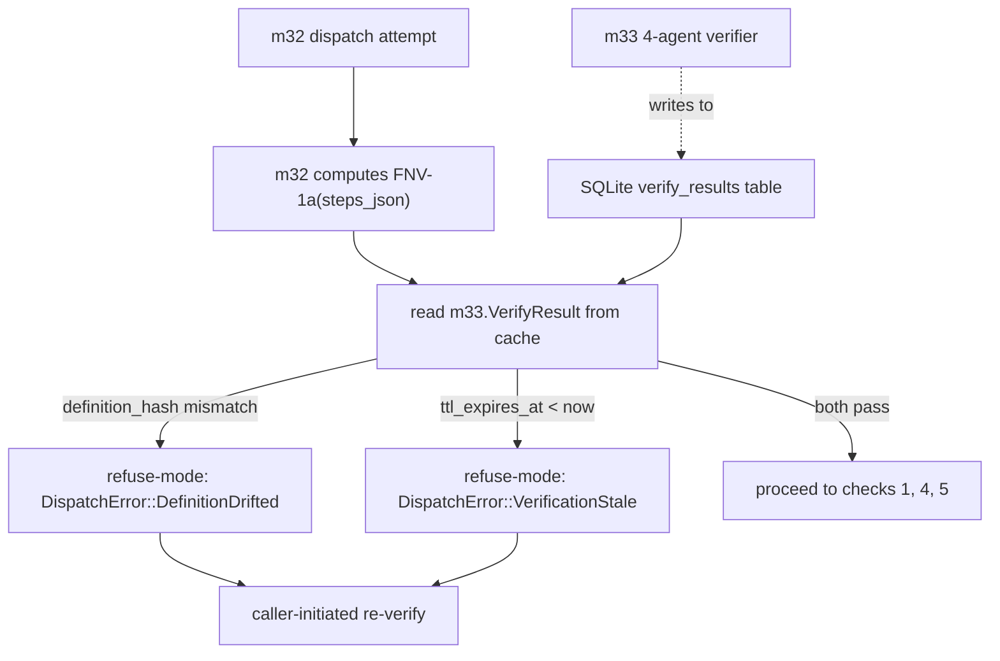

# CC-6 — Verification-Gated Dispatch (G internal)

> **Back to:** [`README.md`](README.md) · [`../INDEX.md`](../INDEX.md) · canonical [`../../ai_docs/optimisation-v7/MODULE_PLANS/CROSS_CLUSTER_SYNERGIES.md`](../../ai_docs/optimisation-v7/MODULE_PLANS/CROSS_CLUSTER_SYNERGIES.md) § CC-6 · [`../layers/cluster-G.md`](../layers/cluster-G.md)

## Contract surface

CC-6 IS **the verification-gated dispatch contract** internal to Cluster G — m33 produces `VerifyResult { definition_hash, ttl_expires_at, verdict }` that m32 reads at dispatch check 2 (TTL freshness) and check 3 (definition hash match). The two modules do NOT call each other synchronously — m33 writes to a persistent cache (SQLite); m32 reads at dispatch time. Staleness (TTL expired) or hash-drift (definition changed since verification) triggers refuse-mode and a caller-initiated re-verify; no soft-fail path.

## Modules involved

- **m33** (Cluster G, OWNER) — `workflow_verifier`; 4-agent dry-run (Zen + security-auditor + silent-failure-hunter + performance-engineer); produces `VerifyResult` with 7-day TTL.
- **m32** (Cluster G, consumer) — reads `VerifyResult` at dispatch check 2 + 3 of the 5-check sequence.

## Data-flow

## Coupling discipline

- m32 and m33 do NOT call each other synchronously. m33 writes `VerifyResult` to a persistent cache; m32 reads at dispatch time.
- The 4-agent verifier requires unanimous PASS from all 4 agents (Zen + security-auditor + silent-failure-hunter + performance-engineer). Any DEGRADED yields verdict DEGRADED; any FAIL yields FAIL.
- 7-day TTL on `last_verified_at`; expiry forces re-verify before next dispatch.
- Definition hash is FNV-1a 64-bit hex of canonical `steps_json`; any edit to `steps_json` post-verification breaks the hash and forces re-verify.

## Invariants

| # | Invariant | Enforcement |
|---|---|---|
| 1 | m33 4-agent unanimous PASS required for verdict PASS | unit test simulates partial PASS → DEGRADED |
| 2 | 7-day TTL hard-bounded | property test on TTL arithmetic |
| 3 | `definition_hash` is FNV-1a of canonical steps_json | unit test on canonicalisation + hash |
| 4 | m32 refuses on hash mismatch (DefinitionDrifted) | unit test |
| 5 | m32 refuses on TTL expired (VerificationStale) | unit test |
| 6 | No m32 → m33 synchronous call | API audit: `rg 'm33::' src/m32_conductor_dispatcher/` returns 0 (read happens via shared cache) |

## Closure test

`tests/integration/cc6_verification_gated_dispatch.rs` — `#[ignore = "requires Conductor :8141"]` until B3 resolved. Asserts:

1. m33 verify succeeds with all 4 agents PASS → `VerifyResult { verdict: PASS, ttl: 7d }` cached
2. m32 dispatch reads cached `VerifyResult`, hash matches, TTL fresh → proceeds
3. m33 verify with 3-of-4 PASS → DEGRADED verdict
4. m32 dispatch with stale TTL → `DispatchError::VerificationStale`
5. m32 dispatch with hash mismatch (caller edits steps_json) → `DispatchError::DefinitionDrifted`
6. Re-verify after staleness → fresh `VerifyResult` allows next dispatch

## Failure modes if violated

- **3-of-4 PASS silently promoted to PASS:** verification theatre; one agent's silence misread as consent. Caught: invariant #1.
- **TTL extended in-place:** verification staleness hidden; dispatch on stale check. Caught: invariant #2 + no `extend_ttl` method.
- **Definition hash collision (two different steps_json → same hash):** dispatch on wrong definition. FNV-1a collision basics tested; reserved as F-Regression slot for future cryptographic upgrade.
- **m32 synchronous call to m33 added for "freshness":** tight coupling defeats the cache architecture; m33's async verify (5 min) blocks dispatch. Caught: invariant #6.

## Watcher class pre-position

- **Class C (refusal)** at every TTL-expired or hash-drift refuse-mode.
- **Class A (activation)** at first successful CC-6 closure (first hash-match + TTL-fresh dispatch).

## Owning runbook

- Primary: `RUNBOOKS/runbook-03-phase-2B-active.md` (Cluster G build wave).
- Integration: `RUNBOOKS/runbook-04-phase-3-integration.md` (CC-6 integration verification).

---

> **Back to:** [`README.md`](README.md) · canonical [`../../ai_docs/optimisation-v7/MODULE_PLANS/CROSS_CLUSTER_SYNERGIES.md`](../../ai_docs/optimisation-v7/MODULE_PLANS/CROSS_CLUSTER_SYNERGIES.md) § CC-6
