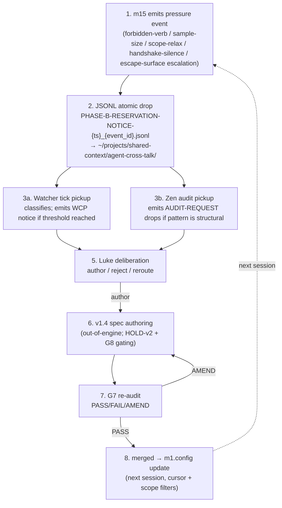

# CC-7 — Pressure-Driven Evolution (E → operator) — GAP-Bidi-02 closure

> **Back to:** [`README.md`](README.md) · [`../INDEX.md`](../INDEX.md) · canonical [`../../ai_docs/optimisation-v7/MODULE_PLANS/CROSS_CLUSTER_SYNERGIES.md`](../../ai_docs/optimisation-v7/MODULE_PLANS/CROSS_CLUSTER_SYNERGIES.md) § CC-7 (GAP-Bidi-02 closure) · [`../layers/cluster-E.md`](../layers/cluster-E.md)

## Contract surface

CC-7 IS **the spec-grain evolution loop** — the only contract that evolves the engine's *spec* on a meta-substrate (human deliberation surface). CC-5 evolves the engine's *behaviour* on a substrate (Hebbian-grain). CC-7 closes the structural pressure surface: m15 emits typed `ReservationNotice` JSONL events to `~/projects/shared-context/agent-cross-talk/` → Watcher and Zen pick them up at tick / G7 cadence → Luke deliberates → v1.4+ spec amendment authored → G7 re-audit → merged → m1 reads updated config (cursor, scope filters) → loop continues.

This is the engine's **meta-loop** that lets CC-3..CC-6 evolve their constraints over time.

## Modules involved

- **m15** (Cluster E, OWNER) — pressure register; emits JSONL one-event-per-file with atomic tmp+rename.
- **agent-cross-talk/** (filesystem) — `~/projects/shared-context/agent-cross-talk/PHASE-B-RESERVATION-NOTICE-{ts}_{event_id}.jsonl`.
- **The Watcher ☤** — reads agent-cross-talk at tick cadence; emits WCP notices via `~/.local/bin/watcher notify`.
- **Zen** — audits forbidden-verb pressure at G7-style cadence; emits AUDIT-REQUEST drops.
- **Luke @ node 0.A** — receives accumulated pressure; deliberates spec amendment.
- **v1.4/v1.5 spec authoring** (out-of-engine) — under HOLD-v2 + G8 gating.
- **m1** (Cluster A, next-session reader) — reads updated config (cursor, scope filters).

## 8-step pressure-driven evolution sequence

## Trigger conditions for m15 emission

Per [`../layers/cluster-E.md`](../layers/cluster-E.md) m15 spec:

- **Forbidden-verb dispatch attempt** — m32 attempted to dispatch a verb not in allow-list.
- **Sample-size relaxation pressure** — m20-m23 internal pressure to weaken n<20.
- **Scope-relaxation pressure** — any module attempting to relax a v1.2 invariant.
- **Handshake silence** — peer ack expected past timeout.
- **Escape-surface escalation** — workflow's classified surface increases over time.

## Coupling discipline

- **One file per event** (no append mode). Append mode = corruption on process crash mid-write. Watcher's reader assumes one-file-one-event.
- **Atomic write (tmp + rename).** `*.tmp` write then `mv` to canonical name. Watcher reads canonical name only.
- **De-dup window 60s.** Same `(event_kind, context_hash)` within 60s collapses to one file with `count: N`. Prevents pressure-flooding under fleet hot-paths.
- **Filename convention contract-binding.** `PHASE-B-RESERVATION-NOTICE-{ts}_{event_id}.jsonl`. Watcher's reader pattern-matches; renaming breaks the reader.
- **Pressure is the signal — never suppressed.** Adding "if too many events, suppress" branch is rejected; suppression is what CC-7 evolution loop runs against (loop never closes if pressure is hidden).

## Invariants

| # | Invariant | Enforcement |
|---|---|---|
| 1 | One file per event | spec contract; no append-mode code path |
| 2 | Atomic tmp+rename | unit test simulates mid-write crash |
| 3 | 60s de-dup window | unit test |
| 4 | Filename matches `^PHASE-B-RESERVATION-NOTICE-\d+_[a-f0-9]+\.jsonl$` | property test on filename generation |
| 5 | JSONL schema matches Watcher reader format | contract test against Watcher's reader |
| 6 | No suppression branch | API surface audit |

## Closure test

`tests/integration/cc7_pressure_driven_evolution.rs` — pure in-process; no live services required (Watcher / Zen / Luke steps are out-of-engine). Asserts:

1. m15 pressure events emit to expected agent-cross-talk path.
2. JSONL filename follows convention (regex match).
3. Content schema matches Watcher's expected reader format (snapshot test).
4. De-dup window (60s same kind+context → coalesce to 1 file with count) honoured.
5. Atomic-write semantics (no `*.tmp` files left after successful emit).

## Failure modes if violated

- **Append mode used to "save filesystem overhead":** crash mid-write corrupts JSONL; Watcher reads garbage. Caught: invariant #1.
- **Tmp file not renamed:** Watcher misses event entirely. Caught: invariant #2.
- **No de-dup:** pressure-flood under fleet hot-paths drowns Watcher signal. Caught: invariant #3.
- **Filename pattern drift:** Watcher's reader rejects all subsequent events; pressure-evolution loop silently breaks. Caught: invariant #4.
- **Suppression branch added for "noise reduction":** the noise IS the signal; suppression breaks the loop. Caught: invariant #6.

## Watcher class pre-position

- **Class C (refusal)** at every pressure emission — emit IS the refusal-to-relax surface.
- **Class G (substrate-frame confusion)** at scope-relaxation pressure events suggesting substrate-grain inputs are being treated as anthropocentric.
- **Class E (ancestor-rhyme)** escalation if same-kind pressure events accumulate >10 over 14 days without spec amendment landing — indicates planning sprawl OR engine ossification (depending on direction).

## Owning runbook

- Primary: `RUNBOOKS/runbook-10-cross-cutting.md` § CC-7 (cross-cutting per V7 TASK_LIST T4.10).
- Secondary: `RUNBOOKS/runbook-06-phase-5-deploy-soak.md` § Phase 5C weekly synthesis includes pressure-event accumulation review.

---

> **Back to:** [`README.md`](README.md) · canonical [`../../ai_docs/optimisation-v7/MODULE_PLANS/CROSS_CLUSTER_SYNERGIES.md`](../../ai_docs/optimisation-v7/MODULE_PLANS/CROSS_CLUSTER_SYNERGIES.md) § CC-7
