# DATA_FLOW — What rows travel which edges

> **Back to:** [`README.md`](README.md) · [`../ARCHITECTURE.md`](../ARCHITECTURE.md) · canonical [`../ai_docs/optimisation-v7/ULTRAMAP.md`](../ai_docs/optimisation-v7/ULTRAMAP.md) · sibling [`MODULE_DEPENDENCY_GRAPH.md`](MODULE_DEPENDENCY_GRAPH.md) · [`CONTROL_FLOW.md`](CONTROL_FLOW.md) · [`CONTEXTUAL_FLOW.md`](CONTEXTUAL_FLOW.md) · [`INVARIANT_MAP.md`](INVARIANT_MAP.md)
>
> **Purpose:** rendering of the engine's typed data lifecycle from the ingest substrate (`~/.local/share/atuin/history.db`) to the substrate-feedback emit (stcortex pathway-weight delta). Every edge is annotated with the **type/struct** that flows across it and a one-paragraph note on the transformation. Read this when you need to answer "between m20 and m23, what shape is the data?" or "what does `m32` actually send to Conductor?". This view sits alongside [MODULE_DEPENDENCY_GRAPH.md](MODULE_DEPENDENCY_GRAPH.md) (build edges) and [CONTROL_FLOW.md](CONTROL_FLOW.md) (when edges fire).

---

## End-to-end flowchart

```mermaid
flowchart LR
    %% =============================================================
    %% workflow-trace data lifecycle (LR = left-to-right)
    %% Each edge labelled with the type/struct flowing across it
    %% =============================================================

    classDef substrate fill:#e8f7e8,stroke:#1a7a1a,color:#000
    classDef ingest    fill:#d6eaff,stroke:#1a4d99,color:#000
    classDef hub       fill:#fff3cd,stroke:#a67c00,color:#000
    classDef keystone  fill:#e7d8ff,stroke:#5a2da0,color:#000
    classDef dispatch  fill:#ffd9d9,stroke:#a00000,color:#000
    classDef emit      fill:#cce6cc,stroke:#1a7a1a,color:#000
    classDef human     fill:#ffe3b3,stroke:#cc6600,stroke-width:2px,color:#000

    %% ----- Substrate inputs (L0) -----
    ATUIN[(atuin.db<br/>~263k rows)]:::substrate
    STC_IN[(stcortex :3000<br/>narrowed scope)]:::substrate
    INJ[(injection.db<br/>causal_chain)]:::substrate

    %% ----- L1 Ingest -----
    m1[m1 atuin_consumer]:::ingest
    m2[m2 stcortex_consumer]:::ingest
    m3[m3 injection_db_consumer]:::ingest

    %% ----- L2 Observation -----
    m4[m4 cascade_correlator]:::ingest
    m5[m5 battern_step_record]:::ingest
    m6[m6 context_cost EMA]:::ingest

    %% ----- L3 Hub -----
    m7[(m7 workflow_runs<br/>SQLite hub<br/>JSONB consumer_inputs)]:::hub
    m12[m12 cli_reports]:::ingest
    m13[m13 stcortex_writer]:::emit

    %% ----- L5 Evidence -----
    m14[m14 outcome_lift<br/>Wilson CI]:::ingest
    m15[m15 pressure_register]:::ingest

    %% ----- L6 KEYSTONE -----
    m20[m20 prefixspan_miner]:::keystone
    m21[m21 variant_builder]:::keystone
    m22[m22 kmeans_feature]:::keystone
    m23[m23 workflow_proposer]:::keystone

    %% ----- Human boundary -----
    OP{{HUMAN<br/>wf-crystallise propose accept ID}}:::human

    %% ----- L7 Dispatch -----
    m30[(m30 curated_bank<br/>AcceptedWorkflow rows)]:::dispatch
    m31[m31 selector<br/>composite α/β/γ/δ]:::dispatch
    m32[m32 conductor_dispatcher<br/>5-check]:::dispatch
    m33[m33 verifier<br/>4-agent · 7d TTL]:::dispatch

    %% ----- L7 external -----
    COND[(HABITAT-CONDUCTOR<br/>:8141)]:::substrate

    %% ----- L8 Substrate Feedback -----
    m40[m40 nexusevent_emit]:::emit
    m41[m41 lcm_rpc]:::emit
    m42[m42 stcortex_emit]:::emit

    SX2[(SYNTHEX v2<br/>:8092/v3/nexus/push)]:::substrate
    LCM[(LCM RPC<br/>lcm.loop.create)]:::substrate
    STC_OUT[(stcortex :3000<br/>workflow_trace_* pathways)]:::substrate

    %% ----- Sideband -----
    ACT[/agent-cross-talk JSONL drop/]:::substrate

    %% =============================================================
    %% Edges — typed
    %% =============================================================

    ATUIN  -->|"AtuinHistoryRow"| m1
    STC_IN -->|"ToolCallRow + ConsumerSignal"| m2
    INJ    -->|"CausalChainRow"| m3

    m1 -->|"AtuinHistoryRow iter"| m4
    m1 -->|"AtuinHistoryRow iter"| m5
    m1 -->|"AtuinHistoryRow iter"| m6

    m4 -->|"CascadeCluster cluster_id, session_id, step_count"| m7
    m6 -->|"ContextCostBand session_type, ema_mean, ema_variance, n"| m7
    m3 -->|"CausalChainRow"| m7

    m7 -->|"WorkflowRunRow consumer_inputs JSONB"| m12
    m7 -->|"WorkflowRunRow"| m13
    m2 -->|"trust signal"| m13

    m7 -->|"WorkflowRunRow"| m14

    %% Cluster F chain
    m5 -->|"BatternStep iter ordered"| m20
    m20 -->|"Pattern steps:Vec~StepToken~, support, gap_bounds"| m21
    m21 -->|"WorkflowVariant"| m22
    m22 -->|"FeatureCluster"| m23
    m14 -->|"Option~Lift~ Wilson CI"| m23

    %% Proposal → human → bank
    m23 -->|"WorkflowProposal"| OP
    OP  ==>|"AcceptedWorkflow + HumanAcceptanceSignature"| m30

    %% Cluster G internal
    m30 -->|"BankEntry definition_hash, sunset_at"| m31
    m11_link[m11 freq×fitness×recency]:::keystone
    m11_link -.->|"decay multiplier"| m31
    m31 -->|"SelectedWorkflow composite_score"| m32
    m33 -.->|"VerificationReceipt verdict, definition_hash, ttl_expires_at"| m32

    %% Dispatch
    m32 -->|"ConductorDispatchRequest dispatch_id, steps, escape_surface"| COND
    COND -.->|"DispatchOutcome accepted | rejected | error"| m32

    %% Fan-out to Cluster H
    m32 -->|"WorkflowDispatchEvent"| m40
    m32 -->|"WorkflowDispatchEvent"| m41
    m32 -->|"WorkflowDispatchEvent"| m42

    m40 -->|"NexusEvent JSON"| SX2
    m41 -->|"deploy-shaped step"| LCM
    m42 -->|"ReinforcePayload fitness_delta, retrieval_ids"| m13
    m13 -->|"pathway write"| STC_OUT

    %% CC-5 substrate feedback loop (slow)
    STC_OUT -.->|"pathway.weight delta days/weeks"| m31

    %% CC-7 pressure sideband
    m15 -->|"PressureEvent JSONL"| ACT

    %% Outputs
    m12 -->|"stdout / JSON"| OPOUT[/operator terminal/]
```

---

## Edge-by-edge transformation notes

### Stage 1 — Substrate to L1 (read-only ingest)

**`atuin.db → m1` : `AtuinHistoryRow`.** m1 opens `~/.local/share/atuin/history.db` with `?mode=ro` URI and `PRAGMA query_only = ON` (per [m1 spec § 1](../ai_specs/modules/cluster-A/m1_atuin_consumer.md)). It yields `AtuinHistoryRow { id, command, session: SessionId, hostname, timestamp_ms, exit, duration_ms, cwd }`. Byte-for-byte preservation is a contract invariant — m1 never folds, normalises, or trims any string field, because downstream m4 derives FNV-1a XOR opaque cluster IDs from these bytes and pre-folding would silently corrupt CC-1 cascade correlation.

**`stcortex :3000 → m2` : narrowed `ToolCallRow + ConsumerSignal`.** m2 subscribes to the stcortex reducer-callback for two table classes only: `tool_call` and `consumption`. Anything outside that narrow scope is rejected at the consumer boundary — per [`plan.toml`](../plan.toml) m2 description "narrowed scope". The async callback dedups via stcortex's reducer-id and emits typed rows plus a trust signal that m13 later consumes when deciding whether to write back.

**`injection.db → m3` : `CausalChainRow`.** m3 reads `~/.local/share/habitat/injection.db` (the workspace-wide habitat-injection database, per [workspace CLAUDE.md memory row 7](../../CLAUDE.md)). Rows are partitioned `resolved_session IS NULL` vs `IS NOT NULL`; m3 surfaces both with a `partition: enum {Resolved, Unresolved}` discriminator.

### Stage 2 — L1 to L2 (interpretation begins)

**`m1 iter → m4` : `AtuinHistoryRow` stream → `CascadeCluster`.** m4 is the engine's first *interpreter*. It groups history rows into cascade clusters using an FNV-1a XOR opaque-ID derivation (per [`../ai_docs/optimisation-v7/ULTRAMAP.md`](../ai_docs/optimisation-v7/ULTRAMAP.md) View 2 m4 row "F11 opaque IDs"). The output type is `CascadeCluster { cluster_id: u64, session_id: SessionId, step_count: usize, steps: Vec<StepToken> }`. Critically, `cluster_id` is *opaque* — not human-readable — because anthropocentric labelling at this layer would let downstream classifiers cheat (F11 mitigation). Per [CC-1 spec § Watcher class pre-position](../ai_docs/optimisation-v7/MODULE_PLANS/CROSS_CLUSTER_SYNERGIES.md), human-readable cluster names would trip Class-G (substrate-frame confusion).

**`m1 iter → m5` : `AtuinHistoryRow` → `BatternStep`.** m5 detects Battern-pattern step sequences (per the Battern dispatch protocol — see [Skills `/battern` reference](../../CLAUDE.md)) and emits `BatternStep { id, label: Option<String>, sequence_position, ts_ms }`. The `label` is intentionally `Option` because unlabelled batterns are preserved (lossless), and m20's PrefixSpan downstream treats labelled and unlabelled steps identically at the token level.

**`m1 iter → m6` : `AtuinHistoryRow` → `ContextCostBand`.** m6 computes a 20-session rolling EMA of context cost (token usage per session — per [`plan.toml`](../plan.toml) m6 description "20-session EMA"). Critically, sessions whose outcome was `Converged` are **excluded** from the baseline (F10) so the EMA represents the *uncertain* substrate cost, not the confident one. Output type: `ContextCostBand { session_type, ema_mean, ema_variance, n }`.

### Stage 3 — L2 to L3 (central hub)

**`m4 + m6 + m3 → m7` : three streams join into one `WorkflowRunRow`.** This is the CC-1 join surface. m7 owns a SQLite table `workflow_runs` with a `consumer_inputs JSONB` column (F9 zero-weight — additive, never removes columns). m4 writes its `CascadeCluster` into `consumer_inputs.cascade`, m6 writes `ContextCostBand` into `consumer_inputs.cost`, m3 writes `CausalChainRow` into `consumer_inputs.injection`. The join discipline is critical: **m4 and m6 never call each other** — they both write through m7's schema. This is the "stable schema as coupling surface" pattern called out in [`../ai_docs/optimisation-v7/MODULE_PLANS/CROSS_CLUSTER_SYNERGIES.md`](../ai_docs/optimisation-v7/MODULE_PLANS/CROSS_CLUSTER_SYNERGIES.md) § CC-1.

**`m7 → m12` : `WorkflowRunRow` → stdout / JSON report.** m12 emits human-readable CLI reports gated by the `api` feature. The transformation is presentational only — no interpretation beyond pretty-printing and optional JSON serialisation for downstream tooling.

**`m7 + m2 → m13` : `WorkflowRunRow` + trust signal → stcortex pathway write.** m13 is the canonical stcortex writer. It applies a **3-band LTP/LTD gate** before writing (per [`plan.toml`](../plan.toml) m13 description) — only writes whose computed Hebbian magnitude lands in one of three configured bands actually fire. Sub-threshold writes are silently buffered in a deferred JSONL queue (per m13 cluster-C spec). The trust signal from m2 lets m13 cross-check the consumer pulled from stcortex matches the version it's about to write back to (no read-modify-write across drift).

### Stage 4 — L3 to L5 (evidence)

**`m7 → m14` : `WorkflowRunRow` → `Option<Lift>`.** m14 computes habitat-outcome lift with a Wilson confidence interval. When `n < 20`, m14 emits `None` — explicitly NOT a numeric stand-in (per [m14 spec via cluster-E plan referenced in CROSS_CLUSTER_SYNERGIES § CC-3](../ai_docs/optimisation-v7/MODULE_PLANS/CROSS_CLUSTER_SYNERGIES.md)). The `Option` is the runtime gate enforced by m23 at proposal construction time.

### Stage 5 — L2 / L3 / L5 to L6 KEYSTONE iteration

**`m5 → m20` : `BatternStep` stream → `Pattern`.** m20 runs PrefixSpan (the Gap 1 net-new algorithm) over session-grouped Battern steps with bounded right-gap `MAX_GAP_STEPS=5`. The output type is `Pattern { steps: Vec<StepToken>, support: usize, gap_bounds: (usize, usize) }` (per [m20 spec § 4 public API](../ai_specs/modules/cluster-F/m20_prefixspan_miner.md)). The `StepToken` is `u32` opaque — display labels are resolved only at report-emit time by m12 via a `StepTypeRegistry`, preserving F11 cascade-monoculture mitigation. Sorting is deterministic: support DESC, then length DESC.

**`m20 → m21` : `Pattern` → `WorkflowVariant`.** m21 expands patterns into workflow variants by Levenshtein clustering — variants whose normalised edit-distance is within a threshold are grouped, and a representative is elected per cluster. Output: `WorkflowVariant { id, base_pattern, similar: Vec<Pattern>, representative_score: f64 }`.

**`m21 → m22` : `WorkflowVariant` → `FeatureCluster`.** m22 runs K-means over a feature embedding of each variant (cost-band, step-length, lift estimate, gap statistics). K is set by silhouette analysis at the workflow-runs hub aggregate. Output: `FeatureCluster { centroid, members, inertia }`.

**`m22 + m14 → m23` : `FeatureCluster` + `Option<Lift>` → `WorkflowProposal`.** m23 is the proposer. It enforces the CC-3 evidence gate at *construction time* via `lift.ok_or(ProposalError::LiftEvidenceMissing)?` (per [CROSS_CLUSTER_SYNERGIES § CC-3 coupling discipline](../ai_docs/optimisation-v7/MODULE_PLANS/CROSS_CLUSTER_SYNERGIES.md)). The "gradient preservation" name reflects that proposals are emitted top-K-by-distance N=3 — not greedy single-best — so the operator sees a small diverse slate rather than a single recommendation. Output: `WorkflowProposal { id, steps: Vec<StepToken>, provenance: Pattern, confidence: f64, deviation_rationale: String, expected_lift: Lift }`.

### Stage 6 — Human boundary (CC-4 mandatory)

**`m23 → OP → m30` : `WorkflowProposal` → operator review → `AcceptedWorkflow + HumanAcceptanceSignature`.** This is the **single most-load-bearing structural refusal** in the engine. The operator runs `wf-crystallise propose accept <id>` interactively; the CLI synthesises a `HumanAcceptanceSignature { signed_at, terminal_fingerprint, accepted_by }`. m30's `BankDb::accept()` API *requires* this argument; there is no `auto_promote()` function, no agent-callable insert path, no "if confidence > threshold, insert" branch (per [m30 spec § 1 First invariant — AP-V7-07](../ai_specs/modules/cluster-G/m30_curated_bank.md)). The output is an `AcceptedWorkflow { workflow_id, steps_json, escape_surface: EscapeSurfaceProfile, sunset_at: ts + 120d, definition_hash, accepted_by }`.

### Stage 7 — Cluster G internal (bank → select → verify → dispatch)

**`m30 → m31` : `BankEntry` (eligible rows where `sunset_at > now`) → composite scoring.** m31 reads eligible bank rows, applies the composite `α·fitness + β·recency + γ·frequency + δ·diversity = 0.40/0.25/0.20/0.15` formula (per [`../ai_docs/optimisation-v7/ULTRAMAP.md`](../ai_docs/optimisation-v7/ULTRAMAP.md) View 2 m31 row), and reads m11's `freq × fitness × recency` decay multiplier to attenuate scores of stale or low-performing workflows. Output: `Option<SelectedWorkflow { workflow_id, composite_score, diversity_band }>`.

**`m33 ⇢ m32` : `VerificationReceipt` (cached, read at dispatch time).** m33 runs a 4-agent verifier with a 7-day TTL and writes the result to a SQLite cache. m32 reads the cached `VerificationReceipt { verdict: Pass | Degraded | Fail, ttl_expires_at, definition_hash, agent_evidence }` at dispatch time — they do NOT synchronously call each other. Staleness or hash drift triggers m32 refuse-mode (per [CROSS_CLUSTER_SYNERGIES § CC-6](../ai_docs/optimisation-v7/MODULE_PLANS/CROSS_CLUSTER_SYNERGIES.md)).

**`m31 → m32 → Conductor` : `SelectedWorkflow` → `ConductorDispatchRequest` → `DispatchOutcome`.** m32 runs the 5-check pre-dispatch sequence (Conductor live → TTL fresh → definition_hash match → sunset → cooldown), builds a `ConductorDispatchRequest { dispatch_id: UUIDv7, workflow_id, steps: Vec<ResolvedStep>, escape_surface, dispatched_at, operator: "wf-dispatch/human", verification_receipt, dry_run }` (per [m32 spec § 2](../ai_specs/modules/cluster-G/m32_conductor_dispatcher.md)), and POSTs to HABITAT-CONDUCTOR at `127.0.0.1:8141/dispatch` (NDJSON, no `http://` prefix per m24_povm_bridge gold standard). Conductor responds with `DispatchOutcome::Accepted | Rejected { reason } | Error { msg }`.

### Stage 8 — Cluster H substrate feedback fan-out

**`m32 → {m40, m41, m42}` : `WorkflowDispatchEvent` fan-out via `tokio::mpsc`.** All three Cluster H modules receive the same event in parallel, fire-and-forget. Failures in any one do not block the others. The event carries `{ dispatch_id, workflow_id, lineage, step_count, escape_surface, dispatched_at, conductor_accepted }`.

**`m40 → SYNTHEX :8092/v3/nexus/push` : `NexusEvent` (JSON, Option A untyped MVP).** m40 emits a coordination event for SYNTHEX v2's Hebbian coordinator. Outbox-first JSONL durability — the event lands in `outbox/m40/*.jsonl` *before* the wire attempt, so SYNTHEX-down never blocks the engine.

**`m41 → LCM RPC` : `lcm.loop.create { max_iters: 1 }` for deploy-shaped steps.** m41 inspects whether the dispatched workflow has any deploy-shaped step (per the LCM contract — not `lcm.deploy`, which is reserved). If so, it routes via LCM's loop primitive with a single iteration. Otherwise it no-ops with a counter increment.

**`m42 → m13 → stcortex :3000` : `ReinforcePayload { session_id, fitness_delta, retrieval_ids, request_id }`.** m42 is the *primary* substrate-feedback channel. It computes a `fitness_delta` based on `RunOutcome { PassVerified +0.25, Pass +0.15, Blocked -0.05, Fail -0.10 }` (module-level `const` per [m42 spec § 2 invariants](../ai_specs/modules/cluster-H/m42_stcortex_emit.md)), clamps to `[-1.0, 1.0]`, builds `retrieval_ids` prefixed `workflow_trace_<workflow_id>` (AP30) with hyphens slug-encoded as underscores (AP-Hab-11), and routes via m13's stcortex writer. **m42 NEVER calls POVM** per the 2026-05-17 ADR — POVM is decoupled from m42's source path entirely.

### Stage 9 — CC-5 substrate-grain loop (the slow loop)

**`stcortex `pathway.weight` delta → m31` : days/weeks timescale.** The whole point of Cluster H is to update pathway weights in stcortex's `workflow_trace_*` namespace; the whole point of CC-5 is that **m31 reads those updated weights at its next selection cycle**, days or weeks later. The composite score shifts, the selection distribution shifts, and over weeks m20 and m22 see different input distributions. This is the only substrate-grain loop in the engine — invisible from inside, monitored externally by Watcher Class-I as a rolling 7-day delta on `learning_health`.

### Stage 10 — CC-7 sideband (pressure-driven evolution)

**`m15 → agent-cross-talk/ JSONL drop` : `PressureEvent { kind, context, ts_ms, count }`.** m15 emits one JSONL file per event (no append mode; atomic tmp + rename) to `~/projects/shared-context/agent-cross-talk/PHASE-B-RESERVATION-NOTICE-{ts}_{event_id}.jsonl`. Watcher and Zen pick these up at their tick cadence; accumulation drives spec amendment (v1.4/v1.5) on a meta-grain (human-deliberation) timescale.

---

## Type summary table (one row per typed edge)

| From | To | Type/Struct | Notes |
|---|---|---|---|
| atuin.db | m1 | `AtuinHistoryRow` | read-only; byte-preserving |
| stcortex | m2 | narrowed `ToolCallRow + ConsumerSignal` | reducer-callback scope |
| injection.db | m3 | `CausalChainRow` | resolved / unresolved partition |
| m1 | m4 | iter `AtuinHistoryRow` | grouped for FNV-1a XOR |
| m1 | m5 | iter `AtuinHistoryRow` | Battern sequence detection |
| m1 | m6 | iter `AtuinHistoryRow` | EMA computation |
| m4 | m7 | `CascadeCluster { cluster_id, session_id, step_count }` | F11 opaque IDs |
| m6 | m7 | `ContextCostBand { session_type, ema_mean, ema_variance, n }` | F10 baseline exclude-Converged |
| m3 | m7 | `CausalChainRow` | causal chain row |
| m7 | m12 | `WorkflowRunRow` | api feature; pretty-print |
| m7 | m13 | `WorkflowRunRow` | 3-band LTP/LTD gate |
| m7 | m14 | `WorkflowRunRow` | Wilson CI on outcome lift |
| m5 | m20 | iter `BatternStep` | session-grouped |
| m20 | m21 | `Pattern { steps:Vec<StepToken>, support, gap_bounds }` | sort: support DESC, length DESC |
| m21 | m22 | `WorkflowVariant` | Levenshtein-clustered |
| m22 | m23 | `FeatureCluster` | K-means features |
| m14 | m23 | `Option<Lift>` | CC-3 gate (None → ProposalError::LiftEvidenceMissing) |
| m23 | operator | `WorkflowProposal` | top-K-by-distance N=3 |
| operator | m30 | `AcceptedWorkflow + HumanAcceptanceSignature` | **CC-4 mandatory human boundary (AP-V7-07)** |
| m30 | m31 | `BankEntry { workflow_id, escape_surface, definition_hash, sunset_at }` | SQL `WHERE sunset_at > now` |
| m11 | m31 | decay multiplier (compound `freq × fitness × recency`) | Gap 2 NEW PRIMITIVE |
| m31 | m32 | `Option<SelectedWorkflow { composite_score, diversity_band }>` | α/β/γ/δ = 0.40/0.25/0.20/0.15 |
| m33 | m32 | `VerificationReceipt { verdict, ttl_expires_at, definition_hash }` | CC-6 cached read |
| m32 | Conductor | `ConductorDispatchRequest` | NDJSON `:8141/dispatch` |
| Conductor | m32 | `DispatchOutcome` | Accepted / Rejected / Error |
| m32 | m40/m41/m42 | `WorkflowDispatchEvent` | mpsc fan-out fire-and-forget |
| m40 | SYNTHEX | `NexusEvent` JSON | `:8092/v3/nexus/push` outbox-first |
| m41 | LCM | `lcm.loop.create { max_iters: 1 }` | deploy-shaped only |
| m42 | m13 → stcortex | `ReinforcePayload { fitness_delta, retrieval_ids, request_id }` | POVM-decoupled (ADR 2026-05-17) |
| stcortex | m31 (next cycle) | pathway.weight delta | **CC-5 substrate-grain (days/weeks)** |
| m15 | agent-cross-talk/ | `PressureEvent` JSONL | **CC-7 sideband** |

---

## Where the data physically persists

| Substrate | What lives there | Owner module |
|---|---|---|
| `~/.local/share/atuin/history.db` | shell history | (read by m1) |
| `stcortex :3000` namespace `workflow_trace_*` | pathway weights, fitness deltas | written by m13 (on behalf of m42) |
| `~/.local/share/habitat/injection.db` | causal chains | (read by m3) |
| `workflow_trace.db` (own crate SQLite) | `workflow_runs` hub, `cascade_clusters`, `battern_step_records`, `proposals`, `bank`, `dispatch_log`, `verification_cache` | m7, m4, m5, m23, m30, m32, m33 |
| `outbox/m40/*.jsonl` | NexusEvent durable buffer | m40 |
| `outbox/m41/*.jsonl` | LCM RPC durable buffer | m41 |
| `outbox/m42/*.jsonl` | ReinforcePayload durable buffer | m42 |
| `~/projects/shared-context/agent-cross-talk/PHASE-B-RESERVATION-NOTICE-*.jsonl` | pressure events | m15 |
| `SYNTHEX v2 :8092` | NexusEvents (coordination) | (written by m40) |
| `LCM RPC` | deploy iterations | (written by m41) |

---

## Cross-references

| Question | Answer | File |
|---|---|---|
| What does the build graph look like? | Mermaid graph TD by cluster | [`MODULE_DEPENDENCY_GRAPH.md`](MODULE_DEPENDENCY_GRAPH.md) |
| When does each edge fire? | trigger taxonomy | [`CONTROL_FLOW.md`](CONTROL_FLOW.md) |
| What metadata attends each row? | per-transformation context table | [`CONTEXTUAL_FLOW.md`](CONTEXTUAL_FLOW.md) |
| What must always be true at each edge? | per-cluster invariants | [`INVARIANT_MAP.md`](INVARIANT_MAP.md) |
| What is the layer view? | V7 ULTRAMAP View 1 | [`../ai_docs/optimisation-v7/ULTRAMAP.md`](../ai_docs/optimisation-v7/ULTRAMAP.md) |
| What is the per-module spec for each box? | per-cluster ai_specs | [`../ai_specs/modules/`](../ai_specs/modules/) |

---

> **Back to:** [`README.md`](README.md) · [`../ARCHITECTURE.md`](../ARCHITECTURE.md) · canonical [`../ai_docs/optimisation-v7/ULTRAMAP.md`](../ai_docs/optimisation-v7/ULTRAMAP.md) · [`ULTRAMAP.md`](ULTRAMAP.md) (this folder's master synthesis)
