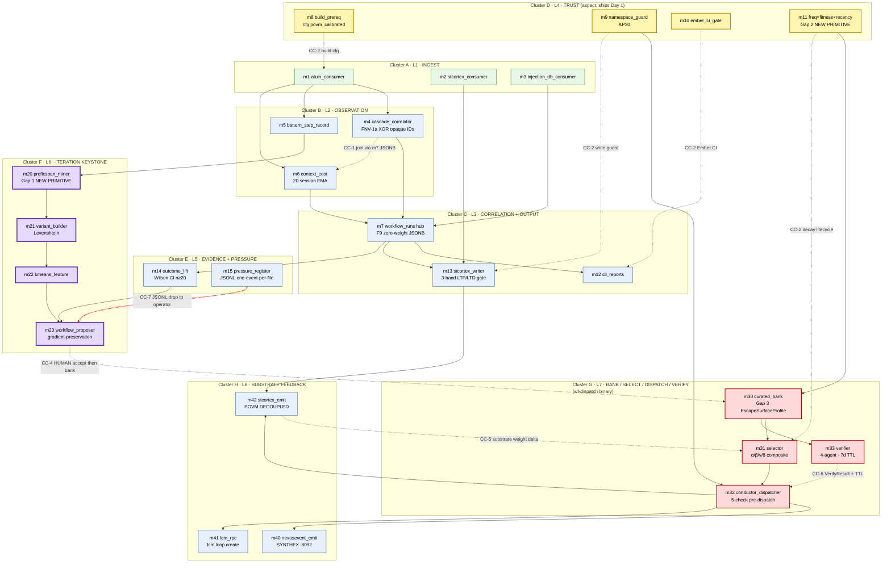

# MODULE_DEPENDENCY_GRAPH — 26-Module DAG

> **Back to:** [`README.md`](README.md) · [`../ARCHITECTURE.md`](../ARCHITECTURE.md) · canonical [`../ai_docs/optimisation-v7/ULTRAMAP.md`](../ai_docs/optimisation-v7/ULTRAMAP.md) (View 1 layer + View 2 module table) · [`../ai_docs/optimisation-v7/MODULE_PLANS/CROSS_CLUSTER_SYNERGIES.md`](../ai_docs/optimisation-v7/MODULE_PLANS/CROSS_CLUSTER_SYNERGIES.md) · [`../plan.toml`](../plan.toml)
>
> **Purpose:** the canonical V7 ULTRAMAP gives **layer** (L0-L8) and **module-table** views. This file gives the **runtime build-graph** — every `[[modules]] depends_on = [...]` edge from `plan.toml` rendered as one Mermaid graph, sub-grouped by cluster, with binary-ownership colour, ship-first highlight, KEYSTONE highlight, and the four named cross-cluster synergy edges (CC-1..CC-7) drawn explicitly. Read this when you need to know "if I touch m20, what compiles after me?" or "what is the longest acyclic chain through the engine?".

---

## The graph



---

## Reading the graph

### Colour legend (`classDef` blocks above)

| Cluster | Colour | Meaning |
|---|---|---|
| **D** (m8/m9/m10/m11) | yellow | aspect-layer ship-first (Day 1, before A) |
| **F** (m20-m23) | purple | KEYSTONE — net-new Gap 1 PrefixSpan + Wilson CI iteration |
| **G** (m30-m33) | red | `wf-dispatch` binary; only modules outside `wf-crystallise` |
| **A** (m1-m3) | green | substrate ingest (read-only) |
| **B / C / E / H** | blue | `wf-crystallise` binary; read-heavy interpretation + emit |

### Edge legend

- **Solid arrow** = build-time dependency from `plan.toml` `[[modules]].depends_on`. If a build-time dependency is unmet, downstream cannot compile.
- **Dotted arrow with link label** = runtime cross-cluster synergy (CC-1..CC-7). These are *contract* edges, not import edges; the modules at either end do NOT necessarily `use` each other — the coupling surface is a shared schema (m7 JSONB, m30 bank rows, stcortex pathway weights) or a sideband channel (agent-cross-talk filesystem drop).
- **Highlighted CC-4 edge** (red, thick) — `m23 → m30` HUMAN-ACCEPT boundary. This is the only edge in the build-graph that traverses a mandatory human consent step (AP-V7-07 / F5 mitigation per cluster-G spec). Auto-promotion is **structurally refused** by `m30::BankDb::accept`, which requires an `accepted_by: HumanAcceptanceSignature` argument.

---

## Sub-graphs read individually

### Cluster D ships first

Cluster D (`m8`, `m9`, `m10`, `m11`) has **zero** `depends_on` rows in `plan.toml`. It compiles standalone. Per [`../ARCHITECTURE.md`](../ARCHITECTURE.md) and `plan.toml` `[[layers]] L4 ship_first = true`, Cluster D must reach BUILT before any reader module in Cluster A starts. This is the "trust before observe" sequencing — `m8`'s `cargo:rustc-cfg=povm_calibrated` is the build-prereq the whole crate gates on, and `m9`'s namespace constants must be the source of truth before `m13` or `m42` write a single byte under `workflow_trace_*` (AP30 enforcement). The yellow highlight in the Mermaid above is not decorative — it is the build-order invariant rendered visually.

### Cluster F as KEYSTONE chain

`m5 → m20 → m21 → m22 → m23` is the longest critical-path chain in the engine. m20 (PrefixSpan, ~300 LOC, 75 tests) is the structural-gap-authored algorithm; everything after m20 is a transformation of its output. If m20 misbehaves, every downstream proposal is garbage. The purple highlight reflects this: tests in Cluster F are the engine's mutation-kill floor (≥80% for m20, ≥85% for m32 — the two highest in the codebase per `ai_docs/optimisation-v7/STANDARDS/TEST_DISCIPLINE.md`).

### Cluster G as dispatch binary

The four red nodes (`m30`, `m31`, `m32`, `m33`) plus shared `workflow_core` lib are the entire `wf-dispatch` binary per `plan.toml` `[[bin_targets]]`. They do not import `m1`..`m23`; they read m30's SQLite bank, which is the **only** persistent surface that crosses the binary boundary. This is the engine's clean separation: read-heavy `wf-crystallise` produces proposals → human accepts → `wf-dispatch` selects/verifies/dispatches.

### Cluster H as fan-out

`m32` fans out to all three Cluster H modules in parallel via `tokio::mpsc` (per [m32 spec § 4 data-flow](../ai_specs/modules/cluster-G/m32_conductor_dispatcher.md)). The three downstream modules are **independent** — m40 (SYNTHEX), m41 (LCM), m42 (stcortex) each have their own outbox-first JSONL + circuit breaker. A failure in any one does not block the others. m42 additionally depends on m13 for the actual stcortex write path (m13 owns the connection; m42 owns the policy/payload).

---

## Cross-cluster CC-N edges drawn explicitly

Per [`../ai_docs/optimisation-v7/MODULE_PLANS/CROSS_CLUSTER_SYNERGIES.md`](../ai_docs/optimisation-v7/MODULE_PLANS/CROSS_CLUSTER_SYNERGIES.md):

| CC | Edge in graph | Coupling surface | Why dotted |
|---|---|---|---|
| **CC-1** | `m4` ⇢ `m6` (via `m7`) | m7 JSONB `consumer_inputs` column | m4 and m6 never call each other; both write to the same hub schema |
| **CC-2** | `m8/m9/m10/m11` ⇢ all | build.rs cfg / write-time guard / CI gate / lifecycle decay | aspect-woven; no module `use`s an aspect — aspects are applied |
| **CC-3** | `m14` ⇢ `m20`/`m22`/`m23` | `Option<Lift>` evidence gate | propagates as construction-time failure in m23 |
| **CC-4** | `m23` ⇢ `m30` (highlighted) | `WorkflowProposal` + `HumanAcceptanceSignature` | mandatory human boundary — auto-promote structurally refused (AP-V7-07) |
| **CC-5** | `m42` ⇢ `m31` | stcortex pathway weight delta (days/weeks timescale) | the *only* substrate-grain loop per G3 substrate-frame pass |
| **CC-6** | `m33` ⇢ `m32` | `VerifyResult` cache + `definition_hash` + TTL | m32 reads cached result; staleness/drift → refuse-mode |
| **CC-7** | `m15` ⇢ operator surfaces | JSONL drop in `agent-cross-talk/` | meta-loop: pressure → spec amendment → m1 config update |

The cross-cluster CC-4 m23→m30 edge is **highlighted in red** because it is the engine's single most-load-bearing structural refusal — every other CC has either a typed-error refusal or a Watcher-observable refusal, but CC-4 is the one place where a human signature is structurally required before a workflow can ever execute.

---

## Critical path (longest chain)

The longest acyclic build chain from leaf to substrate-feedback:

```
m1 → m5 → m20 → m21 → m22 → m23 → (HUMAN) → m30 → m31 → m32 → m42 → stcortex
```

10 build-time edges plus 1 human-consent boundary. m32 fans out at the end to m40/m41/m42 in parallel. This chain crosses every cluster except D (aspect, woven) and matches the canonical V7 ULTRAMAP View 1 L1 → L8 layer path.

---

## Things this graph deliberately omits

- **L0 substrate frame** (atuin / stcortex / injection.db / SYNTHEX / LCM / Conductor / Watcher) — observed, not authored. Per `plan.toml` `[[layers]] L0 authored = false`. Drawn as substrate-tinted nodes only at the leaves of m1/m2/m3 reads and the m13/m40/m41/m42 emits in the [DATA_FLOW.md](DATA_FLOW.md) sibling view.
- **L9 substrate-frame engine** — intentionally absent per single-phase override; placeholder reserved for post-D120 evaluation per ARCHITECTURE.md § L9 reserved.
- **Test crates and `tests/integration/cc*_*.rs` files** — see [`../ai_docs/optimisation-v7/MODULE_PLANS/CROSS_CLUSTER_SYNERGIES.md`](../ai_docs/optimisation-v7/MODULE_PLANS/CROSS_CLUSTER_SYNERGIES.md) § Closure-test inventory.
- **The two binaries** are noted in the cluster sub-graph labels but not drawn as separate nodes — see [`../ARCHITECTURE.md`](../ARCHITECTURE.md) § Binary split for the canonical view.

---

## Cross-references

| Question | Answer | File |
|---|---|---|
| What is the build-time edge list (machine-readable)? | `[[modules]].depends_on` array per row | [`../plan.toml`](../plan.toml) |
| What is the layer view (L0-L8)? | View 1 Mermaid graph TB | [`../ai_docs/optimisation-v7/ULTRAMAP.md`](../ai_docs/optimisation-v7/ULTRAMAP.md) § View 1 |
| What is the module-table view (LOC / tests / verb-class / CC-owns)? | View 2 26-row table | [`../ai_docs/optimisation-v7/ULTRAMAP.md`](../ai_docs/optimisation-v7/ULTRAMAP.md) § View 2 |
| What is the contract surface for each CC edge? | per-CC § Coupling discipline | [`../ai_docs/optimisation-v7/MODULE_PLANS/CROSS_CLUSTER_SYNERGIES.md`](../ai_docs/optimisation-v7/MODULE_PLANS/CROSS_CLUSTER_SYNERGIES.md) |
| When does each module fire at runtime? | trigger taxonomy | [`CONTROL_FLOW.md`](CONTROL_FLOW.md) |
| What rows/structs travel each edge? | typed lifecycle | [`DATA_FLOW.md`](DATA_FLOW.md) |
| What metadata attends each emission? | context table | [`CONTEXTUAL_FLOW.md`](CONTEXTUAL_FLOW.md) |
| What must always hold? | compile-time + runtime invariants | [`INVARIANT_MAP.md`](INVARIANT_MAP.md) |

---

> **Back to:** [`README.md`](README.md) · [`../ARCHITECTURE.md`](../ARCHITECTURE.md) · canonical [`../ai_docs/optimisation-v7/ULTRAMAP.md`](../ai_docs/optimisation-v7/ULTRAMAP.md) · [`ULTRAMAP.md`](ULTRAMAP.md) (this folder's master synthesis)
