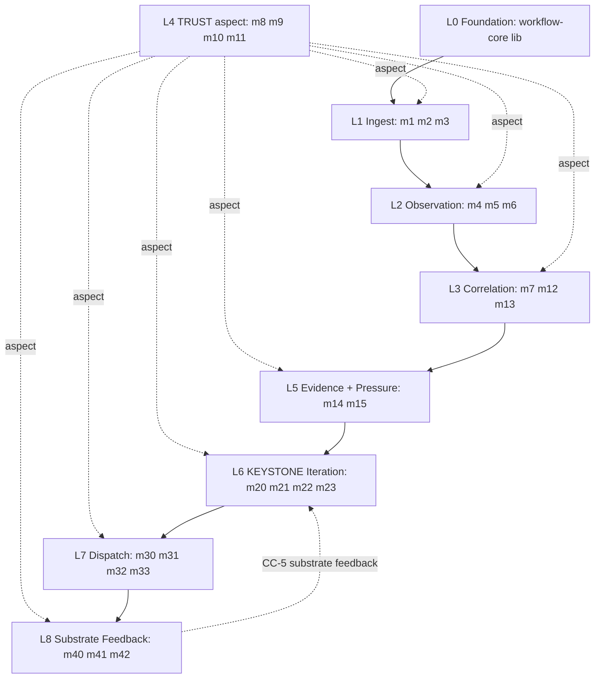

# ULTRAMAP — workflow-trace operational synthesis

> **Canonical (structural, authoritative):** [`../ai_docs/optimisation-v7/ULTRAMAP.md`](../ai_docs/optimisation-v7/ULTRAMAP.md) — View 1 (layer map) + View 2 (26-module table) + View 3 (phase timeline) + View 4 (tooling graph) + View 5 (agent × worktree allocation)
> **This file (operational, complementary):** master synthesis of the 4 new operational views authored in this folder — data flow, control flow, contextual flow, invariant map — with short extracts from each, plus a shortened mirror of the canonical structural views so a reader hitting this file FIRST can orient in one load.
>
> **When to load which file:**
> - **Hit canonical first** for *structural* questions: "what depends on what?" / "which module owns which LOC?" / "what's the phase timeline?"
> - **Hit this file first** for *operational* questions: "what shape is the data at edge X?" / "when does m32 actually fire?" / "what must always hold?"
> - **Hit both** when designing a change that touches both — almost always the right move.

> **Back to:** [`README.md`](README.md) · [`../ARCHITECTURE.md`](../ARCHITECTURE.md) · canonical [`../ai_docs/optimisation-v7/ULTRAMAP.md`](../ai_docs/optimisation-v7/ULTRAMAP.md) · [`MODULE_DEPENDENCY_GRAPH.md`](MODULE_DEPENDENCY_GRAPH.md) · [`DATA_FLOW.md`](DATA_FLOW.md) · [`CONTROL_FLOW.md`](CONTROL_FLOW.md) · [`CONTEXTUAL_FLOW.md`](CONTEXTUAL_FLOW.md) · [`INVARIANT_MAP.md`](INVARIANT_MAP.md) · [`schematics/`](schematics/)

---

## The engine in one paragraph

`workflow-trace` is a planned single-phase Rust codebase that records cascading-command + Battern-protocol + context-window observations across the Zellij habitat (Cluster A ingest, Cluster B observation, Cluster C correlation), gates them through a trust aspect-layer (Cluster D), evidences them with Wilson-CI lift metrics (Cluster E), iterates them via a PrefixSpan-based KEYSTONE proposer (Cluster F), banks human-accepted workflows with EscapeSurfaceProfile classification (Cluster G m30), selects + verifies them via 4-agent + composite scoring (Cluster G m31/m33), dispatches them through HABITAT-CONDUCTOR via a 5-check pre-dispatch sequence (Cluster G m32), and emits substrate feedback to SYNTHEX + LCM + stcortex (Cluster H) — closing the substrate-grain Hebbian learning loop (CC-5) over days/weeks. 26 modules · 8 clusters · 9 layers (L0-L8) · 2 binaries (`wf-crystallise` + `wf-dispatch`) + shared `workflow_core` lib · ~5,200 LOC + 1,562 tests · planning-only under HOLD-v2 until Luke types `start coding workflow-trace`.

---

## The 6 views (this folder's anchor)

| View | Question answered | File |
|---|---|---|
| **V1 Layer (canonical)** | what layers exist? | [`../ai_docs/optimisation-v7/ULTRAMAP.md`](../ai_docs/optimisation-v7/ULTRAMAP.md) § View 1 |
| **V2 Module table (canonical)** | LOC / tests / verb-class / CC-owns per module? | [`../ai_docs/optimisation-v7/ULTRAMAP.md`](../ai_docs/optimisation-v7/ULTRAMAP.md) § View 2 |
| **V3 Phase × Runbook × Owner (canonical)** | who builds what in what week? | [`../ai_docs/optimisation-v7/ULTRAMAP.md`](../ai_docs/optimisation-v7/ULTRAMAP.md) § View 3 |
| **V4 Tooling Integration (canonical)** | which external services does the engine talk to? | [`../ai_docs/optimisation-v7/ULTRAMAP.md`](../ai_docs/optimisation-v7/ULTRAMAP.md) § View 4 |
| **V5 Agent × Worktree × Layer (canonical)** | which agent builds which layer in which worktree? | [`../ai_docs/optimisation-v7/ULTRAMAP.md`](../ai_docs/optimisation-v7/ULTRAMAP.md) § View 5 |
| **V6 Dependency graph (this folder)** | 26-module Mermaid DAG with cross-cluster edges | [`MODULE_DEPENDENCY_GRAPH.md`](MODULE_DEPENDENCY_GRAPH.md) |
| **V7 Data flow (this folder)** | what shape is the data at each edge? | [`DATA_FLOW.md`](DATA_FLOW.md) |
| **V8 Control flow (this folder)** | when does each module fire? | [`CONTROL_FLOW.md`](CONTROL_FLOW.md) |
| **V9 Contextual flow (this folder)** | what metadata attends each row? | [`CONTEXTUAL_FLOW.md`](CONTEXTUAL_FLOW.md) |
| **V10 Invariant map (this folder)** | what must always be true? | [`INVARIANT_MAP.md`](INVARIANT_MAP.md) |

The five structural views in the canonical file + the five operational views in this folder = **10 overlapping representations of the same 26-module engine**. Any cross-view query lands at one or two files; the rest are linked from there.

---

## Shortened mirror — canonical View 1 (Layer)



**Reading rule:** solid = build-time dep; dashed aspect = D woven through everything at compile/write/output/lifecycle; dashed CC-5 = runtime substrate-grain loop (days/weeks, not per-event).

Full canonical View 1 with all annotations: [`../ai_docs/optimisation-v7/ULTRAMAP.md`](../ai_docs/optimisation-v7/ULTRAMAP.md) § View 1.

---

## Shortened mirror — canonical View 2 (Module table summary)

| Cluster | Layer | Modules | LOC | Tests | Binary | Verb-class | Gap-owner |
|---|---|---|---:|---:|---|---|---|
| **A** Ingest | L1 | m1 m2 m3 | ~230 | 150 | wf-crystallise | passive | — |
| **B** Observation | L2 | m4 m5 m6 | ~460 | 180 | wf-crystallise | correlate/record | — |
| **C** Correlation | L3 | m7 m12 m13 | ~370 | 180 | wf-crystallise | record/emit | — |
| **D** Trust (aspect) | L4 | m8 m9 m10 m11 | ~300 | 230 | wf-crystallise | refuse/record | **Gap 2** (m11) |
| **E** Evidence | L5 | m14 m15 | ~200 | 130 | wf-crystallise | record/emit | — |
| **F** **KEYSTONE** | L6 | m20 m21 m22 m23 | ~850 | 260 | wf-crystallise | recommend | **Gap 1** (all) |
| **G** Bank/Dispatch | L7 | m30 m31 m32 m33 | ~950 | 285 | **wf-dispatch** | select/dispatch/refuse | **Gap 3** (m30/m32) + (m9) |
| **H** Substrate Feedback | L8 | m40 m41 m42 | ~450 | 195 | wf-crystallise | emit | — |
| **Total** | L0-L8 | **26 modules** | **~3,810** | **1,562+** | 2 bins | — | — |

Full 30-column canonical table with src/path + Tests count + CC-owns + Boilerplate-lift% + Status: [`../ai_docs/optimisation-v7/ULTRAMAP.md`](../ai_docs/optimisation-v7/ULTRAMAP.md) § View 2 + [`../ai_specs/MODULE_MATRIX.md`](../ai_specs/MODULE_MATRIX.md).

---

## V6 extract — Module dependency graph (cluster colour map)

The Mermaid in [`MODULE_DEPENDENCY_GRAPH.md`](MODULE_DEPENDENCY_GRAPH.md) renders the engine's build-time DAG with cluster sub-groups, four colour classes, and explicit cross-cluster CC-* dotted edges. Key visual cues:

- **Yellow (Cluster D)** = ship Day 1 before A (aspect-layer invariants).
- **Purple (Cluster F)** = KEYSTONE — net-new Gap 1 PrefixSpan + Wilson CI.
- **Red (Cluster G)** = `wf-dispatch` binary; only nodes outside `wf-crystallise`.
- **Red thick edge** = CC-4 `m23 → m30` HUMAN-ACCEPT boundary (AP-V7-07).

Critical path (longest chain):
```
m1 → m5 → m20 → m21 → m22 → m23 → (HUMAN) → m30 → m31 → m32 → m42 → stcortex
```
10 build edges + 1 human consent boundary; m32 fans out to m40/m41/m42 in parallel at the tail.

Full graph + sub-graph reading guide + edge legend: [`MODULE_DEPENDENCY_GRAPH.md`](MODULE_DEPENDENCY_GRAPH.md).

---

## V7 extract — Data flow lifecycle (10-stage walk)

The Mermaid in [`DATA_FLOW.md`](DATA_FLOW.md) renders the data lifecycle as `flowchart LR` with every edge typed. Stage-by-stage:

1. **Ingest** — `atuin.db` / stcortex / injection.db → `AtuinHistoryRow` / `ToolCallRow` / `CausalChainRow`
2. **Observation** — m1 stream → `CascadeCluster` (opaque) / `BatternStep` / `ContextCostBand`
3. **Hub join** — m4 + m6 + m3 → `WorkflowRunRow` with JSONB `consumer_inputs` (CC-1)
4. **Output** — m7 → m12 stdout reports; m7 + m2 → m13 stcortex writes (3-band gate)
5. **Evidence** — m7 → m14 `Option<Lift>` (None < n=20)
6. **KEYSTONE** — m5 → m20 `Pattern` → m21 `WorkflowVariant` → m22 `FeatureCluster` → m23 `WorkflowProposal` (CC-3 gated)
7. **Human boundary (CC-4)** — operator runs `propose accept <id>`; `WorkflowProposal` → `AcceptedWorkflow + HumanAcceptanceSignature` → m30 bank
8. **Cluster G internal** — m30 → m31 (composite α/β/γ/δ) → m32 (5-check sequence; m33 cached `VerificationReceipt` via CC-6)
9. **Dispatch** — m32 → Conductor `:8141/dispatch`; fan-out `WorkflowDispatchEvent` to m40/m41/m42
10. **Substrate feedback (CC-5)** — m42 → m13 → stcortex `workflow_trace_*` pathway weights; m31 reads at next selection cycle (days/weeks)

Full edge-by-edge transformation notes + persistence map + provenance walks: [`DATA_FLOW.md`](DATA_FLOW.md).

---

## V8 extract — Control flow (trigger classes)

The trigger taxonomy in [`CONTROL_FLOW.md`](CONTROL_FLOW.md) classifies each module's firing pattern:

| Class | Modules |
|---|---|
| **Cron-driven** | m1, m3, m4, m5, m6 (m1-tick cascade); m6 hourly EMA refresh; m11 hourly batch decay; m14 hourly Wilson CI; m30 daily sunset sweep; m33 6h TTL sweep |
| **Event-driven** | m2 (stcortex reducer-callback); m13 (m7 write callback); m15 (any in-engine pressure); m33 (m30 insert) |
| **Operator-driven** | m12 `report`; m20-m23 `propose`; m30 `bank accept` (**CC-4 boundary**); m32 `dispatch` (**operator only; never auto**); m33 `verify` |
| **Sequence-driven** | m32 5-check (within `dispatch`); m23 evidence-gate (within `build`); m40/m41/m42 fan-out (from m32) |
| **Retry/backoff** | m40/m41/m42 outbox drain every 30s; breaker half-open back-off 30s → 5min |

Three sequence diagrams render the load-bearing flows: **(i) m32 5-check pre-dispatch** with all 5 short-circuits and audit-first writes; **(ii) m23 → m30 operator review (CC-4)** with `HumanAcceptanceSignature` mandatory; **(iii) m40/m41/m42 outbox-first + circuit breaker** with the 2-failure threshold and half-open probe.

Full taxonomy + cron schedule + per-module table + refuse-mode catalogue: [`CONTROL_FLOW.md`](CONTROL_FLOW.md).

---

## V9 extract — Contextual flow (metadata that travels)

The 11-row transformation table in [`CONTEXTUAL_FLOW.md`](CONTEXTUAL_FLOW.md) shows what fields each row carries at each stage. The three load-bearing observations:

1. **`SessionId` is the spine.** It travels from `AtuinHistoryRow` (stage 1) all the way to `WorkflowDispatchEvent.lineage` (stage 11) via every intermediate. If any stage dropped it, provenance breaks at that boundary. Newtype discipline guarantees it cannot be silently substituted.

2. **Some metadata is intentionally stripped.** m4 drops human-readable labels (F11 cascade-monoculture mitigation); m23 → m30 drops proposal `confidence: f64` numerics (F5 — admit on signature, not confidence); m32 → m40 drops `steps_json` body for size minimisation; m42 → stcortex slug-encodes hyphens as underscores (AP-Hab-11).

3. **CC-5 carries metadata invisibly.** The pathway-weight delta at stcortex has no in-process representation — m42 emits a `fitness_delta`, the substrate accumulates, m31 reads the *current* weight at next cycle, and the difference between cycles N and N+1 is the metadata CC-5 carries. Detection lives in Watcher Class-I externally.

Full transformation table + provenance walks (Proposal back to atuin row; Dispatch back to human signature; Substrate delta back to Pattern) + newtype discipline + JSONB schema: [`CONTEXTUAL_FLOW.md`](CONTEXTUAL_FLOW.md).

---

## V10 extract — Invariant map (compile-time + runtime)

The ledger in [`INVARIANT_MAP.md`](INVARIANT_MAP.md) splits invariants between toolchain-enforced (compile-time, caught by `rustc`/clippy/`build.rs`) and runtime-enforced (caught by typed errors, structural refusal, or external monitoring).

**Compile-time highlights:**
- Newtype discipline across `workflow_core::types`
- AP30 namespace constants single-source-of-truth
- `#![forbid(unsafe_code)]` + `deny_clippy_warnings = true` + `deny_pedantic_warnings = true`
- `m8` `cargo:rustc-cfg=povm_calibrated` gates entire crate
- `EscapeSurfaceProfile: Ord` with stable variant order
- `thiserror` typed taxonomies; no `Box<dyn Error>`
- `#[must_use]` on m12 reports
- No `Command::*` exec primitives in `wf-dispatch` (clippy `disallowed_methods` + grep gate)
- No HTTP server in `wf-dispatch`

**Runtime highlights:**
- m9 namespace guard at every write boundary
- m10 Ember CI gate (Held = CI-FAIL)
- m13 3-band LTP/LTD gate (sub-threshold deferred to JSONL queue, not error)
- m23 NO auto-promote — m30 admits only via `HumanAcceptanceSignature` (AP-V7-07)
- m32 5-check pre-dispatch in order + no-self-dispatch (AP-V7-08)
- m33 4-agent unanimous-PASS required for DataExfil
- m40/m41/m42 outbox-first; circuit breaker on 2 consecutive failures
- Per-cluster panic→Result discipline
- AP-V7-13 awareness — `/health` 200 ≠ behaviour-verified (pair with semantic check)

**Per-cluster invariant summaries** + **invariants the engine deliberately does NOT enforce** + **refusal-shape catalogue**: [`INVARIANT_MAP.md`](INVARIANT_MAP.md).

---

## How to use this folder

### Reading order on cold-start

1. Hit **canonical V7 [`../ai_docs/optimisation-v7/ULTRAMAP.md`](../ai_docs/optimisation-v7/ULTRAMAP.md)** for structural orientation (5 views).
2. Hit **this file** for operational synthesis (extracts of next 4 views + links).
3. Drill into the specific operational view you need:
   - **build-graph question** → [`MODULE_DEPENDENCY_GRAPH.md`](MODULE_DEPENDENCY_GRAPH.md)
   - **data shape question** → [`DATA_FLOW.md`](DATA_FLOW.md)
   - **trigger/timing question** → [`CONTROL_FLOW.md`](CONTROL_FLOW.md)
   - **metadata/provenance question** → [`CONTEXTUAL_FLOW.md`](CONTEXTUAL_FLOW.md)
   - **invariant/refusal question** → [`INVARIANT_MAP.md`](INVARIANT_MAP.md)
4. For a specific cross-cluster contract: [`../ai_docs/optimisation-v7/MODULE_PLANS/CROSS_CLUSTER_SYNERGIES.md`](../ai_docs/optimisation-v7/MODULE_PLANS/CROSS_CLUSTER_SYNERGIES.md).
5. For a specific module: [`../ai_specs/modules/cluster-{A..H}/m{N}_*.md`](../ai_specs/modules/).

### Common cross-view queries (worked examples)

**Q: I'm changing m20's PrefixSpan output shape. What else needs to update?**
- V6 (dependency graph): m20's direct downstream is m21 only. m21 → m22 → m23 transitive.
- V7 (data flow): `Pattern` schema → check `WorkflowVariant.base_pattern` and `WorkflowProposal.provenance` shapes downstream.
- V9 (contextual): `Pattern.support` and `gap_bounds` carry to proposal — preserve at every stage.
- V10 (invariants): m20 deterministic ordering invariant (sort support DESC, length DESC) — re-verify.
- Per-module specs: [m20](../ai_specs/modules/cluster-F/m20_prefixspan_miner.md), [m21](../ai_specs/modules/cluster-F/m21_variant_builder.md), [m23](../ai_specs/modules/cluster-F/m23_workflow_proposer.md).

**Q: Conductor is down (B3 blocker active). What happens at dispatch?**
- V8 (control flow): m32 `Dispatcher::Refuse` variant constructed at init; `dispatch()` returns `Err(ConductorDispatchDisabled)` without entering the 5-check sequence.
- V10 (invariants): hard-refuse — NOT a silent no-op, NOT a fall-through-to-LCM, NOT a delayed retry.
- V8 sequence diagram (i): refuse-mode branch is short-circuit before check 1.
- m32 spec § 1 second invariant: full text at [m32](../ai_specs/modules/cluster-G/m32_conductor_dispatcher.md).

**Q: How do substrate-weight updates from m42 reach m31's next selection?**
- V7 (data flow) Stage 10 CC-5: m42 → m13 → stcortex `workflow_trace_*` pathway weights → m31 reads at next cycle (days/weeks).
- V9 (contextual) CC-5 invisible payload section: pathway weight delta has no in-process representation; lives only in stcortex.
- V10 (invariants): external monitoring via Watcher Class-I, rolling 7-day delta on `learning_health`.
- CC-5 deep contract: [CROSS_CLUSTER_SYNERGIES § CC-5 in depth](../ai_docs/optimisation-v7/MODULE_PLANS/CROSS_CLUSTER_SYNERGIES.md).

---

## The seven cross-cluster synergies (CC-1..CC-7)

| CC | Path | Coupling surface | Closure-test |
|---|---|---|---|
| **CC-1** | m4 ↔ m6 via m7 | JSONB `consumer_inputs` | `tests/integration/cc1_cascade_cost_coupling.rs` (no live services) |
| **CC-2** | m8/m9/m10/m11 → all | aspect-woven (build/write/CI/lifecycle) | `tests/integration/cc2_trust_aspect_routing.rs` (no live services) |
| **CC-3** | m14 → m20/m22/m23 | `Option<Lift>` evidence gate | `tests/integration/cc3_evidence_driven_iteration.rs` (no live services) |
| **CC-4** | m23 → human → m30 → m32 → Conductor | `HumanAcceptanceSignature` mandatory | `tests/integration/cc4_proposal_bank_dispatch.rs` (Conductor :8141 — B3 blocked) |
| **CC-5** | m32 → m40/m41/m42 → substrate → m31 next cycle | stcortex pathway weights (days/weeks) | `tests/integration/cc5_substrate_learning_loop.rs` (synthex-v2 + povm-v2 + Conductor) |
| **CC-6** | m33 → m32 (cached VerificationReceipt + TTL + definition_hash) | SQLite cache + drift detection | `tests/integration/cc6_verification_gated_dispatch.rs` (Conductor :8141) |
| **CC-7** | m15 → agent-cross-talk/ → Watcher/Zen/Luke → v1.4 spec → m1 config | JSONL one-event-per-file sideband | `tests/integration/cc7_pressure_driven_evolution.rs` (no live services) |

CC-5 is the engine's **only substrate-grain loop** — all others are anthropocentric control flows (function calls, schema joins, aspect wraps). When CC-5 fails, the failure is invisible from inside the engine; when any other CC fails, an integration test catches it. Per [`CROSS_CLUSTER_SYNERGIES.md`](../ai_docs/optimisation-v7/MODULE_PLANS/CROSS_CLUSTER_SYNERGIES.md) § Substrate-frame distinction.

---

## Structural-gap authorship summary (the three NEW PRIMITIVES)

| Gap | Cluster | Modules | LOC | What is fresh-authored |
|---|---|---|---|---|
| **Gap 1** N-step compositional sub-graph detection | F (KEYSTONE) | m20 + m23 (primary), m21 + m22 (assist) | ~600-1000 | PrefixSpan miner + Levenshtein variant builder + gradient-preservation proposer + Wilson CI gate |
| **Gap 2** `frequency × fitness × recency` compound decay | D | m11 | ~200-300 | new primitive formula: `base_rate + (1 − base_rate) × clamp(f×fit×r, 0, 1)` |
| **Gap 3** Unified destructiveness / EscapeSurfaceProfile schema | G + D | m30 + m32 (display) + m9 (namespace gate) | ~150-250 | ordinal enum `Sandboxed < SandboxEscape < ProcessMutate < FileWrite < NetworkEgress < DataExfil` + display-before-step banner |

The remaining ~65% of the engine is boilerplate-lift from 48 source clones (per [`../the-workflow-engine-vault/boilerplate modules/BOILERPLATE_INDEX.md`](../the-workflow-engine-vault/boilerplate%20modules/BOILERPLATE_INDEX.md)).

---

## Phase / runbook / agent allocation (canonical View 3 + View 5 summary)

| Days | Phase | Runbook | Primary owner | Output |
|---|---|---|---|---|
| pre-G9 | Phase 0 G1-G9 | R-00 | Watcher / Command / Luke / Zen | all 9 gates GREEN |
| 0-3 | Phase 1 Genesis | R-01 | Command + Command-2 | cargo workspace + Cluster D + Cluster A |
| 3-12 | Phase 2A B/C/E (measure-only) | R-02 | Command-2 | m4-m7 + m12-m15 (~870 LOC) |
| 12-21 | Phase 2B F/G/H (active) | R-03 | Command-2 + Command-3 (G librarian) | m20-m23 + m30-m33 + m40-m42 (~2200 LOC) |
| 21-26 | Phase 3 Integration | R-04 | Command + Command-3 + Zen | 5 integration tracks; CC-5 first closure |
| 26-28 | Phase 4 Hardening | R-05 | Zen + 4-agent gate | PASS/FAIL/DEGRADED verdict |
| 28-30 | Phase 5A Deploy | R-06a | Command + Luke @ terminal | binaries in `~/.local/bin/wf-*` |
| 30 | Phase 5B Cutover | R-06b | Command + Watcher | WCP carriage handoff |
| 30→D120 | Phase 5C Soak | R-06c | Watcher + system | continuous lift + decay + weekly synthesis |
| D120 | Phase 6 Sunset | R-07 | m11 + Luke | PASS continue / FAIL retire / DEGRADED Luke-decide |
| continuous | Phase 7 Security | R-08 | security-auditor (per phase) | 7 domains × 7 phases matrix |
| continuous | Phase 8 Observability | R-09 | observability-engineer (per phase) | 5 tracks |
| any | Emergency rollback | R-11 | Command + Luke | 3-command rollback per phase |

Cluster D **ships Day 1 before A** per `plan.toml [[layers]] L4 ship_first = true`.

Wave allocation (3 worktree waves, 9-pane fleet): full table at [`../ai_docs/optimisation-v7/ULTRAMAP.md`](../ai_docs/optimisation-v7/ULTRAMAP.md) § View 5.

---

## Tooling integration (canonical View 4 summary)

The engine talks to:
- **HABITAT-CONDUCTOR `:8141`** — only path to actual workflow execution (m32)
- **SYNTHEX v2 `:8092/v3/nexus/push`** — coordination events (m40)
- **LCM RPC** — deploy lifecycle (`lcm.loop.create { max_iters: 1 }`, NOT `lcm.deploy`) (m41)
- **stcortex `:3000`** — substrate-feedback pathway weights + narrowed-scope consumer reads (m42, m2, m13)
- **atuin** `~/.local/share/atuin/history.db` — shell history ingest (m1)
- **injection.db** `~/.local/share/habitat/injection.db` — causal chain ingest (m3)
- **CodeSynthor V8 :8111** (build-time only) — scaffold authoring (no runtime dep)
- **DevOps Engine V3 :8082** (build-time only) — T1-T6 + resume_from (no runtime dep)
- **POVM `:8125`** — **DECOUPLED from m42** per 2026-05-17 ADR; workflow-trace has zero POVM dependency

Full Mermaid: [`../ai_docs/optimisation-v7/ULTRAMAP.md`](../ai_docs/optimisation-v7/ULTRAMAP.md) § View 4.

---

## Schematics (Mermaid-only sub-diagrams)

For focused per-flow diagrams that don't fit cleanly in any of the four operational view files, see [`schematics/`](schematics/):

| File | Subject |
|---|---|
| [`schematics/cc4-pipeline.md`](schematics/cc4-pipeline.md) | CC-4 proposal → bank → dispatch sequenceDiagram |
| [`schematics/cc5-loop.md`](schematics/cc5-loop.md) | CC-5 substrate-learning loop closure (m32 → H → F) |
| [`schematics/m32-5check.md`](schematics/m32-5check.md) | m32 5-check pre-dispatch sequenceDiagram + decision tree |
| [`schematics/cluster-d-day1.md`](schematics/cluster-d-day1.md) | Cluster D ship-first ordering (Day 1) |
| [`schematics/gap1-prefixspan-flow.md`](schematics/gap1-prefixspan-flow.md) | m20 PrefixSpan algorithm flowchart |
| [`schematics/gap2-decay-formula.md`](schematics/gap2-decay-formula.md) | m11 freq × fitness × recency compound decay |
| [`schematics/gap3-escape-surface-ordinal.md`](schematics/gap3-escape-surface-ordinal.md) | EscapeSurfaceProfile ordinal hierarchy + display contract |

---

## Cross-link to canonical

This file is the **operational synthesis** sibling to the canonical structural ULTRAMAP. They are designed to be loaded together: the canonical gives the *what* (structure), this file + its siblings give the *how* (operation).

> **Canonical (load first for structural):** [`../ai_docs/optimisation-v7/ULTRAMAP.md`](../ai_docs/optimisation-v7/ULTRAMAP.md)
> **Operational (load first for runtime questions):** this file
> **Either way:** the other one is one click away.

---

## Drift register (this synthesis itself)

| Date | Change | Reason | Generation |
|---|---|---|---|
| 2026-05-17 | initial author | Wave-2 ultramap-deep-author deliverable | G-W2.0 |
| (per change) | (per-change diff) | (per-change rationale) | per-rev |

If a fact in this synthesis drifts from any of the four operational sibling files, this synthesis loses. Update the source-of-truth file (DATA_FLOW.md / CONTROL_FLOW.md / CONTEXTUAL_FLOW.md / INVARIANT_MAP.md) first, then re-extract here.

---

> **Back to:** [`README.md`](README.md) · [`../ARCHITECTURE.md`](../ARCHITECTURE.md) · canonical [`../ai_docs/optimisation-v7/ULTRAMAP.md`](../ai_docs/optimisation-v7/ULTRAMAP.md) · siblings [`MODULE_DEPENDENCY_GRAPH.md`](MODULE_DEPENDENCY_GRAPH.md) · [`DATA_FLOW.md`](DATA_FLOW.md) · [`CONTROL_FLOW.md`](CONTROL_FLOW.md) · [`CONTEXTUAL_FLOW.md`](CONTEXTUAL_FLOW.md) · [`INVARIANT_MAP.md`](INVARIANT_MAP.md) · [`schematics/`](schematics/) · [`../plan.toml`](../plan.toml) · [`../ai_specs/MODULE_MATRIX.md`](../ai_specs/MODULE_MATRIX.md)
