# WF_CRYSTALLISE_PIPELINE — observe → mine → propose

> **Back to:** [`README.md`](README.md) · [`../ARCHITECTURE.md`](../ARCHITECTURE.md) · [`../ai_docs/API_MAP.md`](../ai_docs/API_MAP.md) · sibling [`WF_DISPATCH_PIPELINE.md`](WF_DISPATCH_PIPELINE.md) · [`DATA_FLOW.md`](DATA_FLOW.md) · [`CONTROL_FLOW.md`](CONTROL_FLOW.md)
>
> **Purpose:** the runtime stage sequence of the `wf-crystallise` binary — the first of the two pipelines. Where [`DATA_FLOW.md`](DATA_FLOW.md) maps *what types travel which edges* across the whole 26-module graph, this map traces *what happens, in order, when you run the binary*. The driver is `workflow_core::orchestration::crystallise::run`.

---

## What the binary is

`wf-crystallise` owns modules m1–m23 + m40–m42. The binary itself is intentionally thin: it
parses `std::env::args()`, calls `orchestration::crystallise::run(&Config)`, prints the
resulting `Report` (text or JSON), and translates it into an exit code. **All pipeline logic
lives in the library** — that is what makes the stage sequence below integration-testable
without launching a subprocess.

The pipeline **always runs to completion**. Live-service stages (m2 stcortex registration,
m40 nexus emit) are attempted only when `--offline` is not set; an unreachable service is
logged via `tracing` and recorded in `Report::stages_skipped` — never an abort.
`OrchestrationError` is reserved for true faults (a missing DB, an unwritable output, an
invalid miner parameter).

---

## Stage flowchart

```mermaid
flowchart TD
    classDef thin     fill:#d6eaff,stroke:#1a4d99,color:#000
    classDef file     fill:#fff3cd,stroke:#a67c00,color:#000
    classDef pure     fill:#e7d8ff,stroke:#5a2da0,color:#000
    classDef live     fill:#ffd9d9,stroke:#a00000,color:#000
    classDef dormant  fill:#e8e8e8,stroke:#888888,color:#000
    classDef out      fill:#cce6cc,stroke:#1a7a1a,color:#000

    START([wf-crystallise argv]):::thin
    PARSE[parse_args -> Config<br/>--help / --version short-circuit]:::thin
    RUN[[orchestration::crystallise::run]]:::thin

    S0[Stage 0 — m8 trust floor<br/>KEEP-DORMANT: no runtime probe<br/>static build.rs povm_calibrated cfg only]:::dormant
    S1[Stage 1 — m1 atuin ingest<br/>open_atuin_readonly + collect_all<br/>-> Vec AtuinHistoryRow]:::file
    S1B[Stage 1b — m3 injection.db ingest<br/>read_unresolved<br/>-> Vec CausalChainRow]:::file
    S2{config.offline?}:::live
    S2A[Stage 2 — m2 stcortex<br/>register_narrowed_consumer]:::live
    S2SKIP[record stages_skipped:<br/>m2-stcortex]:::dormant
    S3[Stage 3 — m4 cascade correlation<br/>rows -> AtuinStep -> correlate<br/>-> Vec CascadeCluster]:::pure
    S4[Stage 4 — m7 record run<br/>open_workflow_runs_database + insert_run<br/>merge_observation per cluster + per chain]:::file
    S5[Stage 5 — m14 lift snapshot<br/>find_open + compute_snapshot -> LiftSnapshot<br/>then close_run Outcome::Ok]:::file
    S6[Stage 6 — KEYSTONE iteration<br/>m20 mine_sequences -> Vec Pattern<br/>m23 compose_proposals -> Vec WorkflowProposal]:::pure
    S7[Stage 7 — write proposals JSONL<br/>one WorkflowProposal per line<br/>-> proposals.jsonl]:::file
    S8{config.offline?}:::live
    S8A[Stage 8 — m40 nexus emit<br/>build_nexus_event WorkflowCompleted<br/>HttpNexusClient::push :8092]:::live
    S8SKIP[record stages_skipped:<br/>m40-nexus-emit]:::dormant

    REPORT[Report: completed = true<br/>print text or JSON]:::out
    EXIT([exit 0 ok / 1 fault / 2 arg-error]):::thin

    START --> PARSE --> RUN
    RUN --> S0 --> S1 --> S1B --> S2
    S2 -- yes --> S2SKIP --> S3
    S2 -- no  --> S2A --> S3
    S3 --> S4 --> S5 --> S6 --> S7 --> S8
    S8 -- yes --> S8SKIP --> REPORT
    S8 -- no  --> S8A --> REPORT
    REPORT --> EXIT
```



---

## Stage-by-stage prose

| # | Stage | Module(s) | Kind | What happens |
|---|---|---|---|---|
| 0 | Trust floor | m8 | dormant | **KEEP-DORMANT** (S1003733 F2). m42 is stcortex-routed, so no in-tree POVM-read site remains; the m8 gate is enforced statically by the `build.rs` `povm_calibrated` cfg and is **not** invoked as a runtime stage. |
| 1 | atuin ingest | m1 | file | `open_atuin_readonly(&AtuinConsumerConfig)` then `collect_all()` → `Vec<AtuinHistoryRow>`. Read-only WAL connection; always runs. |
| 1b | injection.db ingest | m3 | file | `open_injection_db_readonly(&InjectionDbConfig)` then `read_unresolved()` → `Vec<CausalChainRow>`. `Forget`-consent rows are SQL-filtered. Always runs. |
| 2 | stcortex registration | m2 | live | `register_narrowed_consumer` against stcortex `:3000`. Skipped under `--offline`; a down stcortex is logged and recorded in `stages_skipped`. |
| 3 | cascade correlation | m4 | pure | `AtuinHistoryRow`s mapped to `AtuinStep`s (`row_to_step`, ms→ns), then `CascadeCorrelator::correlate` → `Vec<CascadeCluster>`. Deterministic. |
| 4 | record run | m7 | file | `open_workflow_runs_database` → `insert_run` → one `merge_observation` per cascade cluster (`ClusterBObservation::Cascade`) and per causal chain (`ClusterBObservation::InjectionChain`). |
| 5 | lift snapshot | m14 | file | `find_open` over the lift window, `LiftAggregator::compute_snapshot` → `LiftSnapshot`. The window is captured **before** the current run is closed; then `close_run(... Outcome::Ok)`. A fresh DB yields `n == 1`, honestly below the F2 floor. |
| 6 | KEYSTONE iteration | m20, m21, m23 | pure | `build_sequences` groups atuin rows into per-session `StepToken` sequences; `mine_sequences` → `Vec<Pattern>`; `compose_proposals(&patterns, &snapshot, \|_v\| None)` → `Vec<WorkflowProposal>`. The `\|_v\| None` diversity closure is a documented honest default — the m22 k-means signal is genuinely absent in the batch path, not faked. |
| 7 | write proposals JSONL | m23 / m13 | file | each `WorkflowProposal` serialised as one JSONL line into `--proposals-out` (default `./proposals.jsonl`). **This file is the cross-binary bridge to `wf-dispatch`.** |
| 8 | nexus emit | m40 | live | `build_nexus_event(NexusEventKind::WorkflowCompleted, …)` then `HttpNexusClient::push` to synthex-v2 `:8092`. Skipped under `--offline`; a down service is recorded in `stages_skipped`. |

After Stage 8 the `Report` is marked `completed = true` and printed (`--format text|json`).

---

## CLI surface

```
wf-crystallise [OPTIONS]
  --atuin-db <PATH>        default: $HOME/.local/share/atuin/history.db
  --injection-db <PATH>    default: $HOME/.local/share/habitat/injection.db
  --runs-db <PATH>         default: ./workflow_runs.db   (created if absent)
  --proposals-out <PATH>   default: ./proposals.jsonl    (the bridge to wf-dispatch)
  --min-support <N>        m20 minimum support           (default: 3)
  --max-gap <N>            m20 maximum gap               (default: 5)
  --offline                skip all live-service stages (m2, m40)
  --format <text|json>     report format                 (default: text)
  --help / --version
```

Exit codes: `0` completion (or `--help`/`--version`), `1` pipeline fault, `2` CLI arg error.

---

## Where this fits in the loop

`wf-crystallise` is the **observation-to-proposal** half. Its `proposals.jsonl` output is the
input to [`WF_DISPATCH_PIPELINE.md`](WF_DISPATCH_PIPELINE.md) (`wf-dispatch`). Together the two
binaries close the CC-4 (Proposal → Bank → Dispatch) and CC-5 (Substrate Learning Loop)
contracts described in [`../ARCHITECTURE.md`](../ARCHITECTURE.md) § 5.

---

> **Back to:** [`README.md`](README.md) · [`../ARCHITECTURE.md`](../ARCHITECTURE.md) · [`../ai_docs/API_MAP.md`](../ai_docs/API_MAP.md) · [`WF_DISPATCH_PIPELINE.md`](WF_DISPATCH_PIPELINE.md)
