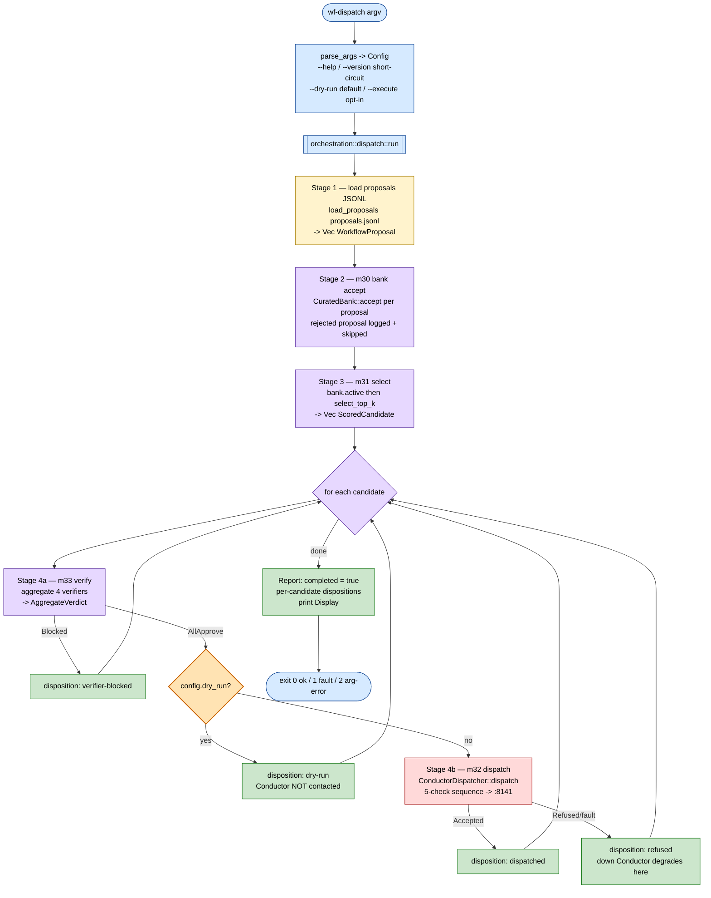

# WF_DISPATCH_PIPELINE — bank → select → verify → dispatch

> **Back to:** [`README.md`](README.md) · [`../ARCHITECTURE.md`](../ARCHITECTURE.md) · [`../ai_docs/API_MAP.md`](../ai_docs/API_MAP.md) · sibling [`WF_CRYSTALLISE_PIPELINE.md`](WF_CRYSTALLISE_PIPELINE.md) · [`DATA_FLOW.md`](DATA_FLOW.md) · [`CONTROL_FLOW.md`](CONTROL_FLOW.md)
>
> **Purpose:** the runtime stage sequence of the `wf-dispatch` binary — the second of the two pipelines. It consumes the `proposals.jsonl` file produced by [`WF_CRYSTALLISE_PIPELINE.md`](WF_CRYSTALLISE_PIPELINE.md), banks each proposal, scores the bank, runs the 4-verifier gate, and (only under `--execute`) dispatches via HABITAT-CONDUCTOR. The driver is `workflow_core::orchestration::dispatch::run`.

---

## What the binary is

`wf-dispatch` owns modules m30–m33 (Cluster G). The binary is thin: it parses
`std::env::args()`, calls `orchestration::dispatch::run(&Config)`, prints the `Report`, and
sets an exit code. All pipeline logic lives in the library.

**`--dry-run` is the default-safe mode** — the pipeline verifies and selects but never
contacts the Conductor. A real dispatch requires the explicit `--execute` flag. Even under
`--execute`, an unreachable Conductor degrades into a `refused` candidate disposition — never
a panic. `OrchestrationError` is reserved for true faults (a missing/malformed proposals
file, an unrecoverable bank fault, an invalid selector config).

The `CuratedBank` is **in-memory** and rebuilt fresh on every invocation from the proposals
file — there is no shared bank database between the two binaries.

---

## Stage flowchart



---

## Stage-by-stage prose

| # | Stage | Module(s) | Kind | What happens |
|---|---|---|---|---|
| 1 | load proposals | — | file | `load_proposals(&config.proposals_in)` reads the JSONL bridge file: one `WorkflowProposal` per line. A blank line is skipped; a malformed line aborts with `OrchestrationError::ProposalsParse`. |
| 2 | bank accept | m30 | pure | a fresh `CuratedBank::new()`; each proposal `accept`-ed at `now_ms`. A rejected proposal (e.g. the AP-V7-08 self-dispatch sentinel) is logged via `tracing` and skipped — the run continues. `Report::bank_accepted` counts the successes. |
| 3 | select | m31 | pure | `bank.active(now_ms, 0.0)` yields the non-sunset workflows; `select_top_k(&actives, &SelectorConfig::default(), \|_w\| 0.0, now_ms, top_k)` → `Vec<ScoredCandidate>`. The `\|_w\| 0.0` diversity closure is a documented honest default — the m22 signal is genuinely absent in the dispatch CLI path. |
| 4a | verify | m33 | pure | for each candidate: `bank.get(workflow_id)` → `AcceptedWorkflow`, then `aggregate(&verifier_refs, &workflow)`. The 4-verifier set (one `ConservativeVerifier` per `VerifierKind` — Security/Consistency/Cost/Ember) is built by `build_verifiers`. `AggregateVerdict::AllApprove` advances; `Blocked` records disposition `verifier-blocked`. **Note:** the verifiers' verdicts are currently a documented conservative "approve" placeholder — the gate is structurally real and runs deterministically, but real per-kind audit logic awaits policy inputs. |
| 4b | dispatch | m32 | live | only under `--execute` (skipped on the default `--dry-run`, which records disposition `dry-run`). `ConductorDispatcher::dispatch(&workflow, ack_ceiling, &signature)` runs the 5-check sequence: (1) AP-V7-08 self-dispatch refusal, (2) `EscapeSurfaceProfile.is_acknowledged_by(signature)`, (3) routing-method `lcm.loop.create`, (4) the m33 verifier gate, (5) Conductor submit at `:8141`. `Accepted` → `dispatched` + `Report::dispatched += 1`; `Refused` (incl. a down Conductor) → `refused`. |

The `HumanAcceptanceSignature` is constructed from the CLI: `interactive_terminal = true` and
`acknowledged_ceiling = config.ack_ceiling` (the `--ack-ceiling` flag). The flag **is** the
operator's acknowledgement — the monotone destructiveness gate at m32 check (2) rejects any
workflow whose escape-surface exceeds the acknowledged ceiling.

After the loop the `Report` is marked `completed = true` and printed.

---

## CLI surface

```
wf-dispatch [OPTIONS]
  --proposals-in <PATH>    JSONL produced by wf-crystallise (default: ./proposals.jsonl)
  --top-k <N>              workflows to select               (default: 5)
  --conductor-url <URL>    HABITAT-CONDUCTOR base URL         (default: http://127.0.0.1:8141)
  --dry-run                verify + select, no Conductor contact   (DEFAULT)
  --execute                perform real dispatch via the Conductor (overrides --dry-run)
  --ack-ceiling <PROFILE>  escape-surface ceiling the operator acknowledges
                           sandboxed | sandbox-escape | process-mutate |
                           privilege-escalation | file-write | network-egress | data-exfil
                           (default: sandboxed)
  --help / --version
```

Exit codes: `0` completion (or `--help`/`--version`), `1` pipeline fault, `2` CLI arg error.

---

## Where this fits in the loop

`wf-dispatch` is the **selection-to-dispatch** half. Its input — `proposals.jsonl` — is the
output of [`WF_CRYSTALLISE_PIPELINE.md`](WF_CRYSTALLISE_PIPELINE.md). Post-dispatch,
substrate feedback (m40/m41/m42) and the m11 fitness-weighted decay close the CC-5 substrate
learning loop, feeding pathway-weight deltas back into the next `wf-crystallise` run. See
[`../ARCHITECTURE.md`](../ARCHITECTURE.md) § 5 for the full CC-1…CC-7 wiring.

---

> **Back to:** [`README.md`](README.md) · [`../ARCHITECTURE.md`](../ARCHITECTURE.md) · [`../ai_docs/API_MAP.md`](../ai_docs/API_MAP.md) · [`WF_CRYSTALLISE_PIPELINE.md`](WF_CRYSTALLISE_PIPELINE.md)
