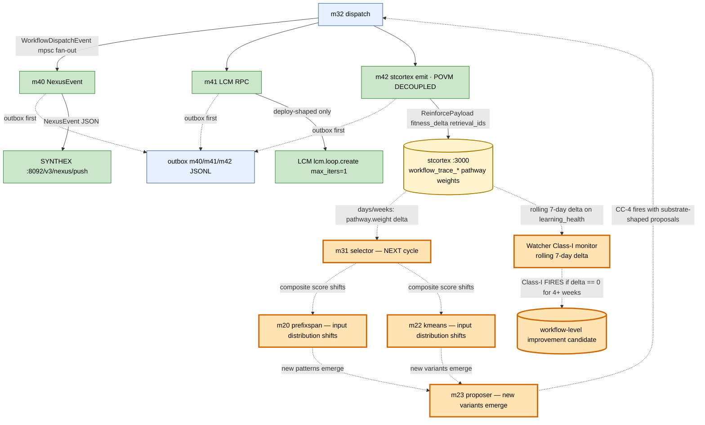

# CC-5 Loop — Substrate Learning (m32 → H → substrate → F)

> **Back to:** [`../README.md`](../README.md) · [`../ULTRAMAP.md`](../ULTRAMAP.md) · [`../DATA_FLOW.md`](../DATA_FLOW.md) · [`../INVARIANT_MAP.md`](../INVARIANT_MAP.md) · canonical [`../../ai_docs/optimisation-v7/MODULE_PLANS/CROSS_CLUSTER_SYNERGIES.md`](../../ai_docs/optimisation-v7/MODULE_PLANS/CROSS_CLUSTER_SYNERGIES.md) § CC-5 (SPECIAL DEPTH)

CC-5 is **the only substrate-grain loop in the engine**. Per G3 substrate-frame pass: all other CCs are anthropocentric control flows (function calls, schema joins, aspect wraps); CC-5 is the one whose absence would cause substrate to silently degrade.

## The slow loop

## fitness_delta constants (m42 module-level)

| Outcome | Delta | Clamped range |
|---|---:|---|
| PassVerified | +0.25 | [-1.0, 1.0] |
| Pass | +0.15 | same |
| Blocked | -0.05 | same |
| Fail | -0.10 | same |

Defense-in-depth clamp applies even though raw constants are well within bounds — Hebbian v3 pattern. Per [m42 spec § 2](../../ai_specs/modules/cluster-H/m42_stcortex_emit.md).

## Why this loop is dangerous when silent

Per [CROSS_CLUSTER_SYNERGIES § CC-5 substrate-frame distinction](../../ai_docs/optimisation-v7/MODULE_PLANS/CROSS_CLUSTER_SYNERGIES.md):

> CC-5 is the only one whose absence would cause substrate to silently degrade. Other CCs failing produces obvious test failures. CC-5 failing produces **invisible non-learning** — engine appears functional but substrate-weight never moves.

The engine looks healthy. Tests pass. Dispatches succeed. Operator gets feedback. But the *next* selection cycle picks the same workflows as the previous one, because the substrate hasn't shifted. This is the F7 "graceful-degrade pretend-fix" antipattern (the same one that triggered the m42 stcortex-only pivot when POVM `:8125` was found returning 200 on `/health` while serving pre-CR-2 binary).

## Detection contract

The CC-5 closure-test is `tests/integration/cc5_substrate_learning_loop.rs`:

1. Capture baseline `stcortex.pathway.weight` for a test `workflow_trace_*` namespace
2. Dispatch a known test workflow
3. Assert `DispatchOutcome::PassVerified | Pass`
4. Sleep 2s for substrate propagation
5. Re-read pathway weight and assert `post > pre`

Requires live services: synthex-v2 `:8092` + Conductor `:8141` (B3-blocked).

External monitoring: **Watcher Class-I** rolling 7-day delta. If delta == 0 for 4+ weeks → fire Class-I as a workflow-level improvement candidate (per [CROSS_CLUSTER_SYNERGIES § Watcher class pre-position](../../ai_docs/optimisation-v7/MODULE_PLANS/CROSS_CLUSTER_SYNERGIES.md)).

## AP-V7-13 cousin awareness

m42 NEVER takes stcortex's HTTP-200 on `/pathway` write as proof that pathway weights actually moved. Class-I monitors the substrate side externally. This is the lesson from the 2026-05-17 m42 ADR.

---

> **Back to:** [`../ULTRAMAP.md`](../ULTRAMAP.md) · canonical [`../../ai_docs/optimisation-v7/MODULE_PLANS/CROSS_CLUSTER_SYNERGIES.md`](../../ai_docs/optimisation-v7/MODULE_PLANS/CROSS_CLUSTER_SYNERGIES.md) § CC-5
