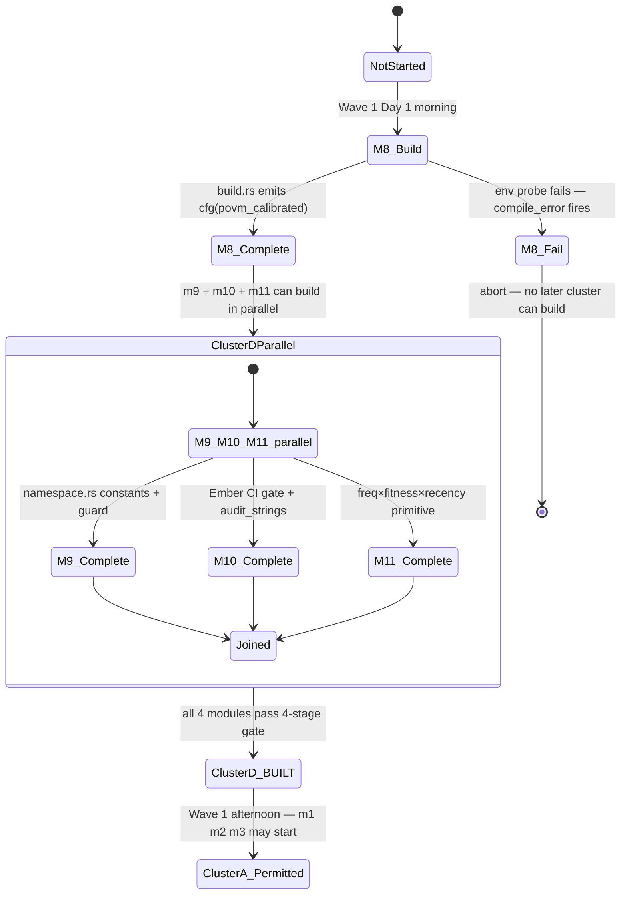

# Cluster D Ships Day 1

> **Back to:** [`../README.md`](../README.md) · [`../ULTRAMAP.md`](../ULTRAMAP.md) · [`../MODULE_DEPENDENCY_GRAPH.md`](../MODULE_DEPENDENCY_GRAPH.md) · [`../INVARIANT_MAP.md`](../INVARIANT_MAP.md) · canonical [`../../ai_docs/optimisation-v7/ULTRAMAP.md`](../../ai_docs/optimisation-v7/ULTRAMAP.md) § View 5

Per `plan.toml [[layers]] L4 ship_first = true`, Cluster D MUST reach BUILT before any reader module in Cluster A starts. This is the "trust before observe" sequencing — without aspect-layer invariants in place, every later write is an unguarded write.

## State machine



## Why D must precede A

Without D in place:

| Missing aspect | Consequence if A reads first |
|---|---|
| **m8 build prereq** | crate root `compile_error!("POVM calibration prereq unmet")` fires → nothing compiles |
| **m9 namespace constants** | m13/m42 writes could land under wrong prefix; AP30 violated; substrate corrupted |
| **m10 Ember CI gate** | user-facing strings (CLI output, errors) ship with Held semantics; reputational drift |
| **m11 decay primitive** | m30/m31 lifecycle hooks have nothing to call; selection scores never decay → bank ossifies |

## Wave 1 timeline (3 days)

```mermaid
gantt
    title Wave 1 — Foundation (Days 0-3)
    dateFormat X
    axisFormat Day %s

    section Cluster D (yellow)
    m8 build_prereq         :crit, m8, 0, 1
    m9 namespace_guard      :m9, after m8, 1
    m10 ember_ci_gate       :m10, after m8, 1
    m11 freq×fitness×recency :m11, after m8, 1
    Cluster D 4-stage gate  :crit, dgate, after m9, 1

    section Cluster A (waits)
    m1 atuin_consumer       :a1, after dgate, 1
    m2 stcortex_consumer    :a2, after dgate, 1
    m3 injection_consumer   :a3, after dgate, 1

    section Cluster L0
    workflow_core types/schemas :foundation, 0, 1
```



## Cluster D ships first because…

- It has **zero `depends_on`** rows in `plan.toml`. The four modules compile standalone.
- It is **NOT feature-gated** (`feature_gate = []`) — its invariants cannot be bypassed by `--no-default-features`.
- It is **aspect-woven, not called** — no module imports an aspect; the aspect is applied to the module via build.rs / CI gate / write-time validation hooks / lifecycle callbacks.

Per [`../ARCHITECTURE.md`](../ARCHITECTURE.md) § L0 / L9 + [`../INVARIANT_MAP.md`](../INVARIANT_MAP.md) § Cluster D:

> Cluster D is NOT feature-gated — aspect-layer invariants that every other module routes through. m8's `cargo:rustc-cfg=povm_calibrated` is env-only (not a Cargo feature) so it cannot be bypassed by `--features full`.

## The 4-stage gate at D close

Before Cluster A is permitted to start, Cluster D runs:

```bash
CARGO_TARGET_DIR=./target cargo check 2>&1 | tail -20 && \
cargo clippy -- -D warnings 2>&1 | tail -20 && \
cargo clippy -- -D warnings -W clippy::pedantic 2>&1 | tail -20 && \
CARGO_TARGET_DIR=./target cargo test --lib --release 2>&1 | tail -30
```

Per workspace charter § Quality Gate Protocol + `plan.toml [quality] gate_chain`. Zero tolerance at every stage. `PIPESTATUS[0]` discipline mandatory (AP-V7-13 cousin — `cargo … | tail` makes `$?` capture tail's exit).

---

> **Back to:** [`../ULTRAMAP.md`](../ULTRAMAP.md) · [`../INVARIANT_MAP.md`](../INVARIANT_MAP.md) · canonical [`../../ai_docs/optimisation-v7/ULTRAMAP.md`](../../ai_docs/optimisation-v7/ULTRAMAP.md) § View 5
