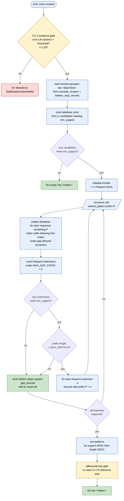

# Gap 1 — m20 PrefixSpan Algorithm

> **Back to:** [`../README.md`](../README.md) · [`../ULTRAMAP.md`](../ULTRAMAP.md) · [`../DATA_FLOW.md`](../DATA_FLOW.md) · per-module [`../../ai_specs/modules/cluster-F/m20_prefixspan_miner.md`](../../ai_specs/modules/cluster-F/m20_prefixspan_miner.md)

m20 is the engine's **KEYSTONE** structural-gap authorship — N-step compositional sub-graph detection that cannot be lifted from existing habitat sources (the habitat's pairwise infrastructure in POVM only covers two elements). PrefixSpan was chosen over Apriori (candidate explosion) and N-gram sliding window (no gap-allowed matching).

## Algorithm flowchart



## Why PrefixSpan over alternatives

| Algorithm | Why rejected / chosen |
|---|---|
| **Apriori** | REJECTED — level-wise candidate generation; O(80⁴) ≈ 40M candidates at 4-step patterns; database pass per level; structural to algorithm, not tunable |
| **N-gram sliding window** | REJECTED — treats sequences as strings; **cannot skip gaps**; cascade `[read_file → bash → edit → bash → cargo_check]` won't match pattern `[read_file → edit → cargo_check]` because bash interleavings break window; gap-allowed matching is hard requirement |
| **PrefixSpan** (Pei et al. 2001) | CHOSEN — projection-based; bounds search to actually-observed extensions; gap-allowed matching intrinsic to projection step; exact frequency support; reference implementations enable differential testing |

## Output type

```text
Pattern {
    steps: Vec<StepToken>,        // opaque u32 alphabet (F11)
    support: usize,               // exact frequency count
    gap_bounds: (usize, usize),   // min/max gap observed within MAX_GAP_STEPS=5
}
```

Sort order is deterministic: `support DESC`, then `length DESC`. Same input → same output (property test invariant).

## Complexity

O(|D| × L × W) where |D| = number of sequences, L = max pattern length (capped at 8), W = average sequence width (typically 6-20 tool calls per cascade). Bounded depth + bounded width → practical single-pass per recursion level.

## Test discipline (mutation kill ≥80%)

Per [m20 spec § 8](../../ai_specs/modules/cluster-F/m20_prefixspan_miner.md) — m20 is one of two modules (alongside m32) with the engine's highest mutation kill thresholds. Property tests verify:

- determinism (same input → same output)
- monotonicity (raising min_support cannot add patterns)
- gap-bound respect (no pattern with gap > MAX_GAP_STEPS=5)
- depth-bound respect (no pattern with length > 8)
- differential equivalence vs O(n³) naive reference

## Downstream consumers

```
m20.Pattern → m21.WorkflowVariant (Levenshtein clustering)
                    → m22.FeatureCluster (K-means)
                              → m23.WorkflowProposal (gradient-preservation top-K N=3)
```

If m20 is broken, every downstream proposal is garbage. The engine's reason-for-existing.

---

> **Back to:** [`../ULTRAMAP.md`](../ULTRAMAP.md) · [`../../ai_specs/modules/cluster-F/m20_prefixspan_miner.md`](../../ai_specs/modules/cluster-F/m20_prefixspan_miner.md)
