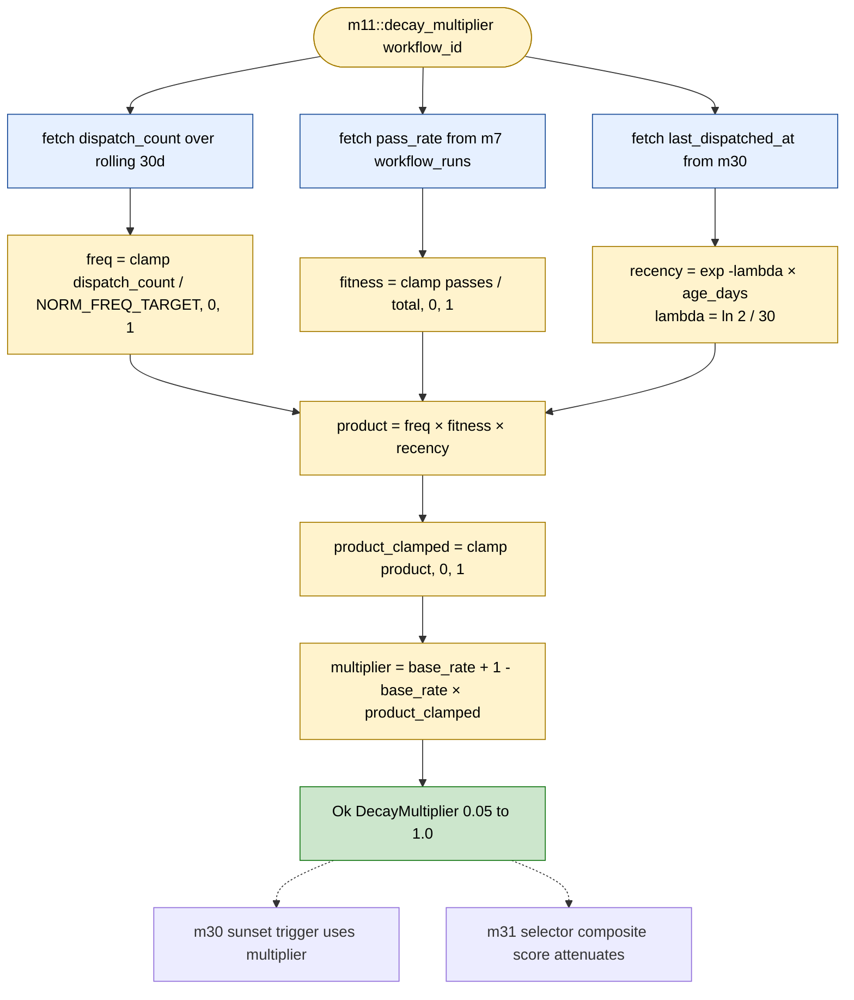

# Gap 2 — m11 Compound Decay Primitive

> **Back to:** [`../README.md`](../README.md) · [`../ULTRAMAP.md`](../ULTRAMAP.md) · [`../INVARIANT_MAP.md`](../INVARIANT_MAP.md) · per-module [cluster-D specs](../../ai_specs/modules/cluster-D/) · canonical [`../../ai_docs/optimisation-v7/ULTRAMAP.md`](../../ai_docs/optimisation-v7/ULTRAMAP.md) View 2 m11

m11 is the engine's **Gap 2** structural-gap authorship — a NEW PRIMITIVE compound decay formula combining three signals (frequency, fitness, recency) into a single multiplier. No existing habitat substrate carries an equivalent formula; the closest analogues (POVM Hebbian decay, ME EventBus exponential, RALPH age-weighting) all decay on a single signal.

## The formula

```text
decay_multiplier(workflow_id) =
    base_rate
    + (1 - base_rate) × clamp(frequency × fitness × recency, 0.0, 1.0)
```

Where:
- `base_rate ∈ [0.0, 1.0]` — minimum multiplier (workflow never decays to literal zero); default `0.05`
- `frequency ∈ [0.0, 1.0]` — normalised dispatch count over rolling window
- `fitness ∈ [0.0, 1.0]` — normalised pass rate (`PassVerified | Pass` / total)
- `recency ∈ [0.0, 1.0]` — exponential decay on `now - last_dispatch` (half-life 30 days)
- `clamp(..., 0.0, 1.0)` — defense in depth (any signal escaping range would still produce sane multiplier)

## Flowchart



## How m31 and m30 use the multiplier

| Consumer | Use |
|---|---|
| **m31 selector** | composite score = `(α·fitness + β·recency + γ·frequency + δ·diversity) × decay_multiplier` — high-performing workflows attenuate slowly; stale low-fitness workflows attenuate fast |
| **m30 sunset trigger** | if `decay_multiplier < SUNSET_THRESHOLD` (default 0.10), the daily 03:00 UTC sunset sweep retires the workflow early — before the 120d hard sunset |

## Worked examples

| Scenario | freq | fitness | recency | product | multiplier |
|---|---:|---:|---:|---:|---:|
| Hot high-fitness | 1.0 | 0.95 | 1.0 | 0.950 | 0.05 + 0.95 × 0.950 = **0.953** |
| Hot low-fitness | 1.0 | 0.20 | 1.0 | 0.200 | 0.05 + 0.95 × 0.200 = **0.240** |
| Stale high-fitness | 0.1 | 0.90 | 0.25 | 0.0225 | 0.05 + 0.95 × 0.0225 = **0.071** |
| Cold start | 0.05 | 0.0 (n=0) | 1.0 | 0.0 | **0.050** (base_rate floor) |
| Forgotten | 0.0 | 0.5 | 0.05 | 0.0 | **0.050** (floor; will sunset on next sweep) |

## Why compound, not additive

The multiplicative compound has the property that **any one signal going to zero zeroes the product** (subject to the `base_rate` floor). Concretely:

- A workflow with high frequency but zero fitness gets `0.05` (the floor) — discoverable but not selected.
- A workflow with high fitness but zero recency (forgotten) gets `0.05` — also floored.
- A workflow with high frequency AND high fitness AND high recency gets ~0.95 — strongly preferred.

Additive would let one strong signal mask two weak signals, which is wrong for the engine's semantics: a workflow is only worth running if it's *currently* strong on all three axes.

## Invariants (per [`../INVARIANT_MAP.md`](../INVARIANT_MAP.md) § Cluster D)

- `base_rate` configurable, default `0.05` — never zero (a workflow that has decayed to literal zero is indistinguishable from one that never existed; the floor preserves discoverability)
- `clamp(0.0, 1.0)` applied to product as defense-in-depth
- Hourly batch decay write (cron) keeps m30 row `decay_multiplier_cached` fresh for m31 reads
- On-demand fresh compute available via `m11::decay_multiplier(workflow_id)` for the dispatcher fast path

## Test discipline

Property tests (70 minimum per [`../../ai_specs/MODULE_MATRIX.md`](../../ai_specs/MODULE_MATRIX.md) m11 row):

- floor invariant (`multiplier ≥ base_rate` always)
- ceiling invariant (`multiplier ≤ 1.0` always)
- monotonicity (raising any one signal cannot lower multiplier)
- zero-signal floor (zero on any signal → multiplier == base_rate)

---

> **Back to:** [`../ULTRAMAP.md`](../ULTRAMAP.md) · [`../INVARIANT_MAP.md`](../INVARIANT_MAP.md) · canonical [`../../ai_docs/optimisation-v7/ULTRAMAP.md`](../../ai_docs/optimisation-v7/ULTRAMAP.md) View 2 m11
