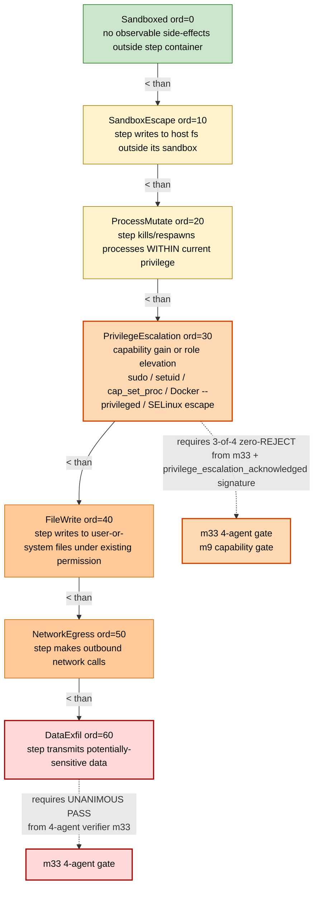

# Gap 3 — EscapeSurfaceProfile Ordinal + Display Contract (cardinality 7)

> **Back to:** [`../README.md`](../README.md) · [`../ULTRAMAP.md`](../ULTRAMAP.md) · [`../INVARIANT_MAP.md`](../INVARIANT_MAP.md) · per-module [`../../ai_specs/modules/cluster-G/m30_curated_bank.md`](../../ai_specs/modules/cluster-G/m30_curated_bank.md) · [`../../ai_specs/modules/cluster-G/m32_conductor_dispatcher.md`](../../ai_specs/modules/cluster-G/m32_conductor_dispatcher.md) · ADR [`../../ai_docs/optimisation-v7/decisions/2026-05-17-escape-surface-cardinality-7-privilege-escalation.md`](../../ai_docs/optimisation-v7/decisions/2026-05-17-escape-surface-cardinality-7-privilege-escalation.md)

m30 + m32 + m9 own the engine's **Gap 3** structural-gap authorship — a unified destructiveness schema (`EscapeSurfaceProfile`) with `Ord`-bearing variant order, stable serde names, and a display-before-step banner contract enforced at dispatch time. **Cardinality bumped 6→7 per D-S1002127-02 (Luke S1002127 `=7` directive)**: `PrivilegeEscalation` inserted at ordinal 30 between `ProcessMutate` (20) and `FileWrite` (40). Numeric ordinals use **steps of 10** to reserve gaps for future inserts (closes the G7 ordinal-stability concern).

## The ordinal hierarchy (7 variants)



## Rust ordinal contract (7-variant; D-S1002127-02)

```text
#[derive(Debug, Clone, Copy, PartialEq, Eq, PartialOrd, Ord, Hash,
         serde::Serialize, serde::Deserialize)]
#[serde(rename_all = "snake_case")]
#[repr(u8)]
pub enum EscapeSurfaceProfile {
    Sandboxed           =  0,  // lowest
    SandboxEscape       = 10,
    ProcessMutate       = 20,  // within current privilege envelope
    PrivilegeEscalation = 30,  // NEW (D-S1002127-02) — capability gain
    FileWrite           = 40,  // under existing write permission
    NetworkEgress       = 50,
    DataExfil           = 60,  // highest
}
```

Per [`../INVARIANT_MAP.md`](../INVARIANT_MAP.md) Cluster G fourth invariant:

> `EscapeSurfaceProfile` is an `Ord`-bearing enum with stable serde names; the ordering `Sandboxed(0) < SandboxEscape(10) < ProcessMutate(20) < PrivilegeEscalation(30) < FileWrite(40) < NetworkEgress(50) < DataExfil(60)` is contract-binding and consumed by m32's banner display, m9's namespace gate, and m33's verdict-composition modulation. Numeric ordinals use steps of 10 to reserve gaps for future inserts. Reordering or renaming variants is a contract break.

## PrivilegeEscalation canonical definition (embed verbatim)

> Capability gain or role elevation that grants the calling process new abilities beyond its pre-call state. Examples: invoking `sudo`; setuid/setgid; capability acquisition (`cap_set_proc`, `setcap`); ACL add; container privilege escalation (Docker `--privileged`, `cap-add`); SELinux/AppArmor profile escape. Distinguished from `ProcessMutate` (modifying another process WITHIN current privilege envelope) and `FileWrite` (which requires existing write permission but does NOT acquire new capabilities). Habitat-relevant: openclaw container UID-1337 escape, sudo gates, role elevations in nerve-center / Conductor.

## Display contract (m32 Gap 3 half)

Per [m32 spec § 1 fourth invariant](../../ai_specs/modules/cluster-G/m32_conductor_dispatcher.md): for every `ResolvedStep` in the workflow, m32 writes the `EscapeSurfaceProfile::banner_line()` plus step kind plus trap annotations to **stdout BEFORE** `conductor_client.dispatch_step(step)` fires.

```text
==============================================================
[DISPATCH] workflow=WF-abc123 step=2/5 surface=PrivilegeEscalation
[BANNER]   PRIVILEGE-ESCALATION!
[TRAPS]    T-SUDO: sudo invocation; requires privilege_escalation_acknowledged=true
           T-CAP-ADD: capability acquisition via setcap
==============================================================
```

This is human-visible output, not an optional log. Suppression via env var is **forbidden**; the banner is part of the dispatch contract.

## Sequence (display-before-step)

```mermaid
sequenceDiagram
    autonumber
    participant M32 as m32
    participant Stdout
    participant Cnd as Conductor

    Note over M32: all 5 checks passed; about to dispatch step k of n
    M32->>M32: resolve EscapeSurfaceProfile::banner_line for step k
    M32->>Stdout: write banner (synchronous, blocking)
    M32->>Stdout: write trap annotations
    M32->>Cnd: POST /dispatch step k
    Cnd-->>M32: 202
    M32->>M32: increment k; if k < n loop
```

## Consumer chain

| Consumer | Use |
|---|---|
| **m30 bank admission** | sets `escape_surface` at accept time based on step classification; `DataExfil` triggers m33 unanimous-PASS requirement; `PrivilegeEscalation` triggers `privilege_escalation_acknowledged` HumanAcceptanceSignature requirement |
| **m32 cooldown_by_surface** | dispatch cooldown scaled by surface — `DataExfil` cooldown 60min, `PrivilegeEscalation` 25min, `Sandboxed` 5min |
| **m32 banner_line** | prints surface name + bracketed coloured marker at every step |
| **m9 namespace_guard** | rejects writes whose surface > permitted surface for the calling module; gates `PrivilegeEscalation` on `privilege_escalation_acknowledged` flag |
| **m33 4-agent gate** | unanimous PASS required for `DataExfil`; 3-of-4 zero-REJECT for `SandboxEscape | ProcessMutate | PrivilegeEscalation | NetworkEgress`; majority PASS for `Sandboxed | FileWrite` |

## Cooldown ladder (by surface; 7-variant)

```text
EscapeSurfaceProfile::Sandboxed            →   5 min default
EscapeSurfaceProfile::SandboxEscape        →  10 min
EscapeSurfaceProfile::ProcessMutate        →  20 min
EscapeSurfaceProfile::PrivilegeEscalation  →  25 min   (NEW per D-S1002127-02)
EscapeSurfaceProfile::FileWrite            →  30 min
EscapeSurfaceProfile::NetworkEgress        →  45 min
EscapeSurfaceProfile::DataExfil            →  60 min (highest)
```

`PrivilegeEscalation`'s 25-minute cooldown sits monotonically between `ProcessMutate` (20 min) and `FileWrite` (30 min). Configurable via `cfg.cooldown_by_surface: HashMap<EscapeSurfaceProfile, i64>` (per [m32 spec § 2 DispatcherConfig](../../ai_specs/modules/cluster-G/m32_conductor_dispatcher.md)); defaults shown above.

## Why ordinal and not just enum

Three Cluster G modules rely on ordinal comparison:

1. **m30**: `if classified_surface > workflow.declared_max_surface { reject }`
2. **m32**: `cooldown = cfg.cooldown_by_surface.get(surface).unwrap_or_else(|| linear_scale(surface as u8))` — falls back to ordinal-scaled default; numeric values (steps of 10) keep the linear scale meaningful
3. **m9**: `if write_surface > module.permitted_max { Err(NamespaceViolation) }` — writes can never be of higher surface than the module's declared maximum

Without `Ord`, these comparisons become pattern-match ladders that drift (variant added without updating every match). The `Ord` derive plus stable variant order plus reserved numeric gaps is the structural guarantee.

## Change discipline (post-D-S1002127-02)

Adding a new variant requires:

1. Inserting it in **reserved numeric gap** (e.g. ordinal 25 between ProcessMutate=20 and PrivilegeEscalation=30) — never shifting existing ordinals
2. Updating `cooldown_by_surface` defaults to include it
3. Updating `banner_line()` colour/marker mapping
4. Updating m33 verifier composition table (which gate fires at this surface) — clippy non-exhaustive match catches drift
5. Updating m9 capability table (which acknowledgement signature, if any, the variant requires)
6. Updating per-module `permitted_max` declarations
7. Updating tests (deterministic ordinal order)
8. Updating JSON schema enum array AND ordinal_mapping object
9. Authoring a companion ADR cross-referencing D-S1002127-02

Adding **at the top** (above `DataExfil`) is always safe — only ordinal-shifting variants below is the contract break.

---

> **Back to:** [`../ULTRAMAP.md`](../ULTRAMAP.md) · [`../INVARIANT_MAP.md`](../INVARIANT_MAP.md) · [`../../ai_specs/modules/cluster-G/m30_curated_bank.md`](../../ai_specs/modules/cluster-G/m30_curated_bank.md) · [`../../ai_specs/modules/cluster-G/m32_conductor_dispatcher.md`](../../ai_specs/modules/cluster-G/m32_conductor_dispatcher.md) · ADR [`../../ai_docs/optimisation-v7/decisions/2026-05-17-escape-surface-cardinality-7-privilege-escalation.md`](../../ai_docs/optimisation-v7/decisions/2026-05-17-escape-surface-cardinality-7-privilege-escalation.md)
