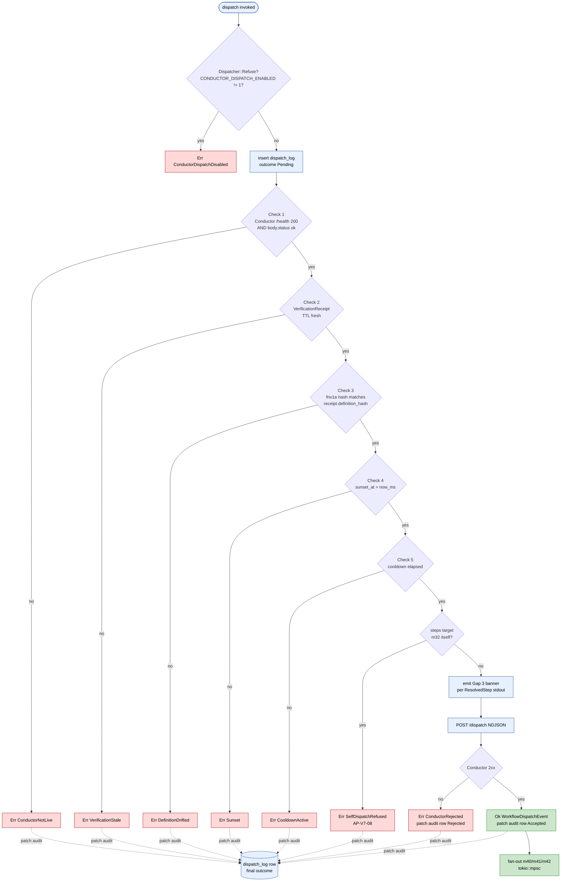

# m32 5-Check Pre-Dispatch

> **Back to:** [`../README.md`](../README.md) · [`../ULTRAMAP.md`](../ULTRAMAP.md) · [`../CONTROL_FLOW.md`](../CONTROL_FLOW.md) · [`../INVARIANT_MAP.md`](../INVARIANT_MAP.md) · per-module [`../../ai_specs/modules/cluster-G/m32_conductor_dispatcher.md`](../../ai_specs/modules/cluster-G/m32_conductor_dispatcher.md)

The most-load-bearing sequence in the engine. Order is **contractual** — failure at check N short-circuits with the correct typed `DispatchError`; checks N+1..5 do not run. Mutation kill threshold ≥85% (highest in engine) because a single surviving mutation could let a `DataExfil` workflow through with a softer banner or skip verification freshness.

## Sequence diagram

```mermaid
sequenceDiagram
    autonumber
    participant M32 as m32
    participant Aud as dispatch_log.db
    participant Cnd as Conductor :8141
    participant M33 as m33 VerifyCache
    participant M30 as m30 BankDb

    M32->>Aud: insert row (outcome: Pending) — AUDIT-FIRST
    Note over M32: Begin 5-check (contractual order)

    M32->>Cnd: (1) GET /health
    alt unhealthy
        Cnd-->>M32: refuse / timeout
        M32-->>M32: Err(ConductorNotLive)
    else 200 + body.status == "ok"
        Cnd-->>M32: ok

        M32->>M33: (2) lookup VerificationReceipt(workflow_id)
        alt TTL expired or missing
            M33-->>M32: stale / absent
            M32-->>M32: Err(VerificationStale)
        else fresh
            M33-->>M32: receipt

            M32->>M30: get(workflow_id); compute fnv1a(steps_json)
            M32->>M32: (3) compare current_hash vs receipt.definition_hash
            alt mismatch
                M32-->>M32: Err(DefinitionDrifted)
            else match

                M32->>M32: (4) check sunset_at > now_ms
                alt sunset elapsed
                    M32-->>M32: Err(Sunset)
                else not sunset

                    M32->>Aud: (5) lookup last_dispatched_at
                    M32->>M32: cooldown = cooldown_by_surface or default
                    alt cooldown active
                        M32-->>M32: Err(CooldownActive)
                    else cooldown elapsed
                        Note over M32: ALL 5 PASS
                        M32->>M32: AP-V7-08 self-dispatch inspect
                        alt self-dispatch
                            M32-->>M32: Err(SelfDispatchRefused)
                        else clean
                            M32->>M32: emit Gap 3 banner per ResolvedStep (stdout)
                            M32->>Cnd: POST /dispatch (NDJSON ConductorDispatchRequest)
                            Cnd-->>M32: 202 or 4xx
                            M32->>Aud: patch outcome = Accepted | Rejected
                        end
                    end
                end
            end
        end
    end
```

## Decision tree



## Why this order matters

Per [m32 spec § 1 third invariant](../../ai_specs/modules/cluster-G/m32_conductor_dispatcher.md):

> Any failure short-circuits with the *correct* typed `DispatchError` variant; later checks do not run. The order is not a suggestion — failures in early checks should not be masked by failures in later checks.

If check 1 (Conductor live) and check 4 (sunset) are both failing, the operator must see `ConductorNotLive` first — because addressing the sunset would mask the bigger systemic problem. Order is the structural way to enforce "fix the right thing first".

## Refuse-mode as type-level discipline

`Dispatcher` is internally `enum { Refuse(RefuseInner), Live(LiveInner) }`. `RefuseInner::dispatch()` is literally `Err(ConductorDispatchDisabled)`; the borrow checker prevents any path that bypasses it. This is the spec's structural defense against silent fallback.

---

> **Back to:** [`../ULTRAMAP.md`](../ULTRAMAP.md) · [`../../ai_specs/modules/cluster-G/m32_conductor_dispatcher.md`](../../ai_specs/modules/cluster-G/m32_conductor_dispatcher.md)
